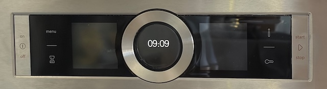

Der Touchscreen mit den Touch-Buttons von Bosch-Backöfen fällt öfter aus, Manchmal auch nur teilweise, zum Beispiel nur die Buttons auf der rechten Seite. Nun hat man drei Möglichkeiten:

1. Man lebt ohne bestimmte, nebensächliche Funktionen (wie Umluft oder Einstellung der Garzeit).
2. Man ruft den Bosch-Kundendienst, der für die Anfahrt bereits deutlich über 100 Euro nimmt, und dann gerne gleich das Logicboard tauscht (mehrere hundert Euro). Da das Fehlerbild alle zwei, drei Jahre auftreten wird, ist das dann ein teurer Backofen.
3. Man probiert, den Touchscreen selbst erneut zu kalibrieren. Oft löst das das Problem.Und manchmal verzichtet auch der Bosch-Techniker sogar auf den teuren Platinentausch, wodurch es eben eine teure Kalibrierung wird.

Das Prozedere unterscheidet sich zwischen Backofenmodellen leicht. Das grundstäzliche Vorgehen ist identisch, aber da die Prozedur keine Fehler verzeiht, sollte man auf YouTube einmal suchen, ob jemand eine passende Prozedur für den eigenen Backofen zeigt.

Ich selbst besitze das Modell HMG6764S1/15.

Der Ablauf sieht folgendermaßen aus: zunächst muß man das „Customer service menu“ öffnen und die Kalibrierung wählen, dann wird der Backofen der Reihe nach die verschiedenen Touch-Punkte durch Aufleuchten benennen. Auf diese muß man dann drücken. Mit dem Finger wird nur manchmal Erfolg haben, am besten nimmt man einen Metall-Teelöffel und drückt mit dem Metall relativ kräftig drauf. Dabei führt Drücken auf eine falsche Stelle zu einem Fehlercode und der Backofen schaltet sich ab. Dann fängt man wieder ganz von vorne an und muß das Servicemenü öffnen. Natürlich hat man auch nur einen relativ kurzen Zeitraum, in dem man drücken muß, wenn in diesem kein Druck erkannt wird, fragt der Backofen noch zwei weitere Male, dann ist wieder Fehlercode und Abschalten.

Nun zum detaillierten Ablauf:

1. Customer service menu betreten: Sanduhr und i gleichzeitig drücken und halten
2. Wenn ein Ton erklingt: **zusätzlich** An/Aus-Button drücken
3. im Servicemenü einen Eintrag nach unten und „Touch calibration“ wählen
4. Die beiden Touchscreenfelder links und rechts neben dem Bedienring sind in 12 Sektionen unterteilt, die der Reihe nach aufleuchten. Diese jeweils drücken
5. Nach den 12 Sektionen muß man einmal den Start-Button drücken
6. Nun folgen die übrigen Buttons, die aufleuchten können, also Sanduhr, i, menu und der Schlüssel.
7. Danach folgen die Buttons, die nicht aufleuchten können. Hier gibt der Backofen keinerlei Hilfestellung. Für den Benutzer sieht es so aus, als müßte er auf etwas warten, aber der Backofen erwartet bereits einen Tastendruck, und nach Ablauf der kurzen Zeit schaltet er ab. Daher die korrekte Reihenfolge beachten, jeweils einmal drücken und nach Signalton den nächsten Button betätigen:
    - Drehrad links  
    - Drehrad rechts  
    - Start-Button (rechte Seite)  
    - An/Aus-Button (linke Seite)
8. Wenn das geschafft ist und alles richtig gemacht wurde, gibt der Backofen eine kurze Meldung aus und ist zurück im Servicemenü. Der Backofen kann dann ausgeschaltet werden.
