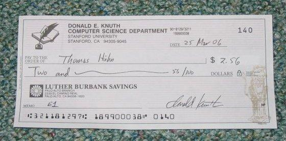

## Der unerreichbare Scheck

Es gehört zur Informatik-Folklore, daß Donald Knuth, seines Zeichen emeritierter Informatikprofessor der Universität Stanford, jedem, der einen Fehler in einem seiner Bücher findet, einen Scheck ausstellt.

Diese Fehler müssen nicht inhaltlicher Natur sein, auch ein Rechtschreib- oder Zeichensetzungsfehler genügt. Sogar rein typographische Fehler wie etwas zu großer oder zu geringer Zwischenraum zwischen zwei Wörtern, gelten als hinreichende Fehler.

Viele Leser seiner bekannten Werke wie „The Art of Computer Programming“ oder „The TeXbook“ haben bestimmt schon davon geträumt, tatsächlich einen solchen Fehler zu finden und den Belohnungsscheck zu erhalten. So auch ich.

Nur ist das eher unwahrscheinlich, man müßte nicht nur einen Fehler finden, der Donald Knuth beim Schreiben nicht aufgefallen ist (und er gilt als sehr sorgfältiger Mensch), man müßte auch allen anderen Lesern zuvorkommen, die diese Bücher aufgrund der Belohnung durchkämmen. Und auch, wenn die oben genannten Bücher sicherlich die bekanntesten und meistgelesenen sind, haben Heerscharen von Lesern auch alle übrigen Knuth-Bücher durchgearbeitet, in der Hoffnung, in diesen weniger gelesenen Büchern größere Chancen zu haben.

## Kann es denn wahr sein?

Ich selbst interessiere mich für Typographie, speziell Buchstabenformen. Und so las ich nicht nur „Digital Typography“ (das ich wärmstens empfehlen kann), sondern auch „Computer Modern Typefaces“, den letzten Band der Reihe „Computers & Typesetting“.

Dennoch fiel mir etwas auf: An einer Stelle schreibt Knuth über „Infinitely many“, obwohl es meiner Ansicht nach nur endlich viele sein dürften. Ich habe lange hin- und herüberlegt und das auch im Bekanntenkreis angesprochen (die wußten natürlich nicht so recht, worum es ging, und konnten wenig dazu sagen).

Zudem befindet sich diese Phrase an extrem exponierter Stelle im Buch, eine Stelle, die sicherlich jeder Leser gesehen und nicht überblättert hat: Kapitel Eins, Seite arabisch eins, das erste Wort im ersten Satz.

Schließlich habe ich mir gesagt, daß ich ja nichts zu verlieren habe, und habe den vermuteten Bug per E-Mail an einen von Donald Knuth benannten Mittelsmann (bzw. eine Mittelsfrau) gemeldet.

## Das Finale

Mit einer baldigen Antwort war kaum zu rechnen. Ich wußte, daß Donald Knuth ein vielbeschäftigter Mann ist, der beispielsweise Bugreports zu TeX (dem Programm) nur noch alle paar Jahre durchsieht. Außerdem müßte meine E-Mail ja auch erstmal durch die Filterung des Mittelsmannes.

Und dann, ein oder zwei Wochen vor meinem Geburtstag im Jahr 2006, erhielt ich einen Brief von der Stanford University. Nachdem ich mich nicht um ein Stipendium beworben, mich dort eingeschrieben oder sonstigen Kontakt mit Stanford gehabt hätte, war ich natürlich sehr aufgeregt. Bedeutete das, daß dort ein Scheck eingetroffen ist? Oder nimmt sich Knuth die Zeit und beantwortet auch abschlägig?

Scheck von Donald Knuth

Long story short: Der Brief enthielt einen Scheck von Professor Knuth über $2.56.

Außerdem den Ausdruck meiner E-Mail mit lapidarem Bleistiftvermerk „$2.56“ am Rand. Und einen sehr passenden Comicstrip, in dem ein Mann zur Bank kommt und einen Drei-Dollar-Scheck einlösen will, der Bankangestellte ihn aber nur verspottet: „Somebody paid you three bucks for something?“ sowie „You sure work cheap!“ 