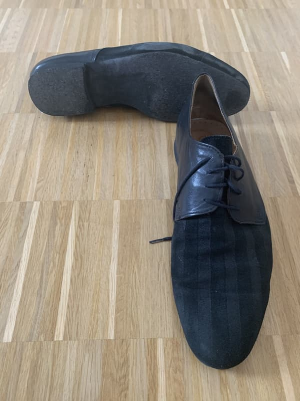

Wer aus dem Standard- oder Lateintanz kommt, der kennt sie bestimmt: die Chromledersohle. Häufig auch als Rauhleder oder Wildleder bezeichnet, sind diese beiden Bezeichnungen jedoch nicht korrekt und bezeichnen eigentlich andere Lederarten.

Richtig präpariert und auf gutem Holzboden sind Chromledersohlen ein Traum. Sie geben Halt, daß man nicht wegrutscht, ermöglichen aber dennoch leichtfüßige Drehungen ohne viel Widerstand.

Hauptthema bei der Handhabung: Ihr braucht eine spezielle Metallbürste, mit der Ihr das Leder aufrauht (daher wohl der falsche Name „Rauhleder“). Das sind so kleine Holzbürsten mit abgebogenen Metallzinken, die sehr fest und sehr spitz sind.

Einmal am Rand der Sohle zu weit gegangen und das Obermaterial ist mit aufgeritzt. Ja, das ist mir damals beim Standardtanzen leider schon passiert. Sieht nicht schön aus.

Wofür das ganze? Chromleder nimmt jeden Dreck und Staub auf der Tanzfläche auf und hält diese fest. Wirklich fest, die kriegt Ihr sonst nie wieder raus. Das verklebt richtig zu einer unansehnlichen, rutschigen Oberfläche. Und genau da geht Ihr mit der Metallbürste rein. Richtig reinstechen und mit Kraft entlangratschen. Dabei kommt der ganze Dreck (und ein wenig Leder) heraus. Das macht eine größere Sauerei, also bitte niemals im Tanzsaal machen.

Es kommt einem immer so vor, als müßte die Sohle nach drei-, viermal bürsten „durch“ sein, bei der Materialmenge, die herausrieselt. Das wirkt aber nur so, meine Chromledersohlen haben ewig gehalten.

Wenn Ihr rutschige Schuhe mögt, beispielsweise weil Ihr Balboa tanzt, dann fällt das Aufbürsten natürlich weg.

Offensichtlicher Nachteil: Niemals naß werden lassen! Das trocknet durch die fein strukturierte Oberfläche noch viel schlechter als glatte Ledersohlen, und so kann man den Staub und Dreck um so besser verkleben.

Wo bekommt man Chromledersohlen her? Fertig am Schuh eigentlich nur im Tanzschuhladen. Und vermutlich nur Standard- und Lateinschuhe, außerdem ein paar Salsaschuhe. Das ist jetzt modisch nicht das, was den meistens Lindy-Hoppern vorschwebt.

Diese lassen sich aber oft Chromleder nachträglich unter ihre – beispielsweise – Keds kleben.

In manchen größeren Städten geht das wohl günstig und schnell beim Schuster in der Fußgängerzone. Ja, diese kleinen Ein-Mann-Schlüsseldienstläden. Jedenfalls berichten das einige Leute im Netz. Gerade erst wieder ein Bericht auf Facebook, acht Euro hats wohl gekostet.

Ich hatte bisher nicht das Glück, an so einen Schuster zu geraten, die haben oft nichtmal gewußt, was Chromleder ist. Und der „richtige“ handwerkliche Schuster, der ans große Schuhhaus angeschlossen ist, nimmt Preise zum Abwinken. Ich weiß sie nicht mehr auswendig, aber da wurden so dreißig Euro pro Schuh aufgerufen. Also sechzig Euro für das Paar, und dann erstmal noch das Schuhpaar an sich kaufen. Das ist nicht günstig.

Wer aber einen Schuster zur Hand hat, der das mal eben für einen Zwanziger insgesamt erledigen kann, sollte das wirklich mal ausprobieren.
