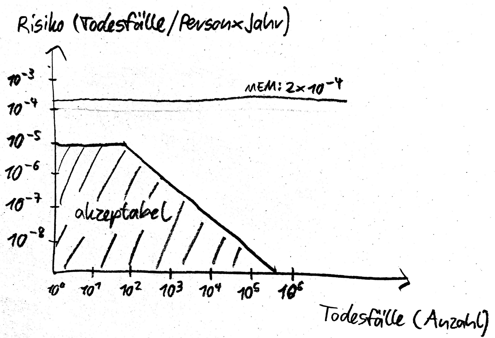

Die Minimale Endogene Mortalität ist ein relativ altes deutsches Risikoakzeptanzkriterium, das versucht, die Frage der Risikominderung auf feste Fundamente zu stellen.

„Endogen“ heißt „im Inneren erzeugt“, sprich: ohne äußeren Einfluß auf das zu bauende System. „Mortalität“ ist die Sterblichkeit.

Es geht also um die Frage, wie wahrscheinlich es ist zu sterben. Dabei wird die minimale Sterbenswahrscheinlichkeit gesucht. Also nicht die des 60-jährigen oder des Krebspatienten, sondern die reale Sterbenswahrscheinlichkeit für Kinder und Jugendliche zwischen fünf und fünfzehn Jahren. Die Zahlenwerte basieren auf einer Studie aus dem Jahr 1981. Daraus ergibt sich eine natürliche Sterblichkeit dieser Gruppe von 2×10^-4 Todesfällen pro Person und Jahr.

## Rechnung

Das Ziel lautet, daß das System keine merkliche Auswirkung auf das Todesfallrisiko haben soll. Es soll also höchstens im Bereich dieses „allgemeinen Hintergrundrisikos“ liegen.

Der Mensch ist häufig von einer Anzahl von technischen Systemen umgeben, nehmen wir bis zu 20 Stück an, dann sollen einem einzelnen System nur fünf Prozent dieser Rate zugestanden werden: 1×10^-5 Todesfällen pro Person und Jahr.

Dabei rechnen wir mögliche Verletzungen in Todesfälle um: hundert Leichtverletzte entsprechen zehn Schwerverletzten entsprechen einem Toten.

Und weil Unfälle mit einer großen Anzahl von Toten gesellschaftlich als besonders schwerwiegend wahrgenommen werden, modifizieren wir den oben errechneten Schwellwert und senken ihn für über hundert Tote linear immer weiter ab:
Minimale Endogene Mortalität

## Eigenschaften

Die Minimale Endogene Mortalität ist ein absolutes Maß, sogar mit konkretem Zahlenwert. Dadurch sticht sie aus der Konkurrenz von ALARP und GAMAB hervor.

Jedoch basiert der Zahlenwert auf nur einer einzelnen Studie.

Die Minimale Endogene Mortalität ist insofern fundiert, als dem Risikoziel eine Begründung zugrundeliegt.

Sie ist aber auch sehr simplistisch und bildet komplexe Zusammenhänge nicht ab.

Inzwischen ist die Minimale Endogene Mortalität als Riskoakzeptanzkriterium mehr oder weniger ausgestorben. Sie findet höchstens noch Verwendung im Zusammenspiel mit [ALARP]() oder [GAMAB](), um eine harte Grenze zu definieren. So kann diese Minimale Endogene Mortalität als Schwelle zur “broadly acceptable region” in ALARP dienen.
