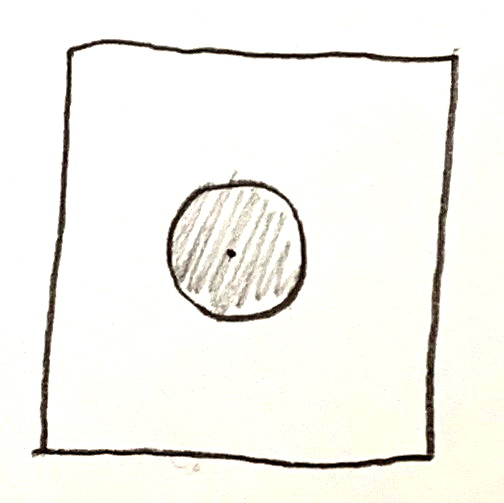

## Einführung

Manchmal auch „Vater des Qualitätswesens“ genannt, prägte [William Edwards Deming](https://de.wikipedia.org/wiki/William_Edwards_Deming) das Feld im 20. Jahrhundert.

Seine Arbeit konzentrierte sich auf Produktionsprozesse, Fertigungsbereiche in der Automobilindustrie und anderen erzeugenden Industrien, aber ich glaube, daß vieles davon auch in anderen Gebieten anwendbar ist, Softwareentwicklung eingeschlossen. Schließlich haben auch davon weiter entfernte Gebiete wie die Medizin inzwischen Notiz von Demings Arbeit genommen.

Doch selbst wenn Sie keine direkte Anwendbarkeit auf Ihre tägliche Arbeit sehen, denke ich, es schadet nicht, ein wenig über Deming und seine Arbeit zu wissen. Kulturelle Anreicherung, sozusagen. Deming hatte großen Einfluß auf die Weltwirtschaft, wenn auch indirekt.

Deming hatte eine Anstellung als Wirtschaftsprofessor an einer Wirtschaftsuniversität und arbeitete nebenher als Consultant. Er sprach sich für die Anwendung statistischer Methoden im Qualitätsmanagement in der Industrie aus. Außerdem hielt er es für wichtig, auch Manager eine Einführung in statistische Methoden zu geben, damit sie nicht nur Ad-hoc-Methoden verwenden.

Deming schrieb mehrere Bücher, die bekanntesten sind wohl “The New Economics of Industry, Government, and Education” und “Out of the Crisis”. An den Titeln sehen Sie bereits, sie sind thematisch breit aufgestellt, es sind keine Statistiklehrbücher.

Vieles in diesen Büchern ist politisch. Er schreibt über Amerika in der Welt. Die Themen wechseln, es geht um Managerethik, aber auch um die Post. Vieles ist nicht gut gealtert, beispielsweise wenn er sich verächtlich darüber äußert, daß die Regierung so ein wunderbares Monopol wie Bell Telephone zerschlagen hat. Anderes wirkt wahllos, wie beispielsweise mehrere Absätze über den Zusammenhang von Zeugnisnoten und Schlägen für Kinder. Zumindest in “New Economics“ scheinen die ersten Kapitel eher „was ich schon immer mal sagen wollte“ zu sein. Glücklicherweise kommt der Leser zum inhaltlichen Teil, sobald er die ersten paar Kapitel überstanden hat.

## Deming und Systeme

Ein Eckpfeiler seiner Managementphilosophie lautet, daß das Problem nicht die Menschen selbst sind.

> Ranking is a farce. Apparent performance is actually attributable mostly to the system that the individual works in, not to the individual himself.

> Abolish ranking […] Manage the whole company as a system.

Klingelts beim letzen Zitat? Jack Welsh bei General Electric? Microsoft bis noch vor kurzem? Diese Unternehmen (und ihre Manager) glaubten fest daran, daß ihre Angestellten Gegenspieler seien. Jegliche unzufriedenstellende Leistung muß daran liegen, daß die Angestellten entweder inkompetent oder faul sind, also muß man die Low-Performer entlassen und durch „Rockstars“ ersetzen.

Deming dachte stets in Systemen, nicht in Individuen. In seinem Workshops für Manager führte er häufig zwei Experimente vor: das Rote-Murmeln-Experiment und das Trichterexperiment. Wir kommen später noch zu letzteren, aber das Rote-Murmeln-Experiment ist an dieser Stelle anwendbar. Leider ist es auch recht langweilig, geradezu banal.

Ich erspare Ihnen eine Schritt-für-Schritt-Reportage und fasse es nur kurz zusammen. Wenn Sie an weiteren Details interessiert sind, gibt es auf YouTube reihenweise Videos, die Deming selbst dabei zeigen, wie er Zuhörer auf der Bühne holt und mit ihnen das Experiment durchführt.

Im Rote-Murmeln-Experiment fischen mehrere Personen („Arbeiter“) mit kleinen Paddeln Murmeln aus einer Kiste. Es gibt rote Murmeln und weiße Murmeln, und die Paddel haben unregelmäßig große Vertiefungen, in denen Murmeln sitzen und herausgefischt werden können. Die Arbeiter haben Weisung, so viele weiße Murmeln und so wenige rote Murmeln wie möglich herauszufischen. Die roten Murmeln repräsentieren dabei Defekte. Das Experiment geht über mehrere Runden, und es gibt jede Menge Vorgaben („Sie müssen das Paddel so halten“), die Leistung der Arbeiter wird jeweils erfaßt und ausgewertet.

Das Experiment ist derart aufgesetzt, daß die Leistung des einzelnen Arbeiters im wesentlich durch Zufall bestimmt ist. Es gibt praktisch keinen Einfluß von Können darauf, welche Art Murmel er erwischt. Und das ist der Punkt. Das System führt zu zufälligen Ergebnissen, der einzelne Arbeiter ist machtlos. Daher macht es wenig Sinn, gute Leistungen zu belohnen oder schlechte Leistungen zu bestrafen. Langweilig, ich weiß. Versuchen Sie einmal, dem Experiment fünfzehn Minuten lang zuzusehen.

Das bedeutet nicht, daß Menschen unwichtig seien, Deming glaubt im in Wirklichkeit das genaue Gegenteil:

> The most important application of the principles of statistical control of quality […] is in the management of people.

Aber das wichtigste, was man aus diesem Experiment mitnimmt, ist folgendes: **Systeme sind wichtig.**

## Demings Bedeutung

Deming versuchte, seinen Ideen in Amerika in die Praxis umzusetzen, aber er wurde von amerikanischen Industriellen weitgehend ignoriert. Das ist nicht sonderlich überraschend, wenn man sich die Zeit vergegenwärtigt, besonders kurz nach dem Zweiten Weltkrieg: Amerika war der Herrscher der Welt. Europa lag in Schutt und Asche, teilweise rauchte es noch. China war noch lange nicht der High-Tech-Lieferant, das es heute ist, sondern ein armes Agrarland. Das Akronym BRIC war noch nicht einmal erfunden, und von „Tigerstaaten“ hat noch niemand gesprochen.

Warum sollte Amerika sich ändern? Die Zukunft schien rosig.

Nicht nur Europa lag in Ruinen, auch Japan, vielleicht sogar noch mehr. Amerika hatte Japan besetzt, und eine Anekdote berichtet davon, daß General MacArthur vor lauter Frust explodierte, als mal wieder ein Telefonat mit einer anderen japanischen Insel einfach abbrach. Er wollte Japan deshalb wiederaufbauen, zumindest einige Infrastruktur.

Ganz so war es wahrscheinlich nicht, die Geschichte ist ja nun apokryph, und auch viele andere sprachen sich dafür aus, Japan beim Wiederaufbau zu unterstützen. Und so schifften viele Experten aller möglichen Fachgebiete ein und kamen nach Japan.

Deming war einer von ihnen. Und plötzlich war er respektiert, ja sogar gefragt.

Die Japaner hatten wenig überraschend auch großes Interesse daran, ihr Land wiederaufzubauen. Sie arbeiteten schwer an ihrem Wirtschaftswunder. Wir wissen, wie das ausging.

Auf YouTube findet man faszinierende Videos von Amerikanern, die japanische Autos zertrümmern. Mit Baseballschlägern. Sogar Politiker in Wahlkampfvideos tun japanischen Produkten rohe Gewalt an.

Ich kann nur annehmen, daß die Japaner sich davon nicht sonderlich beeindrucken ließen, wie Amerikaner ihren eigenen, selbst bezahlten Besitz zerstörten.

Gut, aber als Deming nach Japan ging, wußte noch niemand, wie sehr Japan aus der Asche emporsteigen würde. MacArthur wollte sicher nicht, daß Detroit eine Geisterstadt verlassener Fabriken würde, aber der Mann wollte eben telefonieren!

Wie gesagt, die Japaner waren sehr daran interessiert, was Deming ihnen beizubringen hatte. Er war in Qualitätsmanagementkreisen durchaus bekannt, nur die praktische Umsetzung konnte er in Amerika nie wirklich angehen. Es begann mit der Ingenieursvereinigung, er knüpfte Kontakte zum mittleren Management, später zum Topmanagement, und er lehrte sie das, woran er glaubte. Die Führungsriege (sprich: CEOs der großen japanischen Konglomerate) besuchten seine Seminare. Er war ein Star, und er erhielt unzählige Auszeichnungen und Ehrungen in Japan.

Deming hat all die neumodischen Dinge, mit denen die Japaner ihr Wirtschaftswunder vollbrachten, nicht erfunden. Er hat weder das Toyota Production System erfunden, noch Kanban, noch Total Quality Management.

Aber seine Schüler taten es.

All dies fand hauptsächlich von den Fünfzigern bis in die Achtziger statt. Auf breite Anerkennung in Amerika mußte Deming aber noch bis viel später – kurz vor seinem Tod – warten.

## Der Demingkreis

Diese Japaner kamen nach ihm, aber auf wessen Schultern stand Deming?

Walter Shewhart.

Vieles von dem, wofür Deming bekannt ist, gab es bereits in der ein oder anderen Form bei Shewhart. Was kein Zufall ist, Deming studierte unter Shewhart und arbeitete später mit ihm zusammen. Und am bekanntesten an Shewharts Arbeit ist der Shewhartkreis:

Plan – Do – Check – Act. Eine Grundlage des Projektmanagements. Auch PDCA-Kreis genannt, PDCA-Zyklus, Scrum-Sprint oder – Überraschung! – der Deming-Kreis.

Deming selbst nannte dieses Konzept stets „Shewhartkreis“.

Doch Deming änderte den Shewhartkreis auch in einer Hinsicht. Er strich “Check” und ersetzte es durch “Study”. Es scheint unwesentlich, aber Deming bestand darauf. Für seine Ohren klang “check” wie “inspect”.

**Deming haßt Inspektion.** Mit Inbrunst. Lesen Sie seine Bücher, er hört gar nicht mehr auf, über das Grundübel der Inspektion zu schreiben.

> You can not inspect quality into a product.

Aber was ist Inspektion? Inspektion ist, wenn Sie ein gefertigtes Teil nehmen (eine bestückte Leiterplatte, ein Auto, etc.), seine Eigenschaften vermessen und diese mit einer Spezifikation vergleichen. Auf der Basis dieses Vergleichs entscheiden Sie dann, ob Sie das Teil ausliefern oder wegwerfen (oder einschmelzen und neu fertigen) oder reparieren.

Die Idee dabei ist, wegzuwerfen, was außerhalb der Spezifikation liegt. Sie beginnen mit der Spezifikation und fertigen “to spec”.

> Eliminate the need for inspection on a mass basis by building quality into the product in the first place.

Dieses letzte Zitat ist leicht miszuverstehen. Deming sagt nicht „fertigen Sie einfach Teile, schauen Sie diese niemals an und warten Sie einfach auf Kundenreklamationen“. Wenn Sie Ihre Fertigung aufsetzen, werden Sie viele Versuche brauchen, und Sie werden nach jedem Versuch genau anschauen wollen, was das Ergebnis ist. In der laufenden Produktion möchten Sie ebenfalls Stichproben Ihres Fertigungsoutput ziehen und bewerten. Aber Sie sollte nicht jedes Teil vermessen und jeweils für jedes Teil einzeln entscheiden, ob Sie es verkaufen oder wegwerfen.

Was sonst sollen Sie tun?

## Statistische Prozeßlenkung

Der Produktionsprozeß kann anhand einer Produktionsfunktion P(μ,σ) modelliert werden, die annähernd normalverteilt ist, mit μ als Erwartungswert und σ als Standardabweichung.

Warum eine Normalverteilung? Weil es in der Praxis ganz gut zu funktionieren scheint (der zentrale Grenzwertsatz sagt uns, daß wir unter recht laxen Bedingungen eine annähernde Normalverteilung sehen werden). Und weil es „schöne“ Theoreme für die Normalverteilung gibt, so daß wir damit praktische Dinge errechnen können.

Auf der x-Achse ist ein (kontinuierlicher) Meßwert abgetragen, vielleicht die Länge oder das Gewicht des produzierten Teils. Der Nullpunkt zeigt an, was die „gewollte“ Länge oder das „gewollte“ Gewicht ist, also was der Produktionsprozeß tun soll.

Auf der y-Achse ist die Anzahl der produzierten Teile mit dem entsprechenden X-Meßwert abgetragen.

Das ist natürlich eine Vereinfachung. Ihr Produktionsprozeß mag nicht normalverteilt sein, sein Graph mag asymmetrisch, schief oder mit Sprüngen darin sein. Für eine allgemeine Erläuterung der Methode spielt das keine Rolle.

Zusätzlich zur Produktionsfunktion gibt es eine Verlustfunktion L(x). Es spielt eine Rolle, wir lang oder schwer das Teil ist. Wenn es nahe am gewünschten Wert ist, ist es vermutlich okay. Wenn es weit entfernt ist, dann ist es wohl wertlos und unbrauchbar. Hier ist als Verlustfunktion eine Parabel gewählt.

Auch diese Vereinfachung muß in der realen Welt nicht zutreffen. Wenn Sie den Bus erreichen möchten und eine halbe Stunde zu früh sind, ist das ärgerlich. Wenn Sie fünf Minuten zu früh sind, ist es gut. Wenn Sie nur eine Minute zu früh sind, ist es besser, aber nicht viel besser. Aber wenn Sie eine Minute zu spät sind, haben Sie den Bus verpaßt und warten eine geschlagene Stunde. In diesem Beispiel wäre Ihre „Verlustfunktion“ in etwa eine Parabel links von μ, aber direkt rechts davon ein Sprung zum Maximum von L(x).

Allgemein gesprochen muß die Parabel der Verlustfunktion auch nicht um den Erwartungswert der Produktionsfunktion zentriert sein.

Eine neue Funktion f(μ,σ) kombiniert nun die Produktionsfunktion und die Verlustfunktion, indem sie beide Funktionen miteinander multipliziert und über den gesamten Definitionsbereich integriert. Sie wägt die Zahl der produzierten Teile an einem bestimmten x in der einen Hand und den dadurch verursachten Verlust an demselben x in der anderen Hand, und bestimmt so einen Gesamtverlust. Und nun haben Sie ein Optimierungsproblem: wann wird f minimal?

<aside>
Ich würde vermuten, daß man etwas mehr mathematische Maschinerie benötigt, beispielsweise eine echte Faltung, oder? Sofern ich seine Notation nicht völlig mißverstehe, verwendet Deming aber tatsächlich eine Multiplikation.
</aside>

Für übliche Funktion P und L (und besonders in diesem vereinfachten Beispiel) ist offensichtlich: μ sollte dort sitzen, wo die Verlustfunktion ihr Minimum hat. Wenn dies der Fall ist, verursachen die meisten Teile nur geringe Verluste, und die Teile, die relevante Verluste verantworten, sind nur wenige.

Eine weitere Möglichkeit ist, den Produktionsprozeß zu verbessern, so daß der Graph der Produktionsfunktion enger wird, oder in anderen Worten, so daß die Standardabweichung (und damit die Varianz) kleiner wird. Teile weit jenseits von μ sind nach wie vor verlustreich, aber ihre Anzahl nimmt deutlich ab.

Normalerweise bringt es mehr, den Prozeß auf die gewünschte Länge, Gewicht, etc. der Teile zu zentrieren, als den Prozeß enger zu machen, jedoch um das falsche μ herum. Also lehrt Deming uns, *zunächst den Prozeß zu zentrieren* (und damit μ an die Stelle zu legen, wo es gewünscht ist) und *erst dann daran zu arbeiten, die Standardabweichung zu verringern.*

Was bedeutet „den Prozeß zentrieren“? Zunächst bedeutet es, die Produktionsanlage korrekt einzurichten. Wenn die Maschine auf eine Teilelänge von fünf Zentimetern eingestellt ist, mag sie dennoch ein paar Teile produzieren, die nur vier Zentimeter lang sind. Aber wenn Sie tatsächlich vier Zentimeter benötigen, wäre es dumm, sich auf die Standardabweichung zu verlassen. Stattdessen sollten Sie die Maschine auf vier Zentimeter einstellen. Die allgemeine Bedienung der Maschine gehört auch in diese Kategorie. Wenn der Maschinenführer nicht verstanden hat, wie er die Maschine korrekt bedient, kann das Ergebnis *systematisch falsch* sein.

Die Standardabweichung zu verringern dreht sich eher um Instandhaltung und Wartung. Muß die Maschine mal wieder geölt werden? Gibt es defekte Teile, die ersetzt werden sollten? Aber auch hier spielt die Bedienung eine Rolle. Ein Maschinenführer mag die Maschine anders bedienen als ein anderer. Es ist wichtig, eine offizielle Art der Bedienung festgelegt zu haben und seine Arbeiter richtig zu schulen, wenn eine geringe Standardabweichung herauskommen soll.

## Fehlerarten

Lassen Sie uns über Fehler sprechen. Es gibt zwei grundlegend verschiedene Kategorien von Fehlern, und Deming ist unnachgiebig, wenn es darum geht herauszufinden, zu welcher Kategorie ein beobachteter Fehler gehört: es gibt **besondere Fehler** (“special causes of variation”) und **gewöhnliche Fehler** (“common causes of variation”).

<aside>
Wenn Sie mit sicherheitsgerichteten System arbeiten, mag Sie die Begrifflichkeit kurz stutzen lassen. “Common causes” in diesem Sinne sind nicht Fehler gemeinsamer Ursache, wie ein einzelner elektromagnetischer Puls, der in zwei verschiedene Leiter einkoppelt. Hier bedeutet “common“ einfach „gewöhnlich“, „normal“.
</aside>

Warum ist es wichtig, in welche Kategorie ein Fehler gehört? Weil sie grundverschieden behandelt werden müssen!

Gewöhnliche Fehler (bei Shewhart: “chance causes” – Zufallsfehler) passieren zufällig. Sie stellen die normale Prozeßstreuung dar. Sie passieren ständig, und es gibt keine einzelne spezifische Handlung, um sie zu beseitigen.

Besondere Fehler (bei Shewhart: “assignable causes” – zuordbare Fehler) werden häufig durch einen Arbeiter auf unterster Ebene verursacht. Der Begriff “assignable cause” ist recht gut, weil er die Intuition „es gibt etwas oder jemanden, auf den wir zeigen können“ abbildet.

Beispielsweise könnte ein Bagger am falschen Ort baggern und plötzlich hat Ihre Fabrik keinen Strom mehr. Das wäre ein klassischer besonderer Fehler. Sie können den Schuldigen identifizieren: „der Bagger“, „der Baggerfahrer“, „der Planer“ oder vielleicht auch „derjenige, der nicht daran gedacht hat, eine redundante Stromversorgung vorzusehen“. Es passiert nicht regelmäßig, und Sie würden es wohl kaum als Teil Ihres normalen Produktionsprozesses bezeichnen.

Doch wenn Sie ein großes, landesweit operierendes Telekommunikationsunternehmen sind, dann ist „Bagger trennt Kabel“ vermutlich kein besonderer Fehler, sondern eher „Dienstag“. Es passiert oft genug, daß Sie es nicht als einzigartigen Akt Gottes betrachten sollten, sondern als ein Problem, das Sie statistisch modellieren können, und wo die Vermeidung dieses Fehlers vermutlich zu Ihrem normalen Geschäft und seinen Prozessen gehört.

Diese besonderen Fehler können Sie als unvorhersehbare und statistisch unmodellierbare Fehlerquelle betrachten, die die gewöhnlichen Fehler überlagern. Dadurch werden die gewöhnlichen Fehler schwierig zu modellieren und zu behandeln.

Wie behandeln Sie also all diese Fehler?

Für besondere Fehler ist es einfach: Sie eliminieren sie einen nach dem anderem, denn ansonsten ist ihr Prozeß unvorhersehbar und damit außer Kontrolle. Sie können nicht durch eine Weisung von oben behoben werden, sondern sie müssen auf unterer Ebene (wo sie üblicherweise auftreten) im Einzelfall behoben werden. Da es sich um zufällige Ereignisse handelt, werden Sie niemals alle besonderen Fehler für immer beheben, aber Sie müssen es versuchen, so gut es geht.

Gewöhnliche Fehler werden ganz anders behandelt: Sie beherrschen Sie, indem Sie Ihren Prozeß unter Kontrolle bringen. Das bedeutet, den Prozeß zu zentrieren und die Standardabweichung zu verringern. Und dann kommt der allerwichtigste Teil.

**Finger weg!**

Ja, wirklich. Sie behandeln gewöhnliche Fehler alle auf einmal, indem Sie den Prozeß unter Kontrolle bringen. Sie versuchen niemals, einen dieser Fehler gesondert zu beheben.

Aber was passiert, wenn Sie einen gewöhnlichen Fehler für sich allein behandeln? Gut, daß Sie fragen, denn jetzt kann ich Ihnen etwas über Demings zweites berühmtes Experiment erzählen, das Trichterexperiment.

## Das Trichterexperiment

Im Trichterexperiment legte Deming ein Blatt Papier auf den Tisch, markierte einen Punkt in der Mitte als Ziel (nennen wir ihn Z) und hielt einen Trichter etwas über den Zielpunkt. Dann warf er eine Kugel durch den Trichter und markierte, wo die Kugel aufs Papier gefallen war. Üblicherweise war das nicht genau der Zielpunkt, sondern knapp daneben, nennen wir diesen Punkt T.

Und nun gibt es vier verschiedene Strategien, mit denen er fortfuhr. Jede dieser Strategien bestimmt, wie er den Trichter nach jeder Kugel bewegte (und legte damit einen neuen Zielpunkt Z‘ fest). Er warf wiederholt Kugeln in den Trichter, der jeweils gemäß der Strategie bewegt wurde, und markierte die weiteren Treffpunkte mit T‘, T“ und so weiter. Nach ein paar Dutzend Kugeln sah man dann ein Verteilungsmuster.

Die erste Strategie ist genau die, die Deming für gewöhnliche Fehler empfiehlt: Finger weg! Der Trichter bleibt, wo er ist, also Z = Z‘ = Z“.

Die Zielverteilung ist kreisförmig und ziemlich eng.

Die zweite Strategie spiegelt wider, was viele Menschen tun: sie bewegen den Trichter anhand einer vermuteten systematischen Abweichung. Wenn eine Kugel den Punkt T trifft und dieser Punkt T drei Millimeter links vom Zielpunkt Z ist, dann bewegen sie den Trichter drei Millimeter nach rechts. Der neue Zielpunkt Z‘ ist also drei Millimeter rechts von Z.

Das ist wie Artillerieschießen. Über den Feind hinweggeschossen? Ziel das nächste Mal kürzer! Es ist auch, was passiert, wenn man gewöhnliche Fehler als besondere Fehler behandelt.

Das resultierende Muster ist nach wie vor kreisförmig, hat aber eine um etwa 30% größere Fläche.

Die dritte Strategie ähnelt der zweiten. Jedoch vergleicht man nicht den Treffpunkt T mit dem letzten Zielpunkt, sondern immer mit dem Originalzielpunkt Z in der Mitte des Blatts Papier.

Es entsteht ein Zielmuster, das ein wenig wie ein Propeller aussieht. Der Zielpunkt oszilliert zwischen zwei Quadranten, und das gesamte Experiment divergiert. Das bedeutet, der Fehler wird größer und größer.

Die vierte Strategie sieht ähnlich wild aus. Deming zielte einfach immer auf den letzten Treffpunkt, also Z‘ = T. Wieso sollte man so etwas tun? Sie würden es natürlich nicht tun, in diesem Experiment. Aber es ist ziemlich genau das Spiel Stille Post. Sie zielen dorthin, was der letzte Mitspieler Ihnen gesagt hat. Oder, in anderen Worten, dieses Verhalten ist genau das, wenn man jemandem etwas ohne ein stabiles und gemeinsames Lehrbuch beibringt. Der eine Maschinenführer lernt den seinen Nachfolger an, der Nachfolger versteht das meiste, aber nicht alles ganz exakt. Wenn der Nachfolger nun wiederum seinen Nachfolger anlernt, und der ursprüngliche Maschinenführer nicht mehr zur Verfügung steht, dann divergiert das Training genau wie die Kugeln hier.

Im Ergebnis sieht das Muster so wie hier aus: es divergiert schnell, und im allgemeinen auch in ziemlich direkter Linie in einer Richtung.

## Verschiedene Fehlerarten unterscheiden

Gewöhnliche Fehler und besondere Fehler können mathematisch auseinandergehalten werden. Die Basis für diese Unterscheidung ist die [Qualitätsregelkarte](https://de.wikipedia.org/wiki/Qualit%C3%A4tsregelkarte), auf englisch “control chart” oder zuweilen auch “Shewhart chart” oder “process-behaviour chart”.

Die y-Achse zeigt eine kontinuierliche Messung, „target“ korrespondiert mit dem Ideal. Es gibt ein “upper control limit” (UCL) und ein “lower control limit” (LCL). Beide sitzen respektive bei +3σ und -3σ.

**UCL und LCL werden aus echten Prozeßdaten errechnet!** Sie sind keine Spezifikationsgrenzen.

> Using the manufacturer’s claim as the lower control limit (action limit) is confusing special causes with common causes, making matters worse, guaranteeing trouble forever.
> A wiser procedure would be to get statistical control of the machine, under the circumstances in place. Its performance might turn out to be 90 per cent of the maximum speed as specified by the manufacturer, or 100 per cent, or 110 per cent. The next step would be the continual improvement of the machine and use thereof.

<aside>
Soweit ich es verstehe, gibt es kein hartes Theorem, warum UCL und LCL bei +/-3σ sitzen müssen, sondern es gibt empirische Evidenz für diese Schwellen und auch statistische Argumente, warum sie ungefähr dort liegen sollten.
</aside>

Sie plotten Ihre Meßwerte in die Qualitätsregelkarte. Dies ist keine Inspektion, die Deming ja so verachtet. Sie prüfen nicht einzelne Teile gegen definierte Toleranzen und entscheiden daraus, welche Teile Sie behalten. Sie plotten das Verhalten Ihres Prozesses. Jetzt ist es einfach: alles innerhalb des +/-3σ-Bandes ist ein gewöhnlicher Fehler, alles außerhalb dieses Bandes ist ein besonderer Fehler.

Nur daß das zu einfach wäre und die Wirklichkeit nicht angemessen abbilden würde. Deswegen wurden verschiedene Regelwerke entwickelt, die beiden bekanntesten sind die [Western Electric Rules](https://en.wikipedia.org/wiki/Western_Electric_rules) und die [Nelson Rules](https://en.wikipedia.org/wiki/Nelson_rules). Beide sind etwas komplizierter als nur „drinnen oder draußen?“, sie schauen auf bestimmte Läufe von Meßwerten. Zum Beispiel sieht eine Meßreihe, die abwechselnd zwischen der positiven und der negativen Seite der y-Achse springt, nicht nach einem gewöhnlichen Fehler aus, sondern eher nach einem besonderen Fehler, der eine Oszillation bewirkt.

Ein Prozeß heißt „unter Kontrolle“, wenn nur gewöhnliche Fehler übrigbleiben. Es mag kein besonders guter Prozeß sein, er mag nicht zentriert sein or er mag eine große Standardabweichung aufweisen, aber er ist unter Kontrolle und statistisch modellierbar. Das ist ein großes Plus, und nun können Sie Ihren Prozeß verbessern.

Doch wenn die Qualitätsregelkarte zeigt, daß die meisten Ihrer Fehler besondere Fehler sind, haben Sie ein Problem: Ihr Prozeß ist am Anschlag und definitiv nicht unter Kontrolle. Es mag eine alte, abgenutzte Maschine sein, ungenügend ausgebildete oder gestreßte Arbeiter, aber Sie müssen den Prozeß erstmal unter Kontrolle bekommen, indem Sie die besonderen Fehler zuerst angehen. Erst dann können sie Ihren Prozeß verbessern.

## Zusammenfassung

* Systeme sind wichtig
* Von absoluten Spezifikationsgrenzen und Toleranzen hin zu Statistischer Prozeßlenkung
* Gewöhnliche Fehler: Prozeß verbessern, sonst nichts
* Besondere Fehler: Behandlung im Einzelfall
* Unterscheiden: durch die Qualitätsregelkarte
  