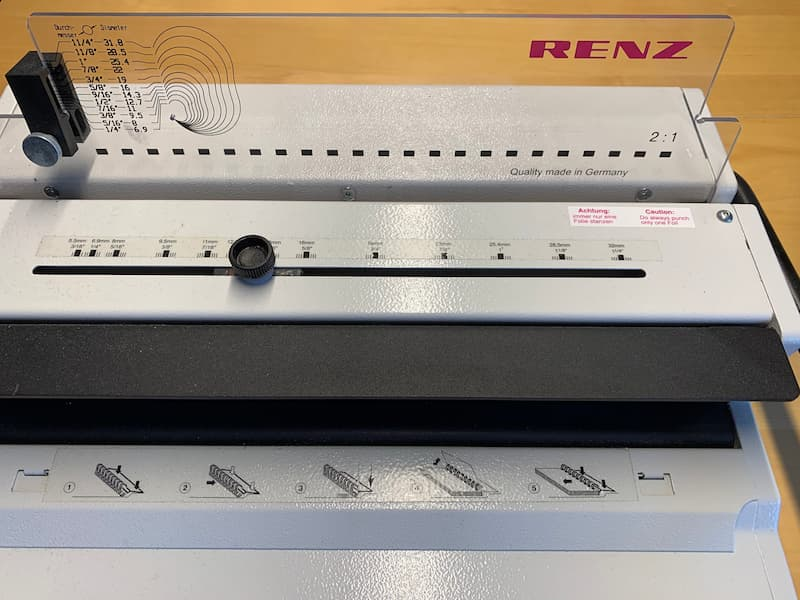

Spiralbindungen kennt jeder vom Collegeblock. Doch sie haben ein offensichtliches Problem:

Am unteren Ende der Spiralbindung läßt sich das Papier nicht voll umschlagen und es bilden sich solche Papierwuste.

Außerdem ist die Spiralbindung auch sonst ungeschickt: sie verschiebt die aufgeschlagenen linken und rechten Seiten vertikal gegeneinander, so daß die Zeilen nicht mehr auf gleicher Höhe liegen.

Eine Drahtkammbindung löst dieses Problem, benötigt aber spezialisiertes Equipment. Denn im Gegensatz zur Spiralbindung, wo man die „fertige“ Spirale in den Papierstapel eindreht, legt man den Stapel hier in den geöffneten Drahtkamm und schließt ihn dann erst. Damit er sich gleichmäßig und knickfrei schließt, verwendet man eine Presse, nämlich die Drahtkammbindemaschine. Sie stanzt auch die notwendigen kleinen Löcher in den Papierstapel.

Vor einiger Zeit habe ich mir eine solche Maschine gebraucht gekauft. Es ist ein älteres Modell, aber hier gilt wie bei so vieleM: wenn überhaupt sind Nachfolgemodelle inkrementelle Verbesserungen, keine evolutionären Sprünge. Neuware ist auch wirklich teuer, weil sie eigentlich nie privat genutzt wird, sondern stets in „richtigen“ Büros.

Von nahem sieht die Drahtkammbindemaschine so aus:

Die Skala links neben dem Anschlag in Millimeter und Inches dient dazu, die benötigte Drahtkammgröße zu ermitteln. Es gibt all diese Größen zu kaufen, ich selbst habe mir drei verschiedene Größen zugelegt.

In den Schlitz direkt vor dem Plexiglas mit der Skala dient zum Stanzen der Löcher. Der Drehknopf stellt eine Schraube an einem Schlitten fest, der den Anschlag für die Presse vorgibt. Hier muß man die verwendete Drahtkammgröße einstellen, die man zuvor an der Skala ermittelt hat. Die große dunkle Kluft darunter (und über der Kurzanleitung) ist die Stelle, wo der gesamte Papierstapel samt Drahtkamm zum Schluß eingelegt wird, um den Drahtkamm zusammenzupressen.

Das ganze Trumm wiegt knappe zwölf Kilogramm. Ernsthaft. Alles Metall. Außer dem Auffangbehälter für die Stanzreste, der ist bei meiner Maschine aus Kunststoff (bei den besseren Maschinen aber auch aus Metall).

Und so funktioniert es:

Ich habe einen Ausdruck, in diesem Fall das [MiniZinc-Tutorial](https://www.minizinc.org/downloads/doc-latest/minizinc-tute.pdf). Doppelseitig bedruckt sind das gute vierzig Blatt Papier. Mit meiner Maschine und den Drahtkammgrößen, die ich im Haus habe, komme ich bequem von wenigen Dutzend Blatt Papier bis zu etwa 160 Blatt.

Neben der Maschine benötige ich vor allem den Drahtkamm. Dieser hier hat die Größe 12mm.

Nun lege ich alles bereit. Der Papierstapel wird auf die Rückseite gedreht.

Die Anleitung der Maschine, wie man das Papier einlegt, finde ich nach wie vor verwirrend.

Am besten legt man den Papierstapel so hin wie gezeigt und führt mit einer Drehbewegung dann jeweils einen kleineren Teilstapel zur Stanzöffnung. Dabei sollte man anfangs mehrfach kontrollieren, daß die Lochstanzung auf der linken Seite (der ungeradzahligen Seitenummern!) erfolgt. Dann stanzt man mit dem hinteren, langen Hebel die Löcher ins Papier.

Der Drahtkamm kann an einer Metallklappe festgeklemmt werden, so daß er nicht wegrutscht.

Der gerade gestanzte Teilstapel wird sinnvollerweise gleich in den Drahtkamm eingefädelt.

Dies wiederholt man nun so lange, bis das Papier vollständig gestanzt und eingefädelt ist.

Kontrollfrage: Welche Seite ist ganz oben und wo ist der Drahtkamm?

Antwort: Die Titelseite schaut einen oben an, und der Drahtkamm ist auf der linken Seite der Titelseite.

Wenn dem nicht so sein sollte, dann hilft nur neu ausdrucken und binden.

Ebenso stanzt man nun die Deckfolie und fädelt sie über er Titelseite ein. Und dann den Rückenkarton, und zwar mit der farbigen Außenseite nach unten, so daß die weiße Innenseite des Rückenkartons nun oben auf dem Stapel zu sehen ist.

Nun kann man den gesamten eingefädelten Stapel aus der Metallklemme ziehen und in den großen Einlaß einlegen (unter der schwarzen Lippe).

Mit dem kürzeren, vorderen Hebel schließt man nun den Drahtkamm. Er sieht anschließend so aus:

Man sieht, daß ich die Stellschraube etwas zu weit links eingestellt hatte, der Drahtkamm ist etwas zu weit geschlossen. Das macht in dem Maße noch nichts, aber man muß öfter mal ein wenig mit der Schraube spielen.

Nun klappt man einfach den Rückenkarton um den ganzen Drahtkamm herum nach vorne, so daß diese Verschlußstelle innen vor dem Rückenkarton verschwindet und nicht gleich ins Auge sticht.

Und fertig ist der drahtkammgebundene Ausdruck!

