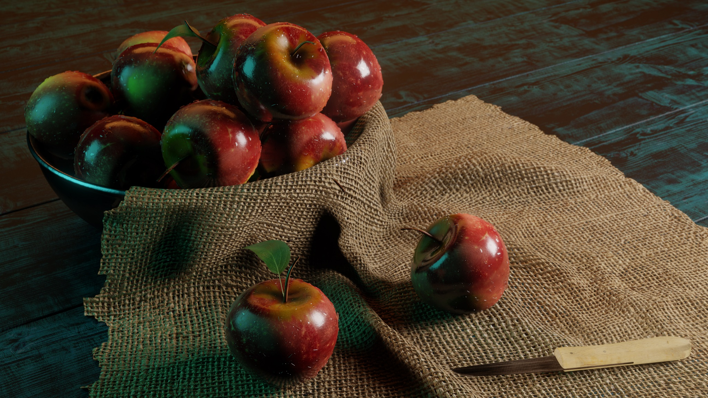
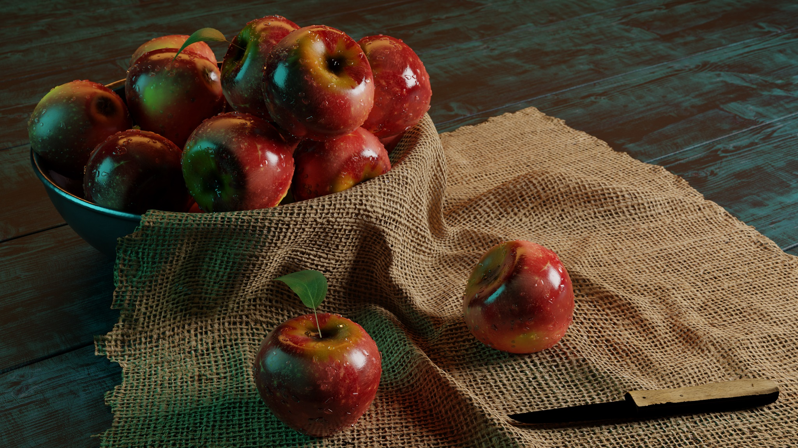

Das Wochenende ist da, Corona verhindert viele Freizeitaktivitäten, da lerne ich doch einfach mal was neues.

Blender ist ein 3D-Grafikprogramm mit interessanter Geschichte: als kommerzielle Software entwickelt, machte der Hauptentwickler nach Untergang seiner Firma der Community ein Angebot: „bekommt 100000 Euro zusammen und ich gebe den Code als Freie Software heraus“.

Das Crowdfunding war erfolgreich, der Hauptentwickler Ton Rosendaal hat das Projekt auch nicht verlassen, wie man annehmen könnte, und es fand sich eine Schar von Benutzern und auch von Entwicklern.

Heute ist Blender eines der Vorzeige-Open-Source-Projekte überhaupt, zusammen mit PostgreSQL: fantastische Software, die stabil ist, ständig neue Features dazubekommt, die Bugdichte gering hält, und solide finanziert ist. Und eine angenehme und professionelle Community hat.

Nun bin ich ja nicht so künstlerisch veranlagt. Also so gar nicht. Schon 2D-Grafikprogramme machen mir Schwierigkeiten. Und Blender ist dann nochmal eine ganz andere Hausnummer.

Aus Büchern lernen klappt meiner Erfahrung nach bei solchen grafiklastigen Themen nicht. Schauen wir eben auf YouTube nach Videos. Und da gibt es Unmengen an Tutorials.

Nun sind kostenlose Tutorials meistens von genau der Qualität, die man von „für umme“ erwarten kann: oft ein hochmotivierter Lehrer, aber das Tutorial hakelt an jeder Ecke, wenn man es nachzuvollziehen versucht, und am Ende bricht man dann entnervt ab.

Für Blender gibt es tatsächlich mehrere gute Optionen:

Der Klassiker ist das [Donut-Tutorial](https://www.youtube.com/watch?v=TPrnSACiTJ4&list=PLjEaoINr3zgEq0u2MzVgAaHEBt--xLB6U). Mich holt das aber aus irgendeinem Grund nicht ab. Grant Abbitt hat ein recht kurzes [Tutorial](https://www.youtube.com/watch?v=7MRonzqYJgw&list=PLn3ukorJv4vs_eSJUQPxBRaDS8PrVmIri), das aber sehr verständlich zeigt, wie man eine einfache Szene aufbauen und rendern kann. Das habe ich mir zweimal komplett angeguckt, aber ohne es konkret am Programm nachzuvollziehen. Das hatte ich eigentlich vor, nun anzugehen.

Aber dann fand ich das [Tutorial](https://www.youtube.com/playlist?list=PL3UWN2F2M2C8-zUjbFlbgtWPQa0NXBsp0) von Zach Reinhardt. Viel umfangreicher (Cloth-Simulation! Generierte Materialien!) und dazu eine viel schönere und stimulierendere Szene. Gesagt getan!

Nach eineinhalb Tagen (mit vielen Pausen) kann ich sagen: es hat sich gelohnt! Spaß gemacht hat es auch.

Probleme gab es auf dem Weg auch einige, aber keine, die ich nicht beheben oder umschiffen konnte.

Wir modellieren einen Korb mit Äpfeln, davor zwei Apfelhälften und ein Messer. Alles texturiert, beleuchtet (3-Punkt-Beleuchtung) und mit viel Liebe zum Detail.

Mein Ergebnis, daß im Beitragsbild oben zu bestaunen ist, kommt bei weitem nicht an die Vorlage, die Zach im Tutorial erstellt, heran. Aber für ein Wochenende, von Null auf Obstkorb, finde ich das schon sehr anständig.

Natürlich könnte ich das jetzt nicht, ohne das Video zu gucken, nochmal nachvollziehen. Aber Teile davon schon. Und manche Dinge sind schon fast im Muskelgedächtnis. „g x“ zum Verschieben entlang der x-Achse, „Shift-d“ zum duplizieren. Ich kann jedenfalls mehr Blender als zuvor.

Schwierigkeiten auf dem Weg waren vor allem folgende:

* Der Kurs ist für Blender 2.8 gemacht, das ist zwar bereits mit dem komplett umgestalteten User-Interface, aber ich habe gleich das aktuelle Blender 2.9 verwendet. Eine Einstellung ist ersatzlos weggefallen, einige andere sind ganz woanders hingewandert. Zum Glück findet man in den Kommentaren darunter in der Regel die Lösung, wenn auch nicht unbedingt weit oben, da muß man sich schon durchkämpfen.

* Der Kurs ist komplett kostenlos, und daher kann man keine Ansprüche an den Autor stellen. Und die Videos neu für Blender 2.9 aufzunehmen, wäre kaum vertretbarer Aufwand. Aber wenn er es den Zuschauern etwas einfacher machen wollte: eine textuelle Zusammenstellung der relevanten Änderungen direkt in der Videobeschreibung (das wären jeweils so ein bis zwei Sätze) würde dem Zuschauer das ganze sehr erleichtern.

* Beim Texture-Painting sah es so aus, als ob nichts passieren würde. Tatsächlich wurde auf der Rückseite gemalt (wo ich es nicht sehen konnte). Das lag an falschen Normalen-Vektoren (klar, wenn die negativ sind, ist alles gespiegelt), aber da habe ich in den Kommentare lange, lange suchen müssen, bis ich mitbekam, was passiert und wie man es behebt. Ich weiß auch leider gar nicht, wie ich das Problem überhaupt verursacht habe.

* Mein Apfel sah gut aus, hat aber offenbar in der Geometrie eine komische Stelle. Beim Zerteilen in zwei Hälften waren es nicht halbkugelartige Gebilde, sondern es war bei beiden Hälften am Rand nochmal eine Stelle ausgefressen. Damit habe ich keine ordentliche Schnittebene eingefügt bekommen.

* Ich habe noch versucht, die Geometrie zu verbessern, indem ich Punkte verschoben habe, aber es wurde nur immer schlimmer. Da fehlte mir klar das Wissen, das Problem zu beheben, und neu anfangen mochte ich nicht, weil das Modellieren des Apfels schon einige Zeit her war, und ich dann sehr viele folgende Schritte hätte erneut durchführen müssen. Ich habe deshalb die Apfelhälften schweren Herzens weggelassen.

* Rendern mit Eevee stürzte bei mir zunächst ab, ich habe dann GPU-Rendern abgeschaltet und nur auf der CPU gerendert. Ja, das dauert.

* Rendern mit Cycles dauerte bei mir 30 Minuten. Mir war gar nicht klar, daß mein Rechner so schwach ist. Hier konnte ich GPU-Rendering ohne Absturz dazunehmen, aber das hat die Zeiten nur marginal verbessert. Meine GeForce GTX 1050 war damals mal Mittelklasse, heute ist sie wohl nichts mehr. Ich habe allerdings auch keine Vorstellung, wie viel sie beitragen können müßte, vielleicht stimmt ja auch nur eine Einstellung nicht.

* Beim Cycles-Rendern fiel mir auf, daß da ein Apfelstiel durch das Tuch durchgesteckt ist. Zunächst dachte ich, das sei ja eine ganz nette Sache, das könne ja auch real passieren, bis mir auffiel, daß der Stiel, um zum Tuch zu kommen, erstmal durch die Metallschale tunneln müßte. Ich hab den Stiel dann gelöscht, aber im Eevee-Render sieht man ihn noch.

  

* Nach den Apfelhälften das größte Problem: irgendwas stimmt mit dem Licht an meinem Messer nicht. Die Klinge ist schwarz, ebenso ist die Rückseite des Messer viel zu dunkel.

    
  
  Selbst nachdem ich nochmal ein Licht direkt darüber gepackt habe, sehe ich kein Licht auf der Klinge reflektieren oder wenigstens die silbrig-metallische Textur. Auch Rotieren des Messers half nicht.
  
  Ich weiß überhaupt nicht, was da los ist, und damit weiß ich auch nicht, wonach ich googeln sollte.
  
  Es sieht jedenfalls doof aus, und deswegen ist der Eevee-Render „mein“ finales Ergebnis.
  
Insgesamt ein lohnendes Wochenende. Und ich möchte weitermachen. Zach Reinhardt hat auch noch einen [bezahlten Kurs](https://academy.cgboost.com/p/blender-2-8-launch-pad) mit geradezu Lastwagenladungen voll Videos. Inklusive Animation und vielem mehr, was im kostenlosen Kurs nicht vorkam. Das steht nach einer Pause dann als nächstes auf dem Programm.