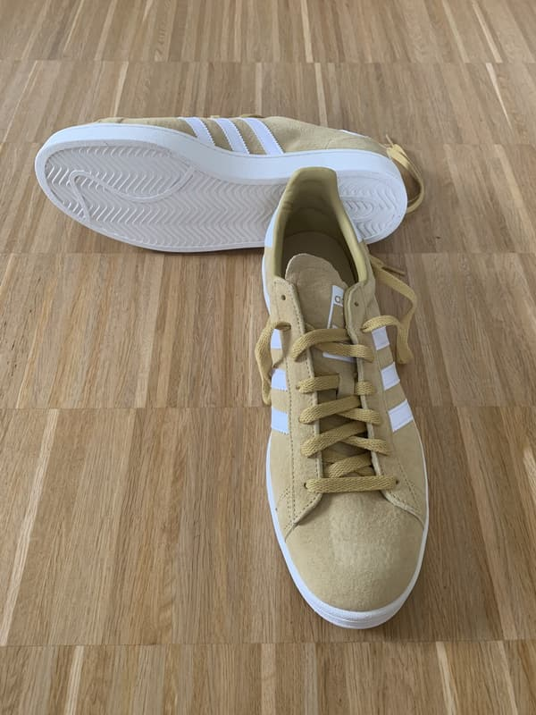

Der klassische Sneaker oder Turnschuh mit Gummisohle klingt zunächst nach einer guten Wahl für Straßentänze wie Lindy Hop. Er ist nicht so formell, es gibt ihn in vielen Designs, er ist sportlich, man kann sich gut darin bewegen.

Leider ist die Gummisohle auch unheimlich stumpf.

Und damit gilt wiederum: jede Drehung zieht direkt ins Kniegelenk. Tut Euch das bitte nicht an. Für die allererste Anfängerstunde oder einen Taster, meinetwegen. Aber bereits im Anfängerkurs solltet Ihr besseres Schuhwerk finden. Nicht unbedingt teureres. Bessser geeignetes.

Ebenso unpraktisch ist, daß Turnschuhe meistens ein stark ausgeprägtes Profil besitzen, wenn man nicht gerade Tennisschuhe nimmt, und selbst die sind auf Grip ausgelegt. Dieses Profil wird man realistisch nicht so weit herunterlaufen, daß man eine Chance hat, daß die Schuhe rutschig genug zum Tanzen werden. Und dann bleibt noch immer das Gummimaterial, das immer stumpf sein wird.

Außerdem hinterlassen Gummisohlen gerne Streifen auf dem Boden. Ihr kennt das vom Sportunterricht, wo spezielle, oft farblose, Gummimischungen für den Schulsport in der Halle verpflichtend waren.

Dasselbe gilt beim Tanzen: die Veranstalter geben sich Mühe, einen guten Tanzboden zu finden. Und das bedeutet oft: Parkett. Wenn Ihr den durch Gummiabrieb verschandelt, dann bekommen die Veranstalter ihn zwar hinterher wahrscheinlich wieder entfernt, aber es ist ein Haufen Arbeit, der nicht sein muß. Und womit Ihr Euch unbeliebt macht.

Und wenn Ihr in einer Pause zum Abkühlen mal kurz vor die Tür tretet, besteht eine echte Gefahr, daß sich kleine Steinchen in die Gummisohle eindrücken und Ihr anschließend den Holzboden beschädigt. Auch nicht gut.

Zudem kommt noch dazu, daß die Sohle beim klassischen Turnschuh oft sehr dick ist, sie soll ja Joggingbelastungen und permanent schnelle Richtungswechsel (beim Tennis) abkönnen.

Fürs Tanzen bietet es sich aber an, nicht so „weit über dem Boden zu schweben“ und ein eher schwammiges Gefühl, sondern eine direktere Rückmeldung und eine feinere Kontrolle über den Tanzschritt zu haben.

Was ist mit Tanzsneakern, die im Tanzsportladen angeboten werden? Für diese gilt das obengesagte nicht. Die Sohle ist kein klassisches Gummi, auch wenn sie teilwesie so bezeichnet wird, sondern entweder aus Kunststoff, oder eine spezielle Gummimischung, bei der die technischen und gesundheitlichen Bedürfnisse der Tänzer beachtet sind.

Ob sie modisch auf eine Swingtanzfläche passen, könnt Ihr dann selbst entscheiden, ich finde sie meistens eher unschön.