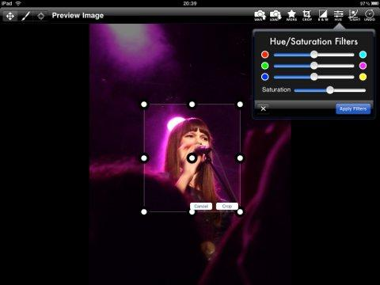
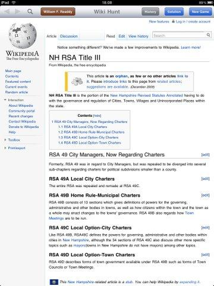

In den letzten Wochen, in denen ich mein iPad benutzt habe, haben sich
einige Apps als besonders lohnenswert herausgestellt. Ich benutze sie
praktisch ständig.

Andere Apps sind ebenfalls interessant und haben einen festen Platz auf
meinem Gerät gefunden, kommen aber nur ab und an zur Nutzung.

Meine iTunes-Sammlung umfaßt derzeit genau 150 heruntergeladene und
ausprobierte Apps, wovon – wie zu erwarten war – der weit
überwiegende Teil als nutzlos und unbrauchbar wieder vom iPad verbannt
wurde.

Einen guten Teil der Überlebenden stelle ich im folgenden vor:

## Erster Teil. In dem wir ein Fünfhundert-Euro-Gerät nutzen, um Zehn-Euro-Papierstöße zu ersetzen.

### iBooks

Seit kurzem ist endlich
[iBooks](http://itunes.apple.com/us/app/ibooks/id364709193) zu haben.
Dabei handelt es sich um Apples eigenen eBook-Reader fürs ePub-Format.
Macht viel mehr her als beispielsweise
[**BookShelf**](http://itunes.apple.com/de/app/bookshelf/id284934036).

Das Regal in iBooks

Winnie The Pooh in iBooks

iBooks im Querformat

iBooks im Hochformat

Font-Auswahl in iBooks

### Goodreader

Von Haus aus kann das iPad PDFs nur im Mailprogramm oder im
Webbrowser anzeigen, und das auch nur mit sehr rudimentären Funktionen.
Will man PDFs lokal aufs iPad laden und lesen, dann sollte man sich unbedingt
[Goodreader](http://itunes.apple.com/de/app/goodreader-for-ipad/id363448914)
leisten. Die App ist konkurrenzlos günstig und leistet alles, was man
zum Lesen braucht. Wer allerdings auch Notizen im PDF machen
will, der werfe einen Blick auf **iAnnotate**, das kostet allerdings
auch wesentlich mehr.

Goodreader

PDF in Goodreader geöffnet

### Instapaper Pro

[Instapaper](http://itunes.apple.com/de/app/instapaper-pro/id288545208)
ist eigentlich eine [Webanwendung](http://www.instapaper.com/), in der
man interessante Webartikel speichert und später lesen kann. Noch dazu
in einem sehr angenehmen und augenfreundlichen Layout, wozu auch die
Schriften beitragen (per Default Hoefler Text). Instapaper ist
überraschend gut darin, Seitenspalten, Navigationsleisten und ähnliches
auszublenden, inhaltlich wichtige Bilder aber bestehen zu lassen.

Für Instapaper gibt es auch eine gleichnamige App. Und die lohnt sich,
denn diese App lädt die Artikel lokal auf das iPad. Das hat mir schon
mehrere U-Bahn- und S-Bahn-Fahrten wie im Flug vergehen lassen.

Und viele iPad-Apps unterstützen den direkten Export zu Instapaper:
Twittelator (ich glaube auch Twitterific) und NewsRack beispielsweise.

Artikelübersicht in Instapaper

Artikel in Instapaper

## Zweiter Teil. In dem wir den neuesten Klatsch und Tratsch erfahren.

### Twittelator

Twitter-Apps gibt es einige, die offizielle von Twitter selbst ist
aber (noch) nicht fürs iPad angepaßt. Ich habe eine ganze Reihe von
Twitter-Apps durchprobiert.
[**TweetDeck**](http://itunes.apple.com/de/app/tweetdeck-for-iphone/id318518757)
verschwendet unglaublich viel vom Bildschirm und sortiert Tweets sehr
seltsam (ich habe kein System dahinter erkennen können). [**Tweet
Flow**](http://itunes.apple.com/de/app/tweet-flow/id352883522) ist ganz
nett, aber auf die Dauer zu funktionsarm.
[**Twitterific**](http://itunes.apple.com/de/app/twitterrific/id284540316)
ist okay.
[**HelTweetica**](http://itunes.apple.com/de/app/heltweetica-for-ipad/id367642664)
ist unter den kostenlosen meine Empfehlung.

[Twittelator](http://itunes.apple.com/de/app/twittelator/id284698706)
ist aber mit weitem Abstand derzeit die beste Wahl, wenn man bereit ist,
ein paar Euro auszugeben.

Twittelator

Erwähnungen in Twittelator

Tweet verfassen

### NewsRack

Kostenlose RSS-Feedreader gibt es einige. Viele davon können
gar nicht wirklich RSS oder Atom, sondern synchronisieren
einfach mit dem Google Reader. Was für mich nicht in Frage kam. Mit den
verbleibenden kostenlosen Apps bin ich nicht so recht warm geworden,
daher habe ich auch hier ein paar Euro liegengelassen. Und
[NewsRack](http://itunes.apple.com/de/app/newsrack/id288815275) ist es
wert.

Feedübersicht in NewsRack

Artikel in NewsRack

### NewsTap

Nein, das Usenet ist tatsächlich noch nicht tot. Auch wenn es
mittlerweile schon etwas streng riecht. Und die Usenet-Keimzelle [vom
Netz gegangen
ist](http://www.heise.de/ct/meldung/Usenet-Keimzelle-geht-vom-Netz-1004201.html).

Mit [NewsTap](http://itunes.apple.com/de/app/newstap-usenet-newsreader/id292410356) gibt es tatsächlich einen richtig guten Newsreader dafür. Für meinen Geschmack verlangt er mir bei jeder Aktion immer einen Bestätigungsklick zu viel ab, aber dennoch macht es Spaß, damit zu posten.

NewsTap

Threadansicht in NewsTap

## Dritter Teil. In dem unserem löchrigen Gedächtnis auf die Sprünge geholfen wird.

### EasyTask

Bei
[EasyTask](http://itunes.apple.com/de/app/easytask-manager/id284944287)
handelt es sich um eine Aufgabenverwaltung, die voll auf [Getting Things
Done](http://de.wikipedia.org/wiki/Getting_Things_Done) getrimmt worden
ist.

EasyTask

### Simplenote

[SimpleNote](http://itunes.apple.com/de/app/simplenote/id289429962) ist
eine ganz einfache Notizen-App. Eine Alternative zur vorinstallierten
App, wenn man gelbes Juristenpapier nicht mag.

Simplenote

## Vierter Teil. In dem wir uns an schönen Dingen erfreuen.

### Brushes

[Brushes](http://itunes.apple.com/de/app/brushes/id288230264) ist eine
hochgelobtes Mal-App. Mit der iPhone-Version davon wurde sogar bereits
ein Coverbild des New Yorker gestaltet. Alternative für Künstler, die
ein etwas weniger intuitives User-Interface akzeptieren können, wenn sie
nur mehr Möglichkeiten und Werkzeuge bekommen: [**SketchBook
Pro**](http://itunes.apple.com/de/app/sketchbook-pro/id364253478) von
Autodesk.

Galerie in Brushes

Brushes

Pinsel in Brushes

### TypeDrawing

Mit [TypeDrawing](http://itunes.apple.com/de/app/type-drawing/id314072879)
kann man Kunstwerke aus Schriftzügen erschaffen. Man. Leider nicht ich.
Wie bei Brushes schon. Es gibt Leute, die beeindruckende Bilder ins Netz
gestellt haben.

TypeDrawing

### Filterstorm

[Filterstorm](http://itunes.apple.com/de/app/filterstorm/id363449020)
ist eine App zur Foto-Bearbeitung. Auch wenn das iPad keine Kamera
besitzt, so gibt es doch eine ganze Menge an Foto- und
Bildbearbeitungs-Apps.

Filterstorm

### Cool Wallpapers

[Diese App](http://itunes.apple.com/de/app/cool-wallpapers-hintergrunde/id342643402) zeigt einem Unmengen von Bildern, die man dann herunterladen und als Hintergrundbild für sein iPad einrichten kann. Die Qualität der Bilder
ist stark schwankend.

Wallpapers

## Fünfter Teil. In dem wir uns unterhalten.

### Guardian Eyewitness

[Der Guardian](http://itunes.apple.com/de/app/the-guardian-eyewitness/id363993651) bringt täglich ein faszinierendes Foto von einem professionellen
Fotografen. Den pro tip kann man getrost den Hasen geben, aber die Bilder selbst sind erstklassig.

Guardian Eyewitness

### Marvel Comics

Die [Marvel-App](http://itunes.apple.com/de/app/marvel-comics/id350027738)
wurde zu recht gehypet. Auch wer mit Comics nichts anfangen kann, sollte
sich die App installieren und mal durch ein oder zwei der kostenlosen
Comics durchblättern.

Entweder im klassischen Stil, mit der ganzen Seite sichtbar.

Ganze Seite in Marvel

Oder im Zoom-Stil, bei dem das Auge des Lesers von Panel zu Panel
geführt wird (und teilweise auch innerhalb eines Panels).

Gezoomt in Marvel

Weitergezoomt in Marvel

### Air Video

[Air Video](http://itunes.apple.com/de/app/air-video/id306550020)
erlaubt es, Videos vom PC (oder Mac) an das iPad zu streamen. Dazu muß
man ein Serverprogramm auf dem PC installieren, das leider etwas
instabil zu sein scheint. Mir bricht die Verbindung immer wieder mal ab.
Nicht im Video (soweit ich das bislang beobachtet habe), sondern eher
nach dem Ende eines Videos.

Und der eigentliche Clou dabei: Videos, die nicht in einem für das iPad
passenden Format vorliegen, werden auf Wunsch entweder vorab oder on the
fly konvertiert.

Preview in Air Video

Air Video

## Sechster Teil. Fakten, Fakten, Fakten!

### Wolfram Alpha

Und wieder eine App zu einer Webseite. [Wolfram Alpha](http://itunes.apple.com/de/app/wolframalpha) ist die mit viel Vorschußlorbeeren gestartete Suchmaschine ganz neuen Musters, die weniger Suchmaschine, als vielmehr Wissensspeicher sein möchte. Das klappt teilweise recht gut, zu weiten Teilen auch eher weniger, aber das, was sie weiß, ist sehr informativ und einwandfrei präsentiert und visualisiert.

Die dazugehörige App erlaubt es, Wolfram Alpha einfacher und fixer zu
benutzen.

Wolfram Alpha

Wolfram Alpha

### The Weather Channel

Eine App für Wetterberichte und -Vorhersagen kommt von [The Weather
Channel](http://itunes.apple.com/de/app/the-weather-channel/id295646461).
Wetterkarten, Wettervorhersagen-Videos des eigenen Senders, Unwetterwarnungen, alles wird schick und übersichtlich präsentiert.

Hauptmenü von TWC

Wettervorhersage in TWC

### WeatherBug

[WeatherBug](http://itunes.apple.com/de/app/weatherbug/id281940292) legt
stärkeres Augenmerk auf die Karte und wirkt in der Präsentation kleinteiliger, weniger plakativ.

WeatherBug

### IMDb

Und noch eine App aus der Reihe kann auch nicht mehr als die Webseite,
die dahintersteht, macht aber dennoch Spaß: Die [Internet Movie Data
Base](http://itunes.apple.com/de/app/imdb-filme-tv/id342792525).

IMDb

### Dictionary.com

Die meiner Ansicht nach beste Wörterbuch-App für Deutsch–Englisch ist
[Dictionary.com](http://itunes.apple.com/de/app/dictionary-com-dictionary/id308750436). Mit Sprachausgabe, wenn man gerade nicht sicher ist, wie ein Wort ausgesprochen wird. Und ausgesprochen flinker Suche.

Dictionary

### Gesetze im Internet

So ziemlich alles an deutschem Bundesrecht ist in [Gesetze im
Internet](http://itunes.apple.com/de/app/gesetze-im-internet/id351653840)
zu finden.

Gesetze

Gesetze

## Siebter Teil. In dem wir das Gehirn stürmen.

### Stickyboard

Mit [Stickyboard](http://itunes.apple.com/de/app/stickyboard/id366620702)
kann man Gedankenfetzen sammeln und als virtuelle Notiz-Klebe-Zettelchen
auf der Arbeitsfläche verteilen.

Stickyboard

### popplet lite

[popplet lite](http://itunes.apple.com/de/app/popplet-lite/id364738549)
ist eine Mindmapping-App. Ich habe Mindmapping in der Schule immer
gehaßt wie die Pest, aber seit ich aus der Schule raus bin, male ich
tatsächlich ab und an solche Bobbel. Nur bislang eben auf Papier.

### Adobe Ideas

[Adobe Ideas](http://itunes.apple.com/de/app/adobe-ideas-1-0-for-iphone/id365441166) ist eine Vektorgrafik-App, die nach Illustrator exportieren kann.
Gedacht ist das wohl für rasche Notizen in völlig freier Form.

Adobe Ideas

## Achter Teil. In dem der Magen knurrt.

### Epicurious

[Epicurious](http://itunes.apple.com/de/app/epicurious-recipes-shopping/id312101965) ist wunderbar, um darin nach Rezepten zu stöbern. Essen, Cocktails, Kuchen, was auch immer. Mit amerikanischen Maßen (cup) sollte man
natürlich zurechtkommen.

Epicurious

### Calorie Counter

Kalorienzählen macht keinen Spaß. Daran ändert auch der [Calorie
Counter](http://itunes.apple.com/us/app/calorie-counter-by-fatsecret/id347184248) nichts. Es macht aber sehr viel Spaß, einfach mal die Angebote der Fast-Food-Ketten dort durchzugehen.

Hauptmenü von FatSecret

FatSecret: BigMäc

## Neunter Teil. Nach dem Brot nun die Spiele.

### Flight Control

[Flight Control](http://itunes.apple.com/de/app/flight-control/id306220440) ist der Pionier dieses Genres der Touch-Spiele gewesen: Der Spieler malt mit
dem Finger Flugbahnen auf den Touchscreen, so daß die Flugzeuge nicht
kollidieren. Das ist gar nicht so einfach, denn der Platz ist begrenzt
und die verschiedenen Flugzeugmodelle sind unterschiedlich schnell.

Flight Control

Zuweilen kommt ein Flugzeug, das der Spieler nicht steuern kann, sondern
das stur seine Bahn fliegt.

Flight Control: Outback

Bei gefährlichen Annäherungen wird der Spieler gewarnt, so daß er noch
einen Moment Zeit hat zu reagieren.

Flight Control: Radar

### Harbor Master

Selbes Spielprinzip, aber mit Schiffen: [Harbor Master](http://itunes.apple.com/de/app/harbor-master/id313014213).

Harbor Master

### Strategery

[Strategery](http://itunes.apple.com/de/app/strategery/id298908505) ist
eine Art von Risiko-Klon, aber alles ganz abstrakt dargestellt. Man muß
mit seinen Armeen angrenzende Gebiete überfallen. Der Kampf wird
ausgewürfelt. Am Ende seines Zuges bekommt jeder Spieler nocheinmal so
viele Armeen, wie er sein größtest zusammenhängendes Gebiet groß ist.
Ziel: Die Weltherrschaft.

Das Spiel eignet sich sehr gut für mal eben schnell zwischendurch, ein
Match dauert nicht lange. Und man kann tausend Einstellungen zum
Spielprinzip vornehmen. Multiplayer wird auch unterstützt, sowohl Pass
and Play als auch online.

Strategery

Strategery

### Friendsheep

In
[Friendsheep](http://itunes.apple.com/de/app/friendsheep-the-insanely-popular/id370838816) spielen mehrere Spieler auf demselben iPad gegeneinander. Aus der Wolke in der Mitte kommen Schafe hervor und die Spieler müssen diese Schafe in
ihren Bereich ziehen. Nur bleiben die Schafe nicht brav da, sondern laufen direkt wieder weg. Für hektisches Gewusel ist also gesorgt. Natürlich kann man auch den Gegenspielern Schafe klauen.

Friendsheep

### Air Hockey

In echt macht [Air Hockey](http://itunes.apple.com/de/app/air-hockey/id286106725) noch viel mehr Spaß, aber für ein rasches Spielchen zu zweit ist diese App auch nicht zu verachten.

Air Hockey

### Wiki Hunt

Bei [Wiki Hunt](http://itunes.apple.com/de/app/wiki-hunt-the-wikipedia-game/id357626743) bekommt man zwei zufällig ausgewählte Wikipedia-Artikel vorgelegt und muß durch Verfolgen von maximal sechs Links vom einen zum anderen kommen. Die App zählt natürlich mit.

Wiki Hunt: Start

Wiki Hunt: Ziel

Das ist unglaublich schwierig, aber zuweilen gelingt es doch. Und die
Lösung kann man sich anzeigen lassen.

Wiki Hunt: Lösung

Weitere Spielvariante: Six Clicks to Jesus.

### Demolition Master

Bei [Demolition Master](http://itunes.apple.com/de/app/demolition-master/id351128966) ist man der Sprengmeister verschiedener Lattengerüstbauten. Man muß das gesamte Gebilde durch Sprengung komplett unter die waagrechte Linie
bekommen. Teilweise gibt es auch rechts und links Schutzzonen, in die kein Teil hineinfliegen darf.

Demolition Master

Demolition Master

Demolition Master

### The Battle for Wesnoth

[The Battle for Wesnoth](http://itunes.apple.com/de/app/battle-for-wesnoth/id340691963) ist ein auf dem PC relativ bekanntes rundenbasiertes Strategiespiel mit Fantasy-Hintergrund. Also so ein bißchen Warcraft als Open-Source. Als App kostet es einen geringen Betrag.

The Battle for Wesnoth

### PaperFootball

[PaperFootball](http://itunes.apple.com/app/jirbo-paper-football/id286615177)
ist die Virtualisierung eines Pausenspiels, das normalerweise mit einem
gefalteten Papierzettel gespielt wird. Grob geht es natürlich um
American Football, der Papier-Football muß in die gegnerische Endzone
geschnippst werden.

PaperFootball

PaperFootball

Sollte das gelingen, darf man sich noch an einem Field Goal versuchen.
Diese sind aber ziemlich schwierig.

PaperFootball

PaperFootball

### Checkers Free HD

Für zwischendurch: Ein
[Dame-Spiel](http://itunes.apple.com/de/app/checkers-free-hd/id367636767).

Checkers

### XPilot

[XPilot](http://itunes.apple.com/de/app/xpilot/id322114791) ist ein
Klassiker, noch von alten Unices her. Und das gibt es tatsächlich auch
fürs iPad!

XPilot

Dabei spielt man auf Internet-Servern.

XPilot

### Plants vs. Zombies HD

[Plants vs. Zombies HD](http://itunes.apple.com/de/app/plants-vs-zombies-hd/id363282253) ist ein toller Vertreter der Tower-Defense-Spiele, allerdings hatte ich es bereits für den PC gekauft und fast durchgespielt. Da ist mir der Preis für einen Re-Run, den ich auch am PC haben kann, zu hoch. Also werde ich
es mir vermutlich nicht zulegen. Aber wer weiß.

## Zehnter Teil. In dem wir eine Wunschliste für die Zukunft schreiben.

### iWorks (Pages, Numbers und Keynote)

Den [drei](http://itunes.apple.com/de/app/keynote/id361285480)
[Office-](http://itunes.apple.com/de/app/pages/id361309726)
[Programmen](http://itunes.apple.com/de/app/numbers/id361304891) von
Apple stehe ich etwas ambivalent gegenüber. Ich weiß nicht, ob man die
haben muß. Zumal ich noch gar nicht weiß, wie man die erstellten
Präsentationen dann nutzen kann. Kann man die ausdrucken?

Ich warte hier auf alle Fälle noch ab.

### SmartGo Kifu

[SmartGo](http://itunes.apple.com/us/app/smartgo-kifu/id364854741) ist
auf dem PC eines der führenden Go-Programme. Es gibt fürs iPhone eine
Version und nun – komplett überarbeitet, mit zusätzlichen Möglichkeiten – auch fürs iPad. Das App ist vergleichsweise teuer (wenn auch sicherlich dem Gebotenen angemessen) und man liest in den entsprechenden Foren zuweilen, daß es noch sehr buggy sei.

Dieses App beobachte ich erstmal noch ein, zwei Updates lang, bevor sich
die Frage ernsthaft stellt.

### Linkinus

Ein IRC-Client. Noch so ein veraltetes Kommunikationsmedium. [Linkinus](http://itunes.apple.com/de/app/linkinus/id364899309) reizt mich sehr, allerdings glaube ich, daß das erst sinnvoll ist, wenn iPhoneOS 4 mit Multitasking da ist. Die Channel, die ich kenne, haben relativ lange Idling-Phasen. Und alle paar Minuten rein und wieder raus führt im Zweifel nur zu einem administrativ durchgesetzten Dauer-Raus.