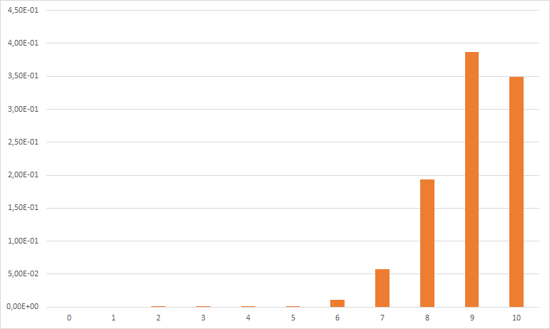

## Warum das alles?

Von uns werden häufig Schätzungen verlangt. Gerade im Projektumfeld möchte der Projektleiter gerne Aufwandsabschätzungen bekommen, die dann auch belastbar sind. Manchmal eine einfache Zahl, häufig aber auch Korridore „best case – average case – worst case“.

Dabei liegt jedoch herkömmlich meistens der Fokus auf einem dieser Werte des Korridors, und die anderen werden dann durch naive Schätzung „plus/minus 30%“ abgeleitet. Das Hauptaugenmerk dabei ist, den Ankerwert möglichst exakt zu treffen.

Diese Schätzung ist schon schwierig, doch die andere Seite wird häufig komplett vernachlässigt: mit welcher Konfidenz ist diese Schätzung versehen?

Eine Konfidenz von 100% zu verlangen ist dabei nicht sinnvoll, denn dann werden die geschätzten Korridore abstrus groß. Und da das Schätzen kein Selbstzweck ist, sondern die Schätzung weiterverwertet werden wird, beispielsweise in einem Projektplan, ist es wichtig, die Schätzungen mit einer sinnvollen Konfidenz zu versehen, die dann auch bezifferbar, konsistent und reproduzierbar ist.

Es gibt kein „Richtig“ für die anzuzielende Konfidenz, aber als ersten Faustwert kann man gut 90% nehmen. Damit liegen die meisten Schätzungen richtig, die geschätzten Intervalle müssen aber nicht extreme und seltene Ausreißer einbeziehen, wodurch sie vernünftig klein werden.

Damit ergibt sich natürlich ein offensichtliches Problem: wir alle sind schon schlecht darin, einen einzelnen Wert zu schätzen. Doch immerhin wissen wir insgeheim selbst, daß wir darin nicht gut sind. Wer kann aber schon seine Schätzungen so wählen, daß sie bei häufiger Wiederholung eine bestimmte vorgegebene Konfidenz aufweisen?

**Dazu müssen wir unsere Schätzungen kalibrieren.**

Es geht nicht darum, den Schätzwert an sich zu verbessern und zielgenauer zu machen. Es geht darum, die Schätzung an eine vorgegebene und gewünschte Konfidenz anpassen zu können.

Wenn ich in der Regel Schätzungen abgebe, die in Übereinstimmung mit dieser vorgegebenen Konfidenz liegen, dann sagt man, ich sei ein **kalibrierter Schätzer.**

Und darum geht es in diesem Artikel. Wie ermittle ich meinen aktuellen Stand der Kalibrierung und wie kann ich meine Kalibrierung verbessern?

## Übungen

### Vorbemerkungen

Sollen diese Übungen in einer Gruppe durchgeführt werden, so sind gewisse Grundregeln wichtig:

* Jeder Teilnehmer beantwortet die Fragen für sich selbst auf seinem eigenen Blatt Papier.
* Jeder Teilnehmer wertet seine Antworten selbst aus (Anleitung folgt).
* Der Moderator fragt anschließend nicht nach Ergebnissen.
* Jeder Teilnehmer nimmt seinen Zettel mit Antworten und der Auswertung mit, wenn er den Raum verläßt.
* Anschließend kann jeder Teilnehmer den Zettel schreddern, in den Papierkorb werfen oder in der Teeküche aushängen, je nach persönlichem Mitteilungsbedürfnis.

### Teil Eins: Intervalle

Es folgen zehn Fragen. Die Antwort auf jede Frage ist eine einzelne Zahl, beispielsweise eine Jahreszahl oder eine Geschwindigkeit.

Die Aufgabe lautet nun, ein Intervall „mindestens – höchstens“ beziehungsweise „frühestens – spätestens“ anzugeben. Also zwei Zahlen.

Und zwar dergestalt, daß dieses Intervall eine Konfidenz von 90% aufweist.

Das bedeutet, daß das Intervall groß genug sein sollte, so daß man sich fast sicher ist. Es sollte aber nicht so groß sein, daß man sich völlig sicher ist. Beispielsweise ist das Intervall „vom Urknall bis gerade eben“ zu eine Frage nach dem Geburtsjahr einer Person zwar insofern eine sehr gute Schätzung, als man sicherlich richtig liegt, aber diese Schätzung ist auch sinn- und wertlos.

Wenn man diese Frage-Antwort-Spiele ganz häufig wiederholt, sollten neunzig Prozent der korrekten Lösungen im geschätzten Intervall liegen und **zehn Prozent außerhalb.**

Dabei ist unerheblich, wie weit außerhalb oder innerhalb des Intervalls die Lösung liegt. Drin ist drin, draußen ist draußen, es gibt kein „aber es stimmte ja fast“.

Hier nun die Fragen:

* Wieviel liegt ein Learjet 75 in Kilogramm?
* Welchen Radius in Meter (Erdmittelpunkt – Satellit) hat der geostationäre Orbit?
* Wieviele Meter unter dem Meeresspiegel lag das havarierte russische U-Boot Kursk?
* Wieviele Millimeter ist ein Zehn-Euro-Schein lang?
* In welchem Jahr stand der DAX erstmal über 5000 Punkte?
* Ab wieviel Grad Celsius verdampft Helium?
* In welchem Jahr wurde die deutschsprachige Sesamstraße erstmal gesendet?
* Wieviele Pokémons gibt es?
* In welchem Jahr wurde Macbeth uraufgeführt?
* Wie hoch war der Listenpreis des Golf 1 in DM?

## Teil Zwei: Konfidenz

Die Übung besteht aus zehn Sachaussagen. Jede ist entweder wahr oder falsch.

Sie antworten diesmal also nicht mit einem Intervall, sondern einfach mit „wahr“ oder „falsch“.

Und außerdem mit Ihrer persönlichen Konfidenz: wie sicher sind Sie sich bei Ihrer Antwort?

Als Konfidenz können 50%, 60%, 70%, 80%, 90% und 100% angegeben werden. Bitte keine 82,7%. Und nicht kleiner als 50%. Wenn Sie geneigt sind, 40% anzugeben, drehen Sie Ihre Antwort um und geben 60% an.

Die Aussagen:

* Ein Eurostück ist schwerer als eine CD.
* Buzz Aldrin war der zweite Mann auf dem Mond.
* Der Zweite Weltkrieg liegt näher am heutigen Tag als am Amerikanischen Bürgerkrieg.
* Manche Schildkröten werden 200 Jahre alt.
* Es gibt in Deutschland mehr als 20000 Kilometer Autobahnen.
* Es gab mehr als 20 deutsche Physiknobelpreisträger.
* Das Bruttoinlandsprodukt von Kalifornien ist größer als das von Italien.
* Die Entfernung (Luftlinie) zwischen Wladiwostok und Mumbai ist größer als die zwischen Wuppertal und Moskau.
* Hannover hat mehr Stadtteile als Stuttgart.
* Ein Eishockey-Puck paßt in ein Golfloch.

## Auswertung

Kommen wir nun zur Auswertung. Zunächst für Teil Eins:

|Frage|Antwort|
|---|---:|
|Wieviel liegt ein Learjet 75 in Kilogramm?|6168|
|Welchen Radius in Meter (Erdmittelpunkt – Satellit) hat der geostationäre Orbit?|42157|
|Wieviele Meter unter dem Meeresspiegel lag das havarierte russische U-Boot Kursk?|108|
|Wieviele Millimeter ist ein Zehn-Euro-Schein lang?|127|
|In welchem Jahr stand der DAX erstmal über 5000 Punkte?|1998|
|Ab wieviel Grad Celsius verdampft Helium?|-269|
|In welchem Jahr wurde die deutschsprachige Sesamstraße erstmal gesendet?|1973|
|Wieviele Pokémons gibt es?|890|
|In welchem Jahr wurde Macbeth uraufgeführt?|1606|
|Wie hoch war der Listenpreis des Golf 1 in DM?|7995|

Markieren Sie die Werte, die innerhalb Ihrer Intervalle liegen. Wenn sie bereits ein gut kalibrierter Schätzer sind sollten es etwa neun von diesen zehn sein. Natürlich ist das mit einer statistischen Schwankung versehen, [dazu später nochmal](#statistische-signifikanz).

Nun zu Teil Zwei:

|Frage|Antwort|
|---|---|
|Ein Eurostück ist schwerer als eine CD.|falsch (7,5 Gramm vs. 15 Gramm)|
|Buzz Aldrin war der zweite Mann auf dem Mond.|wahr|
|Der Zweite Weltkrieg liegt näher am heutigen Tag als am Amerikanischen Bürgerkrieg.|falsch (75 Jahre vs. 74 Jahre)|
|Manche Schildkröten werden 200 Jahre alt.|falsch (über 176 ist die höchste Schätzung)|
|Es gibt in Deutschland mehr als 20000 Kilometer Autobahnen.|falsch (>13000 Kilometer)|
|Es gab mehr als 20 deutsche Physiknobelpreisträger.|wahr (23,5 – Mehrstaatlichkeit wurde halb–halb gewertet)|
|Das Bruttoinlandsprodukt von Kalifornien ist größer als das von Italien.|wahr (2,6 Billionen USD vs. 2 Billionen USD)|
|Die Entfernung (Luftlinie) zwischen Wladiwostok und Mumbai ist größer als die zwischen Wuppertal und Moskau.|wahr (6078 Kilometer vs. 2056 Kilometer)|
|Hannover hat mehr Stadtteile als Stuttgart.|falsch (51 vs. 152)|
|Ein Eishockey-Puck paßt in ein Golfloch.|wahr (3 Zoll vs. 4,25 Zoll)|

Markieren Sie die Aussagen, deren Wahrheitsgehalt Sie korrekt bewertet haben.

Nun rechen Sie die Konfidenzen in von Prozenten in Zahlenwerte um (aus 70% wird 0,7) und addieren Sie diese zehn Zahlenwerte auf. So viele richtige Schätzungen erwarten Sie.

Ein Beispiel:

|Aussage|Ihre Antwort|Antwort richtig?|Konfidenz in %| Konfidenz (Zahl)|
|-------|------------|:--------------:|-------------:|----------------:|
|falsch|wahr|ja|50%|0,5|
|wahr|wahr|ja|70%|0,7|
|falsch|wahr|nein|100%|1,0|
|falsch|falsch|ja|90%|0,9|
|falsch|falsch|ja|90%|0,9|
|wahr|falsch|nein|50%|0,5|
|wahr|falsch|nein|80%|0,8|
|wahr|falsch|nein|80%|0,8|
|falsch|falsch|ja|100%|1,0|
|wahr|falsch|nein|60%|0,6|

Also 5 richtige Antworten und eine Summer der Konfidenzen von 7,7.

In diesem Beispiel hätten Sie also mit Ihrer Antwort eigentlich etwa 8 mal richtig liegen sollen, haben aber nur 5 Treffer gehabt.

Keine Sorge, solche Ergebnisse (und schlechter) sind normal.

## Einschränkungen und Einwände

### Statistische Signifikanz

Natürlich war das nur ein einzelner Versuch mit zehn Fragen, also eine sehr kleine Stichprobe. „ich hatte sieben Antworten im Intervall, das ist doch innerhalb der statistischen Schwankung“ mag Ihnen auf der Zunge liegen. Doch ist dem so?

Für den ersten Teil ist eine Abschätzung recht einfach. Wenn wir eine Bernoulliverteilung annehmen (und das ist vernünftig, auch wenn es hier zu weit führen würde), können wir uns die Frage stellen:

Angenommen, ich bin ein kalibrierter Schätzer. Wie wahrscheinlich ist dann mein Ergebnis?

Und die Antwort liegt in der folgenden Tabelle:

|Anzahl Treffer|Wahrscheinlichkeit|
|-------------:|-----------------:|
|0|1,00E-10|
|1|9,00E-09|
|2|3,64E-07|
|3|8,75E-06|
|4|1,38E-04|
|5|1,49E-03|
|6|1,12E-02|
|7|5,74E-02|
|8|1,94E-01|
|9|3,87E-01|
|10|3,49E-01|

Kurzer Plausibilitätscheck:

1. Die Wahrscheinlichkeit für null Treffer ist exakt 10 hoch minus 10. Denn als kalibrierter Schätzer liegen Sie in 90% der Fälle richtig, also in zehn Prozent der Fälle falsch. Die Wahrscheinlichkeit, bei allen zehn Fragen falsch zu liegen, lautet also 0,1 × 0,1 × … × 0,1, also 10 hoch minus 10.

2. Die höchste Wahrscheinlichkeit liegt bei neun Treffern, wie erwartet. Doch zehn Treffer sind deutlich wahrscheinlicher als acht Treffer. Wieso? Weil Sie zu 90% korrekt schätzen, irren Sie leichter in Richtung „zu viele Treffer“.

Und dasselbe nochmal als Schaubild:

Deutlich wird dabei, daß sieben Treffer schon sehr unwahrscheinlich sind, alles darunter praktisch verschwindet.

Wenn Sie sich in den Bereichen sieben Treffer und niedriger bewegen, dann ist es unplausibel, daß Sie bereits ein kalibrierter Schätzer sind, trotz der geringen Zahl an Fragen.

### Fragen

Der nächste Einwand, der üblicherweise kommt, lautet „das waren ja keine Fachfragen, sondern Trivia“ oder „die Fragen waren albern“.

Das ist richtig. Und Absicht, denn auf diese Weise sind die Fragen vielfältig einsetzbar, unabhängig vom Publikum (jedenfalls in Deutschland). Dadurch müssen nicht für jede Vorstellung andere Fragen vorbereitet werden. Außerdem lockern Triviafragen die Übungen ein wenig auf, niemand fürchtet, sein Gesicht zu verlieren, weil er bei einer Fachfrage falsch lag.

„Wenn man mich etwas elektrotechnisches gefragt hätte, wären meine Schätzungen besser gewesen“.

Diese Erwiderung geht in eine ähnliche Richtung, entspringt aber einem Mißverständnis.

Natürlich wäre die Antwort des durchschnittlichen Layouters auf die Frage „hier ist ein Schaltplan, wie muß dieser Kondensator dimensioniert werden?“ genauer.

Bei einer Fachfrage würde ich selbstverständlich ein engeres Intervall erwarten als bei einer Triviafrage.

Doch die Breite des geschätzten Intervalls wurde überhaupt nicht ausgewertet. An dieser Stelle stutzen viele Teilnehmer und blättern zurück zu ihrer Auswertung. Doch es stimmt. Die Auswertung war binär: Entweder die korrekte Antwort befindet sich im Intervall oder nicht. Es gab keine Bonuspunkte dafür, ein möglichst enges Intervall gewählt zu haben.

Die Breite des Intervalls spielt natürlich eine Rolle, aber nicht für die Frage „richtig oder falsch“, sondern für die Kalibrierung: schätzt man zu konservativ oder zu forsch.

Es handelt sich um keine Trickfragen oder Fangfragen. Aber sie sind so gewählt, daß der Teilnehmer sich gut überlegen muß, wie sicher er sich ist.

## Sich verbessern

Sehr wenige Menschen sind von Natur aus kalibrierte Schätzer. Die gute Nachricht ist aber: fast alle Menschen können sich durch Übung verbessern (Studien sagen, daß etwa 5% sich nicht verbessern).

Zunächst einmal lohnt es sich, diese Übung öfter zu wiederholen, natürlich mit anderen Fragen.

Ein psychologischer Trick besteht darin, so zu tun, als setze man Geld auf seine Antwort. In echt zu setzen funktioniert noch besser, aber so zu tun als ob, hilft auch bereits.

Der „equivalent bet test“ stellt die Frage: „möchten Sie Geld auf Ihre Antwort setzen oder lieber auf dieses Glücksrad mit Gewinnwahrscheinlichkeit 90%?“. Natürlich sollte der Teilnehmer hier indifferent sein, doch oftmals weist eine instinktive Reaktion pro oder contra Glücksrad auf ein Problem der Schätzung hin.

Es kann helfen, einfach mal anzunehmen, daß die Schätzung falsch ist, und dadurch eine gezielte Anstrengung zu unternehmen, die Schätzung zu hinterfragen.

Es ist okay, absurd große Intervalle als Startpunkt zu nehmen, sie sind ein Zwischenschritt auf dem Weg zu einem besseren Intervall.

Bei den allermeisten Fragen sollten die Intervallgrenzen symmetrisch sein. Das bedeutet, wenn Sie ein Intervall von 100 bis 200 mit Konfidenz 90% schätzen, dann sollten Sie den Intervallen „-unendlich bis 200“ sowie „100 bis plus unendlich“ beiden eine Konfidenz von 95% zuschreiben, weil sich die „übrigen“ 10% gleichmäßig auf „darüber“ und „darunter“ verteilen sollten.

## Abschließendes

Ich halte es für wichtig, meine Schätzungen an eine Konfidenz anpassen zu können. Im Berufsleben ist mir bislang allerdings noch niemals begegnet, daß jemand dies eingefordert hätte.

Meine persönlichen Ergebnisse bei den beiden Übungen waren katastrophal. Ich war viel zu selbstbewußt (das bedeutet, meine Intervalle waren deutlich zu eng), und das ist wohl nach Studienlage auch der Regelfall.

Daher habe ich mir vorgenommen, solche Übungen regelmäßig zu wiederholen. Gegebenenfalls werde ich sogar hier im Weblog ab und an diese Versuche dokumentieren.

