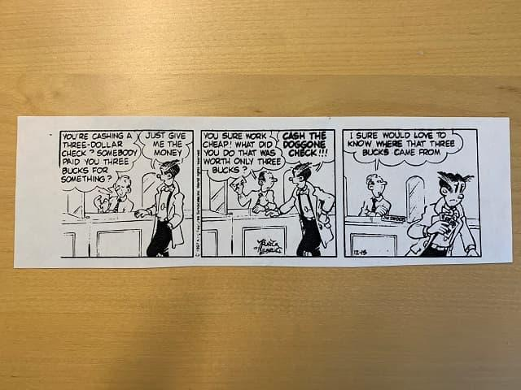
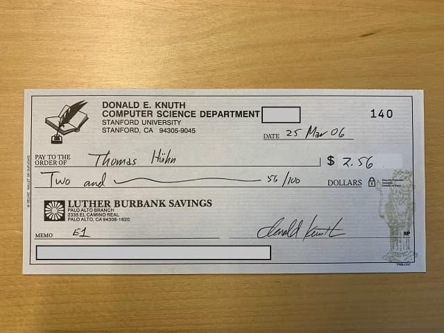
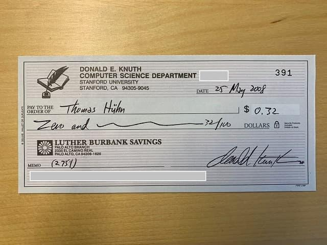

[Donald E. Knuth](https://de.wikipedia.org/wiki/Donald_E._Knuth) ist so etwas wie der Graue Eminenz der Informatik. Begnadeter Algorithmiker (das Knuth-Morris-Pratt-Verfahren und viele mehr), emeritierter Professor in Stanford, Autor des Standard-Übersichtswerks “The Art of Computer Programming” (schon seit 1962 – geplante Fertigstellung derzeit: 2025), und Schöpfer des Textsatzsystems TeX, von dem Leslie Lamport später LaTeX abgeleitet hat.

Und absoluter Pedant. So hat er auf seiner Webseite [einen eigenen Abschnitt](https://www-cs-faculty.stanford.edu/~knuth/help.html), mit Personen, die er in seinen Büchern zitiert, von denen er aber nicht weiß, für welche Vornamen die Mittelinitialen stehen. Und er möchte die nun einmal Namen vollständig zitieren.

Legendär ist sein Angebot, fürs Finden von Fehlern in seinen Büchern Schecks auszustellen. „Fehler“ heißt hier nicht unbedingt „inhaltlicher Fehler“. Davon gab es von Anfang nicht sehr viele, und nun nach Jahrzehnten noch viel weniger.

Nein, auch Tippfehler qualifizieren für einen Belohnungsscheck über zwei Dollar und sechsundfünfzig Cent (ein hexadezimaler Dollar). Ebenso typographische Mängel. Ein Zeilenabstand um einen Zehntel Millimeter zu groß? Scheck. Ein kaum wahrnehmbarer Leerraum vor einem Komma? Scheck. Ein Eintrag einer Aufzählung nicht korrekt eingerückt. Scheck.

Man kann sich schon denken, der Durchschnittsautor würde auch bei Zwei-Dollar-Belohnungen arm. Aber die Fehlerhäufigkeit ist eben überschaubar bei Knuth.

Außerdem war das schon ein cleverer Schachzug von ihm: Kaum jemand löst diese Schecks je ein. Die hängt man sich an die Wand. Ernsthaft.

Es gibt ein paar Verrückte, Knuth erzählte in einem Interview einmal, es gebe da einen Deutschen, der schon so viele Schecks gesammelt habe, daß er zum Spaß jedes Jahr einen davon einlöse.

Lange Einleitung, der Leser ahnt es schon: ich besitze solch einen Scheck.

Natürlich hatte ich schon lange davon geträumt, einmal einen Fehler in einem seiner Bücher zu finden, aber nach einigem Lesen war mir klar: das wird wohl nichts werden.

Und eines Tages hatte ich einen Fehler. Sogar einen inhaltlichen Fehler, nicht nur typographischen Kleinkram.

Ich habe länger gezögert, den Fehler zu melden. Der ist bestimmt schon bekannt. Ich täusche mich und blamiere mich nur damit. Und dann habe ich den Fehler gemeldet.

Und er ist grandios! Ich hatte immer vor meinem geistigen Auge, daß ich die dicken Schinken mit Argusaugen lesen und die Beweise bis ins kleinste Detail nachvollziehen und verstehen muß.

Und dann fiel es mir wie Schuppen von den Augen. An einer Stelle, von der niemand behaupten kann, er sei mit Lesen nicht so weit gekommen.

Denn in “Computer Modern Typefaces” findet sich der Fehler auf der Seite arabisch eins. Im allerersten Absatz. Gleich das allererste Wort ist falsch.

“Infinitely many…” – nein! Es sind nur endlich viele, wenn auch eine astronomische Anzahl.

Der Eintrag in den [Errata](https://ftp.fau.de/ctan/systems/knuth/dist/errata/errata.twelve) steht unter “Page E1”.

Einige Zeit später kam ein Brief.

Zunächst hat Knuth einen wunderbaren Comic-Strip beigelegt, der zu den zwei Dollar irgendwas paßt wie die Faust aufs Auge:

Aber natürlich auch den Scheck!

Ich habe zwei Stellen mit maschinenlesbaren Informationen übermalt. Knuth machte sich irgendwann Sorgen, daß dort seine Kontonummer erkennbar sei, und in Amerika reichen diese Daten wohl, um Geld abzubuchen.

Daraufhin hörte er auf, echte Schecks zu versenden, und verschickte nur noch Fantasie-Schecks einer fiktiven [„Bank von San-Serriffe“](https://www-cs-faculty.stanford.edu/~knuth/boss.html). Ich freue mich jedenfalls, noch einen echten Scheck bekommen zu haben. Dort auf der Webseite findet man mich auch, mit $1.20.

Aber warum nun $1.20? Weil ich später zwar unrecht hatte mit einer weiteren Fehlermeldung, und Knuth das aber als Verbesserungsvorschlag gewertet und mit einem kleineren Scheck belohnt hat:

