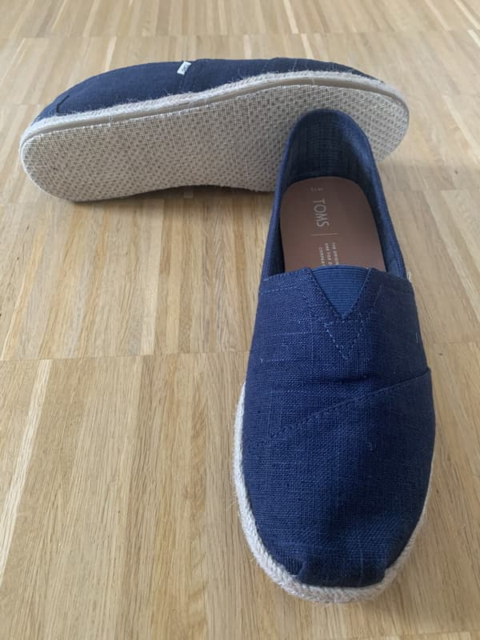

Ein Klassiker bei Lindy-Hoppern ist der Freizeitschuh mit Kunststoffsohle.

Besonders die Tänzerinnen sieht man viel mit [Keds](https://keds.de/), die fast schon eine Art Uniform auf der Tanzfläche geworden sind.

Ich selbst habe eine Zeitlang mit [Dockers](https://dockersbygerli.de/) getanzt und war damit immer sehr zufrieden. Irgendwann waren sie dann natürlich durch und Ersatz mußte her. Nach längerer Zeit mit [Ledersohlen]() und den speziellen Saint-Savoy-Sohlen habe ich nun wieder Freizeitschuhe mit Kunststoffsohle gekauft.

Die oben abgebildeten Espadrilles habe ich also erst seit kurzem und erst eine halbe Kursphase lang getragen.

Sie sind von [Toms](https://www.shoptoms.de/) und haben eine etwas ungewöhnliche Sohle, weil ein Gewebe (ebenfalls aus Kunststoff) darübergezogen ist. Ich habe mir ein besseres Rutschen von Beginn an erhofft, und nach ersten Versuchen muß ich sagen, es rutscht nicht ganz so wie erwartet, aber die Schuhe sind dennoch geeignet.

Normalerweise muß man solche Schuhe erst eine Weile benutzen, damit die Sohle abgenutzt und dadurch glatter wird, sonst sind sie zu stumpf. Am besten geht das dadurch, daß man sie ganz normal im Alltag auf der Straße anzieht, und wenn das Profil weg ist, dann reinigt man sie samt Sohle gründlich und nimmt sie fortan zum Tanzen.

Apropos Profil: Wenn die Schuhe ein ausgeprägtes Profil haben, dann wird man darin gehen können, wie man will, sie werden nicht hinreichend rutschig werden.

Einfach zu reinigen sind diese Schuhe natürlich. Einfach mit feuchtem Lappen abwischen. Auch ein Schritt vor die Tür macht ihnen nichts aus. Feuchtigkeit saugen die Sohlen nicht auf, man kann sie abwischen oder relativ zügig verdunsten lassen. Und ein weiterer Vorteil: Im Gegensatz zu Gummi drücken sich Steinchen von draußen nicht so einfach in die Sohle und verkratzen anschließend den Tanzboden.