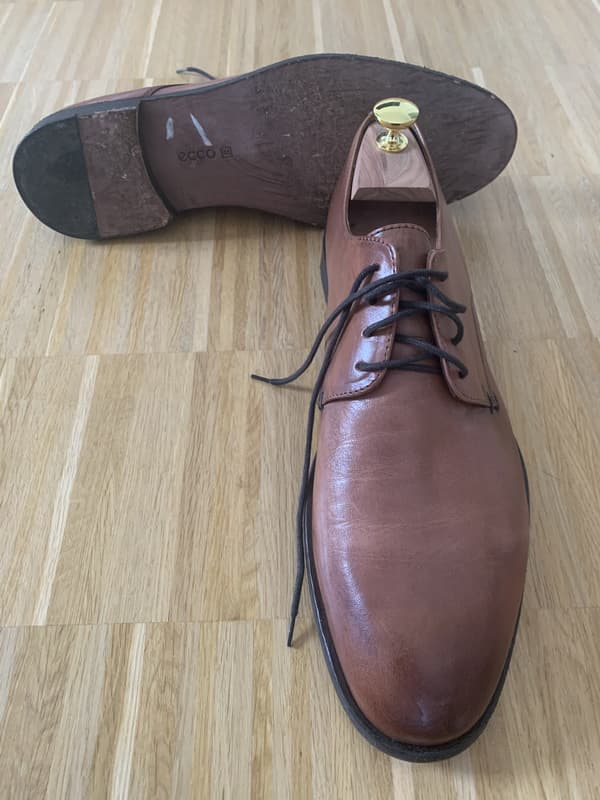

Der klassische Lederschuh als Tanzschuh hat viele Vorteile: man kann ihn auch außerhalb des Tanzsports tragen, er ist in jedem Schuhgeschäft in großer Auswahl zu finden, und die Marken und Paßformen sind einem bereits vertraut.

Eine Gummisohle verbietet sich natürlich, aber es gibt ja auch Lederschuhe mit Ledersohle. Um diese soll es hier gehen.

Eine wirklich durchgängige Ledersohle scheint dabei selten geworden zu sein, der Absatz ist meistens aus Gummi. Das schadet jedoch nicht, denn im Gegensatz beispielsweise zu einer Impetusdrehung im Langsamen Walzer sind Fersendrehungen im Swingtanz nicht üblich. Aber auch ansonsten scheinen Echtledersohlen deutlich auf dem Rückzug zu sein. Bei meinem letzten Besuch in einem großen Schuhhaus fand ich viele Dutzend Schuhmodelle mit kompletter Gummisohle, aber nur zwei oder drei, die noch eine Ledersohle hatten.

Die Tanzeigenschaften sind schnell erläutert: Nicht nur recht steif, vor allem rutschig ist die Sohle. Hui, da kann man echte Probleme kriegen, wenn man sehr groß tanzt oder seinen Schwerpunkt (noch) nicht sauber kontrollieren und unter seinem Körper halten kann.

Balboatänzer sieht man häufiger mit Ledersohlen. Dort spielt die Starrheit eine geringe Rolle, weil der Fuß sehr wenig abgerollt wird. Und die Schritte und Bewegungen sind sehr klein und kontrolliert gesetzt, aber auch schnell.

Die Ledersohle verträgt natürlich Nässe nicht gut, sie reibt sich im feuchten Zustand schnell kaputt. Auf den Gang vor die Tür zum Abkühlen sollte man gegebenenfalls also eher verzichten. Im nassen Zustand wird die Sohle auch schnell stumpf und untanzbar, außer an den paar Stellen (Fliesen auf der Toilette eventuell?), wo die Haftreibung verschwindet, und der Schuhträger Gefahr läuft hinzufallen.

Der klassische Leder-Herenhalbschuh hat natürlich noch einen weiteren Nachteil. Er ist recht teuer. Nicht so teuer wir „echte“ Tanzschuhe, aber schon eine andere Preisklasse als Keds, Toms oder Dockers.

Mein abgebildetes Paar Schuhe verwende ich so auch hauptsächlich für Balboa. Ich kann auch Lindy Hop damit tanzen, aber muß dann ziemlich vorsichtig sein.
