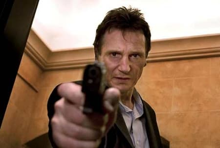
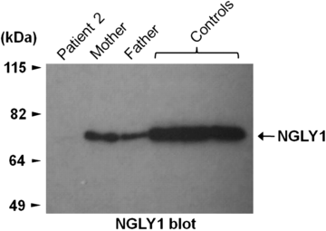
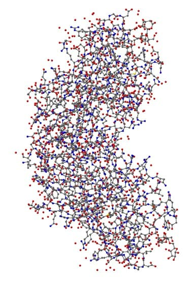
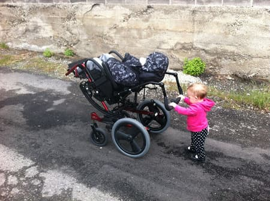
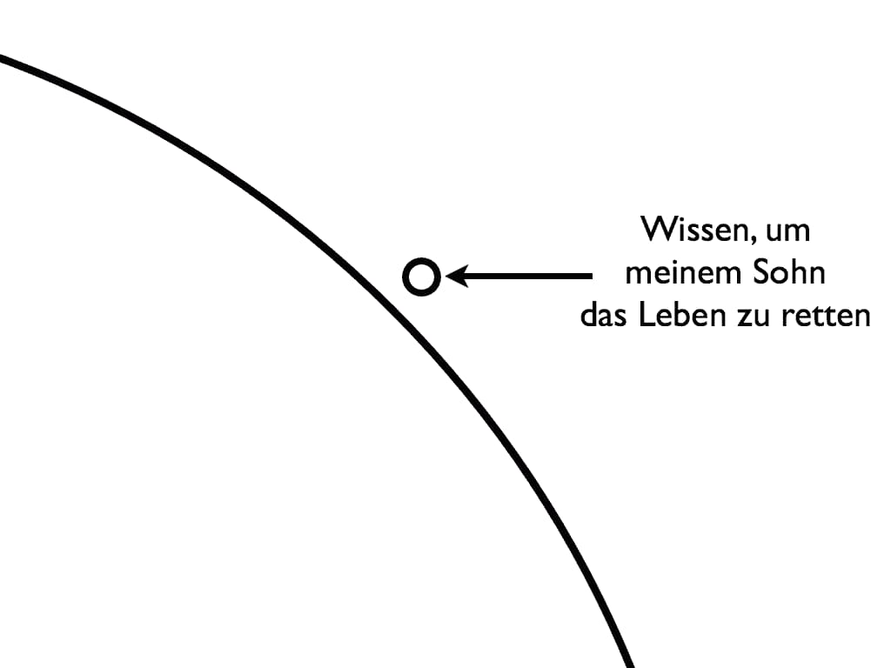

**Übersetzer:** Dies ist die deutsche Übersetzung des Artikels [“Hunting down my son’s killer”](http://matt.might.net/articles/my-sons-killer/) von [Matt Might](http://matt.might.net/), übersetzt ins Deutsche von [Thomas Hühn](http://www.thomas-huehn.de/).

**Übersetzer:** Bitte melden Sie mögliche Fehler in der Übersetzung, insbesondere solche medizinischer Natur, unbedingt an <t@2uo.de>.

Ich habe den Mörder meines Sohnes gefunden.

Es hat drei Jahre gedauert.

Aber wir haben es geschafft.

Ich sollte einen Punkt klarstellen: mein Sohn ist sehr wohl am Leben.

Trotzdem hat sich herausgestellt, daß meine Frau Cristina und ich für seinen Tod verantwortlich sind.

[Mein Sohn Bertrand](http://overcomingmovementdisorder.blogspot.com/) leidet an einer neuartigen genetischen Störung.

Patient 0.

Um sie zu finden, hat ein Team von Wissenschaftlern an der Duke University an mir, meiner Frau und meinem Sohn Exom-Sequenzierungen (eine proteinzentrische Variante der Gen-Sequenzierung) durchgeführt.

Wir fanden heraus, daß mein Sohn zwei verschiedene (bislang einzigartige) Mutationen im selben Gen – dem NGLY1-Gen – geerbt hat. Dieses Gen kodiert das [Enzym N-Glykanase 1](http://en.wikipedia.org/wiki/NGLY1). Infolgedessen kann er dieses Enzym nicht herstellen.

Mein Sohn ist der einzige Mensch, von dem bekannt ist, daß ihm dieses Enzym fehlt.

Im folgenden dokumentiere ich unseren Weg zur unwahrscheinlichsten aller Diagnosen.

Diese ist eine Geschichte über die Sorte Hoffnung, die nur die Wissenschaft bieten kann.

[Lesen Sie die volle Geschichte weiter unten.](#normal)

**Update:** Ein Open-Access-Artikel in The Journal of Medical Genetics enthält die detaillierten Ergebnisse des bahnbrechenden Experiments, das zu seiner Diagnose führte.

**Übersetzer:** Bitte melden Sie mögliche Patienten, insbesondere falls Sie medizinische Informationen mitsenden, unbedingt an Matt Might unter <matt-blog@might.net>, keinesfalls an den Übersetzer.

Seit ich diesen Artikel geschrieben habe, sind uns 15 weitere Fälle von NGLY1-Mangel begegnet, allesamt durch Exom- oder Genomsequenzierung bestätigt. Wenn Sie ein Elternteil, Arzt oder Wissenschaftler sind, der einen Patienten mit möglichem NGLY1-Mangel gefunden hat, seien Sie sich bitte bewußt, daß der Phänotyp für NGLY1-Mangel variiert und daß zwischen den Geschlechtern deutlich unterschiedliche Erscheinungsbilder auftreten können. Ihr Patient entspricht möglicherweise nicht der Beschreibung in diesem Artikel. Bitte nehmen Sie unverzüglich mit mir Verbindung auf, wenn Sie einen Patienten mit NGLY1-Mangel gefunden haben oder vermuten, sie könnten einen gefunden haben. Wir behandeln alle Details zum Patienten vertraulich.

**Update:** Ein weiterer Vater und ich haben gemeinsam einen Artikel über den Entdeckungsprozeß in [Genetics in Medicine](http://matt.might.net/papers/might2014ngly1.pdf) verfaßt, und in derselben Zeitschrift ist ein Artikel veröffentlicht worden, [der den Phänotyp von acht Patienten mit NGLY1-Mangel beschreibt](http://www.nature.com/gim/journal/vaop/ncurrent/full/gim201422a.html).

Verfügbare Übersetzungen:

* [Chinesisch](http://matt.might.net/articles/my-sons-killer/translation/chinese/)

## Normal

Abgesehen von schwerer Gelbsucht war Bertrand bei der Geburt normal.

Zwei Monate lang entwickelte er sich normal.

Mit drei Monaten hatte sich seine Entwicklung verlangsamt, aber sie war „innerhalb normaler Abweichungen“.

Mit sechs Monaten hatte er wenig bis gar keine Bewegungskontrolle.

Seine Bewegungen schienen „ruckelig“, wie wir es beschrieben.

Etwas stimmte nicht.

## „Hirnschaden“

Bertrand war acht Monate alt, als wir seine Kinderärztin für Entwicklungsstörungen zum ersten Mal trafen – gleich nach unserem Umzug nach Utah.

Am Tag seiner Untersuchung war ich bei meiner ersten Fakultäts-Klausurtagung, und nachdem sie um war, fand ich eine Flut von Sprachnachrichten und SMSen von meiner Frau vor.

Mein Herz setzte einen Moment aus.

Die Kinderärztin vermutete, Bertrand habe einen Hirnschaden, daher setzte sie ein MRT in der folgenden Woche aufs Programm.

## Kein Hirnschaden

Das MRT zeigte ein anscheinend gesundes, normales Gehirn.

Also wurde der Fall zu einem Kinder-Neurologen überwiesen.

Der Neurologe bestätigte, daß er eine Bewegungsstörung hatte, aber seine Symptomatik war „rätselhaft“: er hatte weder charakteristische [Chorea](http://de.wikipedia.org/wiki/Chorea_(Medizin)), noch [Ataxie](http://de.wikipedia.org/wiki/Ataxie).

Der Neurologe ordnete einen Bluttest an.

Dies war der erste von Dutzenden Bluttests, die noch folgen würden.

(Inzwischen schicken wir Bertrands „Lieblings“-Blutabnehmern Weihnachtskarten.)

## Das erste Todesurteil

Die Laborergebnisse zeigten nur eine Anomalie: extrem erhöhtes [Alpha-Fetoprotein](http://de.wikipedia.org/wiki/Alpha-1-Fetoprotein) (AFP), im Vergleich zu dem, was in seinem Alter normal wäre.

Nur eine Handvoll bekannter Störungen verursachen erhöhtes Alpha-Fetoprotein.

Nur eine davon befindet sich in der Schnittmenge von Bewegungsstörungen und erhöhtem AFP: das [Louis-Bar-Syndrom](http://de.wikipedia.org/wiki/Louis-Bar-Syndrom), auch Ataxia telangiectasia (A-T) genannt.

A-T ist eine degenerative, tödliche, unheilbare, unbehandelbare Störung.

Meiner Frau und mir hat es das Herz gebrochen.

## Sind Sie miteinander verwandt?

Weil A-T eine autosomal-rezessive Genstörung ist, würde dies nur das erste von vielen Malen sein, an denen meine Frau und ich gefragt wurden:

> Sind Sie beide sicher, nicht miteinander verwandt zu sein?

Ich komme vom platten Land in Ohio und stamme von Nordeuropäern ab. Meine Frau ist in mehreren Generationen puertorikanisch.

Wir können unsere Familienstammbäume Jahrhunderte zurück verfolgen.

Nein.

Wir sind *nicht* miteinander verwandt.

## Genetik für Programmierer

<aside>
Hinweis: Meine formelle Ausbildung in Biologie beträgt zwei Monate in der High-School. Bitte mailen Sie mir, wenn ich Fehler gemacht haben sollte.
</aside>

Um zu verstehen, warum uns immer jeder Arzt gefragt hat, ob wir miteinander verwandt sind, und wie unwahrscheinlich Bertrands schlußendliche Diagnose ist, müssen Sie verstehen, wie Gene und Mutationen funktionieren.

### DNS

Ihr Genom enthält die notwendige Information, um Sie zu bauen und zu betreiben.

Ihr Genom ist in DNS niedergeschrieben – der molekularen Kodierung einer Sprache, die aus nur vier Buchstaben besteht: A, C, T und G.

(A, C, T und G stehen für Adenin, Cytosin, Thymin und Guanin.)

A, C, T und G sind für das Leben das, was 0 und 1 für Computer sind.

Wie bei Computern ist es auch im Leben wichtig, wie diese Abfolgen Informationen oder Berechnungen kodieren.

Bei Computern könnte eine Abfolge wie 00000100 „an der Stelle addieren“ bedeuten, so daß 000001000 0001 0010 „addiere die Zahl in Register 1 zur Zahl im Register 2“ bedeuten könnte.

### Codons und der genetische Code

Die meisten Computer laufen mit dem x86-Befehlssatz.

Erstaunlicherweise gibt es im Leben auch einen vorherrschenden Befehlssatz – den genetischen Code, wie ihn die [DNS-Codon-Tabelle](http://en.wikipedia.org/wiki/DNA_codon_table) beschreibt.

Der genetische Code ist ein Befehlssatz für die Herstellung von Proteinen durch Zusammenketten einzelner Aminosäuren.

Der genetische Code besteht aus Befehlen, die Codone genannt werden.

Jedes Codon ist eine Drei-Buchstaben-Abfolge in DNS, die kodiert, daß entweder eine Aminosäure oder der Befehl „Beende den Zusammenbau dieses Proteins“ eingefügt werden soll.

Zum Beispiel bedeutet das Codon TTG „füge ein Leucin ein“.

Mit vier Buchstaben im Alphabet gibt es 43 = 64 mögliche Codons, aber es gibt nur 25 genetische Befehle, weil einige Codons dieselbe Aminosäure und mehrere Codons „Stop“ kodieren.

### Gene

Im menschlichen Genom ist ein Gen eine funktionale Einheit – ein wenig wie der *Code* für eine Prozedur in einem Programm. Jedes ist aus Exons (Codon-Abfolgen, die daran beteiligt sind, das Protein zu beschreiben) und Introns (ignorierte Abfolgen, die in etwa dieselbe Wirkung haben wie Codekommentare) zusammengesetzt.

Die Exons beschreiben eine Abfolge von Aminosäuren, die zu einem Protein gefaltet werden.

Wenn ein Gen zu einem Protein übersetzt wird – üblicherweise als Enzym – wirkt dieses Enzym wie eine Funktion im Inneren der Zelle: Enzyme ermöglichen die Reaktion von Eingabemolekülen zu Ausgabemolekülen.

Mit Ausnahme der Geschlechtschromosomen bei Männern haben Menschen zwei Versionen jedes Gens – eine von ihrer Mutter und die andere von ihrem Vater.

Zwei funktional ähnliche Versionen eines jeden Gens zu besitzen, bringt Redundanz.

### Mutation und Evolution

Die Redundanz der Gene ist ein wichtiger Schutz gegen Mutationen.

Eine Mutation ist eine Veränderung im genetischen Code eines Organismus.

Manche Mutationen ändern einen Buchstaben in einen anderen, zum Beispiel T zu A oder A zu G.

Dadurch kann sich die Aminosäure ändern, die eingefügt wird, wie bei TTT (Phenylalanin) zu TTA (Leucin), sie muß es aber nicht, wie bei TTA (Leucin) zu TTG (Leucin).

#### Stop-Mutationen

Obschon ungewöhnlich, ist es möglich, daß eine Mutation ein Codon in einen „Stop“-Befehl umwandelt, der den Zusammenbau des Proteins vorzeitig beendet, beispielsweise TCG (Tryptophan) zu TGA (Stop).

Dies nennt man eine Nonsens-Mutation, weil das entstehende Protein selten dazu fähig ist, die Aufgabe des Originals zu erfüllen.

#### Frame-Shift-Mutationen

Manche Mutationen fügen eine beliebige Zahl von Buchstaben ein oder löschen sie. Wenn die Zahl der Veränderungen durch drei teilbar ist, können die Codons nach der Einfügung oder Löschung weiterhin richtig gelesen werden; dies nennt man eine In-Frame-Mutation.

In-Frame-Mutationen können die Funktion eines Proteins leicht verändern.

(Sie können die Funktion auch zerstören.)

Wenn die Zahl der veränderten Buchstaben *nicht* glatt durch drei teilbar ist, werden die Codons nach der Einfügung oder Löschung verstümmelt. Dies ist eine *Frame-Shift-Mutation.*

In den meisten Fällen wird das entstandene Protein um so funktionsfähiger sein, je weiter hinten im Gen die Mutation auftritt. (Doch, wie wir schließlich bei Bertrand gesehen haben, zerstört selbst eine Frame-Shift-Mutation ganz am Ende des Gens manchmal das entstehende Protein.)

#### Was passiert dann?

Wenn eine Mutation auftritt, gibt es für ihren Träger vier Möglichkeiten:

1. Nichts passiert. Manche Mutation beeinflussen die Funktion (oder die Struktur) des entstehenden Proteins nicht. Doch selbst wenn die Mutation das Protein zerstört, muß es keine Anzeichen dafür geben. Wenn die redundante Version des Gens vom anderen Elternteil in der Lage ist, genug von dem Protein herzustellen, gibt es keine Symptome. Dies ist, was üblicherweise passiert. Redundanz ist großartig!

2. Mangel. Wenn das andere Gen nicht genug von dem Protein herstellen kann, reichen die Symptome von kaum wahrnehmbar bis zu schwerwiegend und/oder tödlich.

3. Aktives Schaden. Wenn das mutierte Gen ein neues Protein erzeugt, das aktiv schadet, wird es Symptome geben. Wenn ein einzelnes abnormes Gen Probleme verursacht, handelt es sich um eine [autosomal-dominante Störung](http://de.wikipedia.org/wiki/Erbkrankheit#Autosomal-dominante_Erbg.C3.A4nge).

4. Evolution. Wenn das mutierte Gen eine bessere, effektivere Version des Proteins herstellt, ist das resultierende Individuum „fitter“. Die Wahrscheinlichkeit für Überleben und Vermehrung steigt.

### Autosomal-rezessive Störungen

Autosomal-rezessive Störungen wie A-T geschehen, wenn ansonsten harmlose (aber nicht-funktionierende) mutierte Gene aufeinander treffen.

Wenn zwei Nachkommen des ursprünglichen Mutanten miteinander Kinder bekommen, und beide eine Kopie des mutierten Gens in sich tragen, besteht jeweils eine 25-prozentige Wahrscheinlichkeit, daß ihre Kinder beide Kopien des mutierten Gens erhalten.

Deshalb sind viele genetische Störungen mit bestimmten Gruppen oder Gebieten verknüpft – Situationen, in denen die Wahrscheinlichkeit eines gemeinsamen mutierten Vorfahren erhöht ist.

Wenn jemand zwei Versionen desselben mutierten Gens erbt, dann sind die Eltern (üblicherweise sehr entfernte) Cousins.

Doch Cristina und ich sind (nachweislich) nicht miteinander verwandt.

Dennoch leidet Bertrand an einer autosomal-rezessiven Störung.

## Untreuevorwürfe

Es war nicht hilfreich, daß Bertrand Cristina viel ähnlicher sieht als mir.

Nach überzeugten Versicherungen, daß wir nicht miteinander verwandt sind, fanden Bertrands neue Ärzte die nächsten paar Jahre stets einen Weg, meine Frau beiseitezunehmen und sie unter vier Augen zu fragen: „Kann es sein, daß Ihr Mann *nicht* Bertrands Vater ist?“

Dem ist nicht so.

## In die leere Menge

Als der Schock der A-T-Diagnose sich gelegt hatte, begannen wir nachzuforschen.

Innerhalb von Tagen waren wir davon überzeugt, daß Bertrand nicht darunter leidet.

Obwohl er erhöhtes AFP und eine Bewegungsstörung hat, unterschied sich sein Erscheinungsbild von der medizinischen Literatur.

Wir machten einen Gentest auf A-T und, wie wir erwartet hatten, war er negativ.

Mit zehn Monaten hatte die Schnittmenge seiner Symptome Bertrand in die leere Menge plaziert.

Mit jeder neuen Erkenntnis wurde die leere Menge nur immer noch leerer.

## Gib dein bestes

Kleine Erkenntnisse ergaben sich die nächsten paar Monate immer wieder.

Jede Erkenntnis führte zu neuen Hypothesen und (negativen) Tests.

Wir fanden erhöhte Spiegel von [Alanin-Aminotransferase (ALT)](http://de.wikipedia.org/wiki/Alanin-Aminotransferase) und [Aspartat-Aminotransferase (AST)](http://de.wikipedia.org/wiki/Aspartat-Aminotransferase), was auf Leberversagen hindeutete.

Doch trotz einer ausführlichen Untersuchung fand der Gastroenterologe nichts.

Geistig stoppte Bertrands Entwicklung um den achten Lebensmonat, und dort befindet sie sich noch heute, obwohl er nun vier Jahre alt ist.

Die sonderbare Natur von Bertrands Fall zog die Aufmerksamkeit von Spezialisten auf sich, die sich an einer Diagnose versuchen wollten.

Keiner hatte Erfolg.

## Das nächste Todesurteil

Mit etwa 15 Monaten folgte der nächste große Fund.

Wir fanden [Oligosaccharide](http://de.wikipedia.org/wiki/Oligosaccharide), einfache Zuckerketten, in seinem Urin.

Dieser Befund deutete sofort auf eine kleine Familie genetischer Defekte hin: [angeborene Stoffwechselstörung](http://de.wikipedia.org/wiki/Stoffwechselst%C3%B6rung).

Spezifische Gruppen innerhalb dieser Familie beinhalten Oligosaccharidose, Lysosomale Speicherkrankheit, Kongenitaler Defekt der Glycoproteinbiosynthese und Mitochondriopathien.

(Wir wissen heute, daß Bertrand eine neue Klasse in dieser Familie von Krankheiten begründet hat: eine angeborene Störung der Deglykosylierung.)

Bertrands Lebenserwartung war damit auf etwa zwei bis drei Jahre verkürzt.

Wir wußten nicht, welche er davon hatte, aber diese (ultraseltenen) Störungen tragen allesamt Namen wie:

* Alpha-Fukosidose
* Alpha-Mannosidose
* Alpha-N-Acetylgalactosaminidase-Mangel (Schindler-Krankheit)
* Aspartyl-Glukosaminidase-Mangel
* Beta-Mannosidose
* Galaktosialidose
* Morbus Gaucher
* Morbus Pompe (GSD II)
* GM1-Gangliosidose
* GM2-Gangliosidose
* I-Zellkrankheit
* Mukolipidose II
* Mukolipidose III (Pseudo-Hurler-Polydystrophie)
* Sandhoff-Krankheit
* Sialidose

## Optionen

Mit Ausnahme von mitochondrialen Störungen werden diese Krankheiten tendentiell durch die Unfähigkeit verursacht, ein Enzym herzustellen, das für einen Teil des Zellstoffwechsels notwendig ist.

Theoretisch könnte ein Fortschreiten der Störung gestoppt werden, indem man das fehlende Enzym in die Körperzellen einführt.

In einigen wenigen Fällen kann das Enzym synthetisiert werden, auch wenn die Versorgung aller Zellen mit dem Enzym ein komplexes pharmakologisches Problem ist.

(Viele Moleküle sind schwierig durch die [Blut-Hirn-Schranke](http://de.wikipedia.org/wiki/Blut-Hirn-Schranke) hindurchzubekommen.)

Doch in den meisten Fällen weiß die Menschheit nicht, wie man das Enzym synthetisiert.

Deshalb ist eine [Knochenmarktransplantation](http://www.dkms.de/) die einzige Chance, das Enzym zu verteilen.

## Die Erschaffung einer Chimäre

Bei einer Knochenmarktransplantation wird das Knochenmark, das Stammzellen produziert, abgetötet (übrigens zusammen mit dem größten restlichen Teil des Patienten) und (hauptsächlich) durch stammzellproduzierendes Knochenmark eines Spenders ersetzt.

Stammzellen können sich zu vielen verschiedenen Arten von Zellen entwickeln, und dadurch spielen sie eine wichtige Rolle bei Wachstum und Heilung.

Wenn sich die Spender-Stammzellen ausbreiten, wird der Empfänger zu einer künstlichen [Chimäre](http://de.wikipedia.org/wiki/Chim%C3%A4re_(Genetik)): einem hybriden Organismus, der Zellen zweier verschiedener genetischer Quellen besitzt.

Wenn die Spenderzellen das fehlende Enzym herstellen, kann das genug sein, damit der Körper normal, oder zumindest besser funktioniert.

## Duke

Innerhalb von Wochen nach dem Oligosaccharide-Fund hatten wir mit Bluttests begonnen, um einzugrenzen, welche genaue Störung (und welches fehlende Enzym) vorlag.

In der Zwischenzeit reisten wir zur Duke-Universität, um [Dr. Joanne Kurtzberg](http://www.dukemedicine.org/find-doctors-physicians/joanne-kurtzberg-md) zu treffen, die Expertin für Knochenmarksstammzell-Transplantationen zur Behandlung von angeborenen Stoffwechselstörungen.

Dr. Kurtzberg wollte wissen, unter welcher Störung Bertrand genau leidet, bevor sie ihn dem Risiko einer Stammzelltransplantation aussetzt (mit einer etwa dreißigprozentigen Sterblichkeitsrate).

Also trafen wir uns mit den Genetikern [Dr. Vandana Shashi](http://www.dukemedicine.org/find-doctors-physicians/vandana-shashi-md-mb-bs) und Kelly Schoch.

Wir arbeiten seitdem mit den beiden und ihrem Team.

## Epilepsie und Verlust weißer Substanz

An der Duke führte das Neurologenteam ein EEG und ein weiteres MRT durch.

Sie fanden „ungewöhnliche“, „mutmaßlich epileptische“ Vorgänge, die in seinem Gehirn wüteten.

(Bis zum heutigen Tag ziehen seine EEGs eine Zuschauermenge an.)

Das MRT zeigte, daß sein Gehirn verzögerte Myelinisierung hat.

Sein Gehirn verlor (oder baute zumindest nicht auf) weiße Substanz (oder funktional gesprochen, die Vernetzung).

Dieser Befund paßte zu [Leukodystrophie](http://de.wikipedia.org/wiki/Leukodystrophie) – die oft durch angeborene Fehler des Zellstoffwechsels verursacht wird.

## Keine weiteren Optionen

Bevor wir die Duke verließen, sagte uns Dr. Kurtzberg offen, aber voll Mitgefühl, daß Bertrands Störung, um welche auch immer es sich handele, zu weit fortgeschritten sei, als daß ihm eine Knochenmarktransplantation noch helfen könnte.

Wir waren am Boden zerstört.

## Konzentration auf die Behandlung

Nach der Duke verlagerten wir einen Teil der Energie von der Diagnose auf die Behandlung.

Die Entdeckung, daß viele von Bertrands abnormen Bewegungen in Wirklichkeit Anfälle waren, war beunruhigend.

Tatsächlich hatte Bertrand drei Arten von Anfällen: myoklonische „zuckende“ Anfälle, „Leerer-Blick“-Absencen und atonische „Fall-“Anfälle.

Innerhalb einiger Monate begann er tonische Anfälle mit langdauernden und schmerzhaften Muskelkrämpfen im ganzen Körper zu haben.

Bertrand fing an, Keppra zu nehmen, ein oft verschriebenes Epilepsie-Medikament.

## Ketogene Diät

Als Keppra nur teilweise dabei erfolgreich war, seine Epilepsie in den Griff zu bekommen, versuchten wir ketogene Diät.

Ketogene Diät ist eine strenge Hoch-Fett-Diät, die das Gehirn zwingt, für seine Hauptversorgung von Glukose auf Ketonkörper umzustellen.

Als er auf der ketogenen Diät war, aß Bertrand für jedes Gramm Kohlenhydrate und/oder Eiweiß vier zusätzliche Gramm Fett.

Diese Diät ist gut erforscht und oft verschrieben, aber vieles darüber, warum sie in manchen Fällen schwer behandelbarer Epilepsie wirkt, ist unbekannt.

Auf der Diät verschwanden Bertrands Fall-Anfälle annähernd vollständig, und die übrigen Anfallsarten waren stark vermindert.

Doch als die tonischen Anfälle einsetzten, begannen wir, nach weiteren Möglichkeiten zu suchen.

## Keine Tränen

Manchmal ist ein Symptom zu offensichtlich, um es zu bemerken.

Aber mit knapp zwei Jahren fiel uns auf, daß Bertrand nie Tränen produzierte.

Er konnte weinen.

Aber es kamen niemals Tränen.

Eine kurze Suche nach „Alacrima“ führte zum [Allgrove-Syndrom](http://en.wikipedia.org/wiki/Triple-A_syndrome).

Inzwischen hatten wir auf alle bekannten angeborenen Fehler der Zellstoffwechsels getestet und alle ausgeschlossen. Daher folgten wir eifrig dieser Spur.

## Am NIH

Cristina kontaktierte den Allgrove-Spezialisten [Dr. Stratakis](http://segen.nichd.nih.gov/stratakis.html) am NIH, der amerikanischen Gesundheitsbehörde.

Bertrands ungewöhnlicher Fall erregte Dr. Stratakis Interesse, daher ließ er Cristina und Bertrand einfliegen, um eine Expertenkommission am NIH zu sehen.

Die Expertenkommission vermutete, daß Bertrand nicht an Allgrove litt, aber daß ein Gentest sich dennoch lohnen würde.

Der Gentest war negativ.

Die Expertenkommission am NIH folgerte schließlich, daß Bertrand unter dem [Rett-Syndrom](http://de.wikipedia.org/wiki/Rett-Syndrom) oder vielleicht auch unter dem [Schinzel-Giedion-Syndrom](http://en.wikipedia.org/wiki/Schinzel%E2%80%93Giedion_syndrome) litt.

Obwohl er phänotypisch dem Rett-Syndrom ähnelte, ergaben weitere Tests, daß er an keiner der beiden Störungen leidet.

## Die nukleare Option: ACTH

Weil Bertrands schmerzhafte tonische Anfälle häufiger und heftiger wurden, versuchten wir verzweifelt, sie zu stoppen.

In manchen Fällen schwer behandelbarer Epilepsie stoppen sie hohe Dosen von ACTH.

Glücklicherweise funktionierte ACTH bei Bertrand.

Doch die Hormonspritzen, zweimal pro Tag, hatten Nebenwirkungen.

Er schwemmte zum doppelten Gewicht auf.

Sein Haar dünnte aus und er bekam eine Glatze.

Er entwickelte Gesichtsbehaarung.

Er war auch ständig wütend.

Stellen Sie sich vor, mit zwei Jahren in Höchstgeschwindigkeit durch die Pubertät zu rasen.

Aber die Anfälle waren weg.

## Nahtoderfahrung

Das Ende sowohl von ACTH als auch der ketogenen Diät kam plötzlich.

ACTH zerstörte Bertrands Immunsystem.

Nach einigen Monaten fing er sich eine schwere Atemwegsinfektion ein.

Mit zwei Jahren war sein kleiner Körper derart mit Flüssigkeit gefüllt, daß er sich nicht mehr bewegen konnte.

Jeder Teil seines Körpers war angeschwollen; er sah aus wie ein Luftballon.

Wir dachten, er würde sterben.

Um ihn zu retten, setzten wir sowohl ACTH als auch die ketogene Diät ab, und er wurde an Kabel und Drähte angeschlossen und mit Antibiotika versorgt.

Er sah aus wie die Borg.

## Lachen

Am Morgen, nachdem Bertrand von ACTH und der ketogenen Diät heruntergenommen worden war, hörten wir etwas, das wir zuvor noch nicht gehört hatten: Lachen.

Noch immer aufgeschwemmt und dem Tod nahe, lachte er in seinem Krankenhausbett.

Immer wenn die Lachspur aus dem Krankenhausfernseher kam, stimmte er ein.

Es war das direkteste Anzeichen für Bertrands Menschlichkeit, das wir jemals gesehen hatten.

Cristina war in Tränen aufgelöst.

## Im Auge des Sturms

Nachdem Bertrands sich erholt hatte, blieben seine Anfälle fast zwei Monate weg.

Selbst sein EEG sah „normal“ aus.

Frei von Anfällen begann Bertrand zu lernen und sich zu entwickeln.

Für Cristina und mich waren dies die besten zwei Monate unseres Lebens.

**Video:** Zwei Monate nach ACTH lacht Bertrand zu Spielfilmen.

## Die Anfälle kehren zurück

Die myoklonischen Anfälle kehrten schließlich zurück, doch die atonischen sowie die tonischen Anfälle und die Absencen taten dies nicht.

Die myoklonischen Anfälle wurden schwächer, als wir Lamotrigin zu seiner Medikation hinzunahmen, doch es machte ihn groggy.

Unsere Mission, eine Diagnose zu finden, ging weiter.

## Leberfibrose

Da Bertrands Leberwerte beständig erhöht blieben, stimmten wir einer Leberbiopsie zu, während er im Krankenhaus war.

Die Biopsie schloß zwei jüngere Überlegungen aus: die Lafora-Krankheit und die Unverricht-Lundborg-Krankheit.

Unglücklicherweise ergab die Biopsie eine Fibrose in Bertrands Leber.

Sein Gastroenterologe sagte voraus, daß seine Leber schließlich eine Zirrhose entwickeln und versagen würde.

Er empfahl Ursodiol, also versuchten wir es.

## Herzprobleme: Long-QT-Syndrom

Während Bertrands Krankenhausaufenthalts deckte ein [Elektrokardiogramm](http://de.wikipedia.org/wiki/Elektrokardiogramm) das Long-QT-Syndrom auf.

Long-QT ist eine seltene Herzkrankheit, die zu tödlichen Unregelmäßigkeiten im Herzschlag führen kann.

Long-QT hat normalerweise einen genetischen Hintergrund, kann aber auch durch Medikamente verursacht werden.

Für kurze Zeit untersuchten wir angeborene Kanalopathien als mögliche Ursache für seine Probleme.

Während dieser Zeit schien es ein düsteres Wettrennen zwischen Bertrands Gehirn, Herz und Leber zu geben, wer ihn töten würde.

## Eine gefährliche Hypothese

Nachdem fast alle Wege zu einer Diagnose erschöpft waren, hatten Cristina und ich Hypothesen zu Bertrands Zustand ausgearbeitet.

Da unsere Familien nicht miteinander verwandt sind (und eine autosomal-rezessive Störung damit unwahrscheinlich), und da es auf beiden Seiten keine Vergangenheit genetischer Erkrankungen gab, glaubten wir, daß Bertrands Zustand wahrscheinlich die Folge einer de-novo-Mutation war.

Wir begannen anzunehmen, daß Bertrand eine einzigartige Mutation hatte, nicht wir.

Daher nahmen wir an, daß kein Risiko darin bestünde, ein weiteres Kind zu bekommen.

Wir lagen falsch.

Aber für den Fall, daß Bertrand eine neuartige Mutation hatte, schmiedeten wir einen Plan, diese zu finden.

## Abendessen mit einem Genetiker

Ich schaffte es, ein Abendessen mit dem Genetiker [Dr. Lynn Jorde](http://medicine.utah.edu/faculty/mddetail.php?facultyID=u0030694) von der University of Utah zu bekommen.

Ich fragte ihn nach Möglichkeiten, drei Genome zu sequenzieren: meines, das meiner Frau und Bertrands.

Genomsequenzierung liefert den genetischen Code eines Organismus – bei Menschen etwa 3,1 Milliarden Buchstaben.

Wenn wir diese drei Sequenzen hätten, könnten wir mutmaßlich die wenigen Mutationen finden, durch die sich Bertrand von uns beiden unterscheidet.

Doch das ist leichter gesagt als getan, und selbst, wenn es getan ist, ist es immer noch nicht sonderlich leicht.

## Fehlerraten bei der Sequenzierung

Dieser Sequenzierungsvorgang hat eine Fehlerrate.

Das bedeutet, daß jede Sequenzierung einige falsche Mutationen enthalten wird.

Bei einer Fehlerrate von 1 in 10000 wird eine gegebene Sequenzierung etwa 310000 Fehler enthalten – falsche Mutationen.

Wiederholtes Sequenzieren senkt die Fehlerrate, aber treibt die Kosten nach oben.

Bei Tisch schätzte ich, daß es etwa 500000 Dollar kosten würde, um ein vernünftiges Konfidenzniveau zu erreichen.

Dr. Jorde nickte entschuldigend.

## Und was dann?

Aber angenommen wir fänden die Mutationen, was dann?

Wir müßten jede einzelne untersuchen, um herauszufinden, wie sie die Proteinherstellung und -Funktion beeinflußt – eine einschüchternde Aufgabe.

Aber *theoretisch* wäre es möglich.

## Eine Gelegenheit: Exom-Sequenzierung

Die ganze Zeit über waren Dr. Shashi und Kelly Schoch an der Duke mit uns in Verbindung geblieben und arbeiteten mit uns daran, Hypothesen zu testen.

Sie vermuteten stark, daß Bertrand an einer unbekannten genetischen Störung leidet.

Und sie erdachten eine clevere Methode, diese Hypothese auf die Probe zu stellen.

Sie schlugen eine neue Methode bei uns Dreien vor – Exom-Sequenzierung (anstelle von Genom-Sequenzierung).

Nur etwa 2% der DNS – das Exom – kodiert aktiv Proteine.

Man schätzt, daß Mutationen in diesen 2% für die große Mehrzahl genetischer Störungen verantwortlich sind.

Exom-Sequenzierung kann diesen kleinen Bruchteil der DNS auf kostengünstige Art sequenzieren.

Falls die Mutation in Bertrands Exom aufträte, würden wir sie finden können.

Bertrand und elf andere Kinder mit undiagnostizierten Krankheiten nahmen an einer Pilotstudie an der Duke teil.

## Zwei Kugeln ausgewichen

Nachdem wir Bertrands Leber mit Ursodiol behandelten und Anzeichen für Leberversagen fest im Blick behielten, sahen wir eine stetige Verbesserung,

Ein Jahr später waren alle seine Leberwerte im „normalen“ Bereich.

Bertrand würde nicht an Leberversagen sterben.

Wiederholtes Testen seines Herzens ließ seinen Kardiologen zu dem Schluß kommen, daß Bertrand unter durch Medikamente verursachtem (nicht angeborenem) Long-QT-Syndrom leidet.

In Bertrands Fall stellte sich Erythromycin, womit seine Infektion im Krankenhaus bekämpft worden war, als Ursache seines Long-QT heraus.

## Hornhauterosion

Direkt nachdem er von Long-QT und Leberversagen geheilt war, bekam Bertrand immer wieder schwere Augeninfektionen.

Eine reagierte nicht auf Antibiotika, und er mußte operiert werden, um den Eiter aus seiner Hornhaut zu entfernen.

Der Mangel an Tränen und wenig Feuchtigkeit führten zu Hornhauterosion.

Direkt unter der Pupille entstanden Narben, die seine Sicht trübten, aber nicht verhinderten.

Mit Hilfe seines Augenarztes begannen wir eine Behandlung, bei der er alle zwei Stunden befeuchtende Salben und Tropfen in die Augen bekommt.

Seit wir damit begonnen haben, haben sich seine Augen verbessert, aber wenn wir seine Tropfen auch nur einen halben Tag vergessen, führt dies üblicherweise zu wochenlangen Augeninfektionen und weiterer Vernarbung.

Bertrand kann nicht länger als ein paar Stunden ohne ausgebildeten und vertrauenswürdigen Pfleger auskommen.

## Schwangerschaft

Etwa einen Monat, nachdem das Exom-Experiment an der Duke begonnen hatte, wurde Cristina mit unserem zweiten Kind schwanger.

Uns war klar, daß das Experiment zeigen könnte, daß unser ungeborenes Kind dieselbe Störung wie Bertrand hat (oder haben könnte).

Wir beschlossen, daß wir diese Information nicht dazu verwenden würden, den Verlauf der Schwangerschaft zu steuern, ganz gleich, was wir erfahren würden.

(Der Prüfplan der Ethikkommission schrieb vor, daß schwangere Familien vom Experiment ausgeschlossen waren, eben aufgrund dieser heiklen ethischen Frage.)

## Stammzellen

Während das Experiment lief, behandelten wir Bertrands Epilepsie weiterhin.

Eine Hypothese zu der Zeit lautete, daß Bertrand kein vollständiger Mutant war – daß eine seiner Zellen mutiert hatte, als er noch aus nicht mehr als einer Handvoll Zellen bestand.

Der Fachbegriff dafür ist somatisches Mosaik, da die Person ein Hybrid zweier sehr ähnlicher genetischer Quellen ist.

Unter Annahme dieser Möglichkeit beschlossen wir, ein Risiko einzugehen.

Wir hatten Bertrands Nabelschnurblut-Stammzellen bei der Geburt aufgehoben.

Dr. Kurtzberg führte an der Duke eine experimentelle Studie durch, die die Auswirkungen einer Stammzellinfusion (keine -transplantation) auf Kinder mit Krankheiten, die das Gehirn beeinflussen (wie Zerebralparese), erforschte.

Weil eine Infusion der eigenen Stammzellen ungefährlich ist, versuchten wir es.

Unsere Überlegung war, daß diese Stammzellen damit anfangen könnten, bei der Heilung des Hirnschadens zu helfen und funktionale Versionen seines fehlenden Enzyms herzustellen, falls die Mutation sein Nabelschnurblut nicht beeinflußt hätte.

Selbst wenn sie das Enzym nicht herstellen würden, bestand Grund zur Hoffnung, daß der Verlust weißer Substanz im Gehirn zeitweise gestoppt oder umgekehrt würde.

## In der Cleveland Clinic

Wegen des multifokalen Charakters von Bertrands Epilepsie war uns gesagt worden, daß eine Operation nicht möglich sei.

Doch um absolut sicher zu sein, fuhren wir in die Cleveland Clinic, die bei der operativen Behandlung von Epilepsie bei Kindern führend ist.

Auch wenn die Cleveland Clinic bestätigte, daß Bertrand kein Kandidat für eine Operation ist, erweiterten sie seine Medikation, um seine Anfälle deutlich zu verringern.

Doch das MRT an der Cleveland zeigte etwas überwältigendes: der Verlust weißer Substanz in Bertrands Gehirn war (vorübergehend) zum Stillstand gekommen.

Für sich genommen ist das nicht genug, um sagen zu können, daß die Stammzellinfusion gewirkt hatte, aber es ist ermutigend und deutet darauf hin, daß weitere Forschung zu Stammzelltherapie angebracht ist.

## Die erste Mutation

Als Bertrand dreieinhalb war, eine Woche bevor Bertrands Schwester Victoria geboren wurde, erhielten wir einen Anruf von Dr. Shahis Team an der Duke.

Aufgrund des Prüfplans der Ethikkommission konnten sie nicht sagen, was sie gefunden hatten, aber sie waren stark der Ansicht, daß Victoria von Bertrands Störung nicht betroffen sein konnte.

Sie wollten Blutproben von Cristinas Eltern (aber nicht von meinen).

Wir fügten die Puzzleteile auf der Stelle zusammen: Das Duke-Team hatte eine Mutation im X-Chromosom gefunden, die sie für verantwortlich für Bertrand hielten.

Wenn das X-Chromosom eine Mutation enthält, ist es oft der Fall, daß Frauen nicht voll betroffen sind: sie haben ein redundantes X-Chromosom, um das auszugleichen.

Wenn Männer ein mutiertes X-Chromosom haben, kann der Mangel an Redundanz schwerwiegende Symptome verursachen.

Das Wichtigste davon ist: wenn Bertrand eine Krankheit hat, die mit dem X-Chromosom zu tun hat, dann könnte Victoria zwar Überträgerin sein, sie sollte aber nicht weniger gesund als Cristina sein.

Wir waren überglücklich.

Doch das Team an der Duke lag falsch.

## Die falsche Mutation

Die Testergebnisse für Cristinas Eltern kamen, nachdem Victoria geboren worden war.

Cristinas Vater hatte dieselbe Mutation in seinem X-Chromosom.

Selbst wenn diese mit dem X-Chromosom zusammenhängende Mutation unter der Kontroll-Datenbank von über tausend Genomen einzigartig war, und sie ein Protein beeinflusste, das einige von Bertrands Symptomen plausibel hätte erklären können, schloß die Tatsache, daß Cristinas Vater „normal“ war, ihre Schuld aus.

## Vitaminmangel

Manchmal scheint eine Lösung fast zu einfach, um sie zu probieren.

In Bertrands Fall waren Vitamine eine dieser Lösungen.

Während sie Ursachen für trockene Augen recherchierte, stieß Cristina auf Vitaminmangel.

Obwohl Bertrand täglich eine Dosis Multivitamine nahm, deckte ein Test von Bertrands Vitaminspiegel erstzunehmende Mängel bei den Vitaminen auf, die in der Leber gespeichert werden.

Mit täglichen Riesendosen dieser Vitamine brachten wir seine Werte in den „normalen“ Bereich.

Seitdem ist Bertrand in der Lage, Tränen zu vergießen – nicht viele – aber genug.

Aufgrund der Hornhautvernarbung blinzelt er leider nicht mehr, daher braucht er weiterhin häufiges Salben und Befeuchten – aber viel weniger als zuvor.

## Diagnose: N-Glykanase-1-Mangel

Mit viereinhalb Jahren erhielten wir den Anruf von der Duke.

Die Exom-Studie war beendet, und sie hatten die Antwort.

Cristina und ich tragen beide ein unterschiedlich mutiertes NGLY1-Gen in uns.

Ich habe eine Nonsens-(Stop-)Mutation in Exon 8, Cristina hat einen Frame-Shift im letzten Exon.

Cristina und ich stellen im Vergleich zu Menschen ohne diese Mutation jeweils etwa die halbe Menge N-Glykanase 1 her. Bertrand hat beide mutierten NGLY1-Gene geerbt, wodurch er nicht in der Lage ist, das Enzym herzustellen.

Die dunklen Bänder auf diesem Klecks zeigen die N-Glykanase-1-Menge an. Bertrand ist „Patient 2“.

Er ist der erste und bislang einzige Mensch, von dem bekannt ist, daß ihm dieses Enzym fehlt:

N-Glykanase 1 spielt eine wichtige Rolle bei der Deglykosylierung falsch gefalteter Proteine, wodurch diese in ihre Aminosäure-Bestandteile recycelt werden können.

Bertrands Zellen scheinen falsch gefaltete Glykoproteine anzusammeln.

## Die Wahrscheinlichkeiten

Es lohnt sich, die Wahrscheinlichkeit dieser Diagnose zu betrachten.

Da die Mutationen, die Cristina und ich in uns tragen, beide in einer Kontrollgruppe von Tausenden einzigartig waren, können wir abschätzen, daß nicht mehr als einer von tausend diese Mutation in sich trägt.

Das bedeutet, daß eine zufällige Paarung bestenfalls eine Wahrscheinlichkeit von eins in einer Million aufweist, einen Bertrand hervorbringen zu können.

Doch da nur eines von vier Kindern aus solch einer Paarung beide Gene, und damit die Krankheit, besitzen würde, sollte höchstens eine von vier Millionen Geburten einen Bertrand ergeben.

Bis weitere Menschen mit ähnlichen NGLY1-Mutationen gefunden werden, wird die obere Schranke, einen Bertrand hervorzubringen, weiter sinken.

Wir wissen heute, daß eine Eins-in-vier-Wahrscheinlichkeit bestand, daß Victoria beide Mutationen erben würde.

Sie hat keine.

Mit nicht einmal einem Jahr schiebt Victoria Bertrand zur Haltestelle für den Schulbus.

## Neue Optionen

In Zusammenarbeit mit Cristinas Vater [Dr. Manuel Casanova](http://en.wikipedia.org/wiki/Manuel_Casanova) und unserer Freundin Dr. Karen Ho haben wir damit begonnen, die biologischen Folgen von N-Glykanase-1-Mangel zu untersuchen.

Dr. Ho hat die Theorie aufgestellt, daß N-Glykanase-1-Mangel Streß für das [endoplasmatische Retikulum](http://de.wikipedia.org/wiki/Endoplasmatisches_Retikulum) verursachen könnte.

In dem Fall könnten bestimmte Antioxidantien dabei helfen, diesen Streß zu verringern.

Dr. Casanova konzentriert sich auf Medikamente, die in der Lage sein könnten, meine Stop-Mutation zu „hacken“, so daß die Mutation zuweilen überlesen würde, wodurch meine kaputte Kopie von NGLY1 in der Lage wäre, N-Glykanase 1 herzustellen.

Nach einem Treffen mit einem Forscher in Toronto, hat sich Dr. Casanova auf [Gentamicin](http://de.wikipedia.org/wiki/Gentamicin) als vielversprechenden Kandidaten festegelegt, weil es in dieser Eigenschaft bereits dazu benutzt wird, bestimmte Formen von Mukoviszidose zu behandeln.

## N-Glykanase synthetisieren

Doch ein paar Tage nach unseren Treffen an der Duke traf Cristina mit ihren Forschungen den Jackpot: ohne daß das Team an der Duke oder unser Team in Salt Lake davon wußten, kann eine Variante von N-Glykanase 1 bereits synthetisiert werden.

(Genzyme hält das Patent auf seine Synthese.)

Seine deglykosylierende Eigenschaft ist im Laborumfeld nützlich, und wir Menschen können das Zeug bereits seit etwa zwei Jahrzehnten herstellen.

Man kann ein [Los für 244 Dollar bestellen](http://www.prozyme.com/product_details.html?key=GKE-5006A).

## Die nächsten Schritte

Leider können wir nicht einfach ein Los bestellen und Bertrand injizieren.

Wir benötigen die Zustimmung der FDA, der amerikanischen Arzneimittelzulassungsbehörde, und wir benötigen die Mitarbeit von Genzyme.

Obwohl seine Krankheit lebensbedrohend ist, seine Anfälle schlimmer werden, und er weiterhin weiße Substanz verliert, werden wir nachweisen müssen, daß es unbedenklich ist.

Selbst wenn wir all diese Schritte hinter uns haben, werden wir möglicherweise an der Formel drehen müssen, um die Bioverfügbarkeit zu verbessern.

Und es gibt mit Sicherheit unbekannte Unbekannte darüber hinaus.

Aber Bertrands Leben steht auf dem Spiel

Und daher werden wir genau das tun.

## Nachwort

In dem [düsteren Blogeintrag vor drei Jahren, in dem wir die Entdeckung von Oligosacchariden bekanntgegeben haben](http://overcomingmovementdisorder.blogspot.com/2009/03/bad-news.html), haben wir mit einem Versprechen an Bertrand geschlossen:

> Natürlich werden wir alles für ihn tun, was möglich ist.
> 
> Und wenn das fehlschlägt, werden wir das Unmögliche versuchen.

Doch was heißt es, das Unmögliche zu versuchen?

Im [“Illustrated Guide to a Ph.D.”](http://matt.might.net/articles/phd-school-in-pictures/) sprach ich davon, Ausbuchtungen in die Ränder menschlichen Wissens zu machen.

Dieser Artikel enthält die Geschichte einer solchen Ausbuchtung – des unordentlichen, aber notwendigen Vorgehens in der modernen Wissenschaft.

Wissenschaft ist die systematische Umwandlung des Unbekannten in das Bekannte.

Sie ist somit notwendigerweise eine Umwandlung des Unmöglichen in das Mögliche.

Einige Zeit, nachdem ich die Anleitung geschrieben hatte, habe ich ein Nachwort hinzugefügt, das die Wichtigkeit dieser Umwandlung betont:

Es gibt eine neue Ausbeulung im Rand.

Wir haben es fast geschafft.

Wir müssen nur weiter gegen den Rand drücken.
