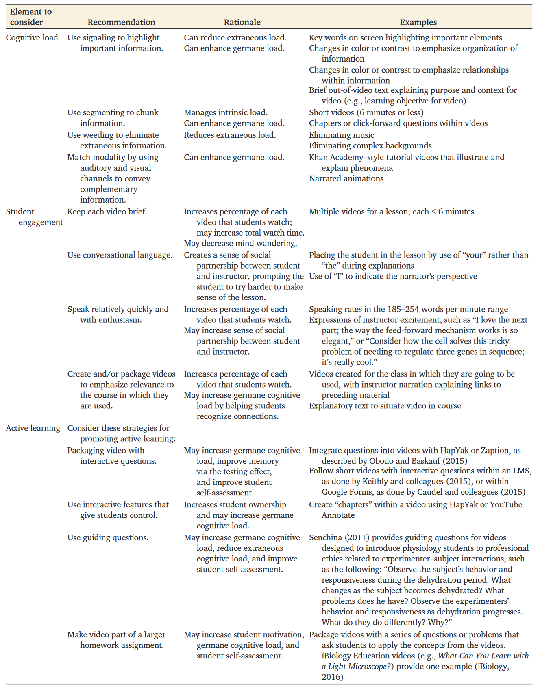
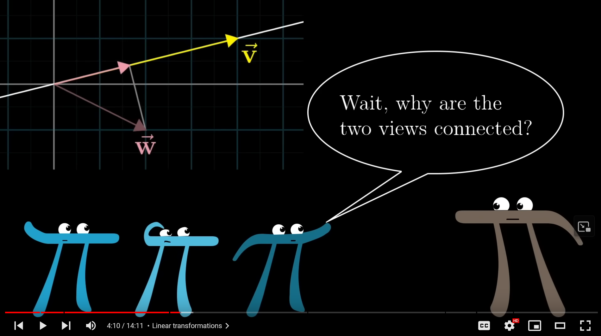

# Einleitung

Anhand eines konkreten Fallbeispiels als Ausgangspunkt werden die
bildungstheoretischen Eigenschaften von Erklärvideos sowie ihre
Desiderata in Hinblick auf Gestaltungs- und Qualitätskriterien betrachtet,
und beides anschließend auf das Fallbeispiel angewendet.

**Programmierte Erklärvideos: Der YouTube-Kanal 3Blue1Brown**

Der YouTuber Grant Sanderson stellt auf seinem Kanal 3Blue1Brown
Erklärvideos zu verschiedenen Themen der (höheren) Mathematik ein.
Sanderson nutzt grafische Animationen zur Verdeutlichung und legt Wert
darauf, mathematische Intuition zu fördern. Viele Menschen – die Videos
haben bis zu 16 Millionen Aufrufe – schauen sich diese Videos
regelmäßig im Abonnement oder aufgrund einer Suche zum jeweiligen Thema
an. Dabei kommentiert ein Teil von ihnen diese Videos, wobei mehrere
tausend Kommentare bei beliebten Videos vorkommen können. Die Zuschauer rekrutieren sich nicht nur aus studentischen Kreisen, sondern durch die attraktive graphische Gestaltung gehen diese Videos zuweilen „viral“ und werden auch von Menschen geteilt, die wenig Mathematikinteresse besitzen, sondern denen das Zuschauen Freude bereitet (vgl. Valentin, 2020, S. 52). Ob
tatsächliches Lernen stattfindet, ist dabei nicht überprüfbar.
Insbesondere die einfache Auffindbarkeit, der Unterhaltungswert und die
Gestaltung lassen eher einen Unterhaltungs- denn einen Lernwert
vermuten. Nichtsdestoweniger kommentieren Menschen oftmals, sie hätten
das Thema nun erstmals begriffen. Sanderson hat bereits zwei Jahre in
Folge einen “Summer of Math Exposition” ausgerufen, in dem er andere
Menschen ermutigt, eigene Erklärvideos zu produzieren und ihnen durch
diesen Wettbewerb Aufmerksamkeit seiner eigenen Abonnenten zu schenken.

Die programmierten mathematischen Animationen, mit denen der
YouTube-Kanal 3Blue1Brown mathematische Zusammenhänge erläutert, haben
aufgrund ihrer Beliebtheit inzwischen zahlreiche Nachahmer gefunden. Die
Neuheit dieser Präsentation gegenüber herkömmlichen Lehrbüchern oder bis
dahin bei Mathematikvideos üblichen Kameraaufnahmen von oben auf
Handschrift wirft unmittelbar die Frage auf, welchen Lehrwert diese
animierten Videos haben. Um dies beantworten zu können, müssen
wissenschaftlich gesicherte Kriterien zugrundegelegt werden. Jedoch
existieren keine expliziten didaktischen Kriterien für mathematische
Animationsvideos, ebensowenig für programmierte Animationen. Daher
werden vorliegend Kriterien zu Qualität und Gestaltung von Erklärvideos
allgemeiner Art herangezogen. Daraus ergibt sich folgende
Forschungsfrage:

**Entsprechen die 3Blue1Brown-Videos den Qualitäts- und
Gestaltungskriterien, die in der Fachliteratur aufgestellt werden?**

Zur Beantwortung werden zunächst der Begriff der und die Eigenschaften
von Erklärvideos diskutiert. Anschließend werden geeignete Theorien
vorgestellt, die auf Erklärvideos Anwendung finden können. Der
anschließende Schritt, Qualitätskriterien für Erklärvideos aus der
Literatur anhand ihrer Anwendbarkeit sowie Sinnhaftigkeit mit Blick auf
das konkrete Fallbeispiel herauszufiltern, ist zunächst durch die
vorgestellten Theorien informiert; die Forschenden, die diese
Qualitätskriterien aufgestellt haben, haben sich wesentlich durch diese
Theorien leiten lassen. Der selbst aufgestellte Katalog anwendbarer
Qualitätskriterien wird dann auf eine Auswahl von 3Blue1Brown-Videos
angewendet, um abschließend im Rückblick die Forschungsfrage zu
beantworten und in einem kurzen Ausblick weitere Forschungsmöglichkeiten
mit engem Bezug zur vorliegenden Arbeit aufzuzeigen.

Die Literatur grenzt Erklärvideos auf ganz unterschiedliche Weisen von
anderen Videoformen mit Lehranspruch wie z.B. Lehrvideos ab. Vorliegend
wird dem Definitionsversuch von Fey gefolgt, der zwei zentrale Merkmale
identifiziert: (1) es besteht die Absicht der Produzierenden, den
Zuschauenden etwas zu erklären (intentionaler Aspekt), (2) dies wird in
der medieneigentümlichen Gestaltung des Medienformats „Video"
ausgedrückt (gestalterisch-didaktischer Aspekt) (vgl. Fey, 2021, S. 21).
Der intentionale Aspekt umfaßt also instruktionale Erklärungen (vgl.
Kulgemeyer, 2018, S. 9, vgl. 2020a, S. 5–6), mithin allgemein- wie
fachdidaktische Überlegungen. Der gestalterische Aspekt umfaßt den
gezielten Einsatz des Medienformats „Video“ unter Nutzung der
spezifischen Vorteile und Möglichkeiten und damit neben
mediendidaktischen auch medienpraktische und medientechnische
Überlegungen.

Die klassischen 3Blue1Brown-Videos sind vollständig computergeneriert,
es findet keine Videokamera Verwendung. Ausnahmen existieren bei
„FAQ-Videos" (Videoverzeichnis: [QA]) oder Ankündigungsvideos,
beispielsweise für den „Summer of Math Exposition“ (Videoverzeichnis:
[SoME]). Sanderson hat dazu mit manim (Sanderson, 2015/2023) eine
Programmbibliothek entwickelt, die es ihm ermöglicht, Videos in der
Programmiersprache Python zu programmieren und daraus eine Videodatei
generieren zu lassen. Dies umfaßt sowohl die High-Level-Organisation des
Videos samt Szenen, Anzeigedauer, Schnitten und Übergängen, als auch die
eigentliche mathematische Visualisierung mit Achsenkreuzen,
Funktionsgraphen, 3D-Visualisierung komplexer Formen, aber auch von
Graphen, Netzwerken und vielem mehr. All dies wird animiert, also
zeitlich in Bewegung gebracht, dazu werden Texte an passender Stelle
ein- und ausgeblendet, besondere Koordinaten farblich hervorgehoben und
vieles mehr. Die Tonspur ist separat aufgenommen und in Postproduktion
hinzugemischt.

# Theoretische Rahmung

Da keine speziellen Theorien für Erklärvideos oder programmierte
Animationen vorliegen, muß auf allgemeinere Theorien zurückgegriffen
werden. Zunächst wird die Medieneigenschaft von Erklärvideos diskutiert.
Anschließend wird als erstes die Theorie der Dualen Kodierung
beschrieben. Darauf aufbauend wird die „Kognitive Theorie Multimedialen
Lernens” vorgestellt, die aufgrund der multimedialen Verknüpfung von
Sprache und Bild in Erklärvideos Ansätze zur Untersuchung der
3Blue1Brown-Videos liefern kann. Abschließend wird eine Erweiterung
dieser Theorie vorgestellt, die „Cognitive-Affective Theory of Learning
with Media".

## Medium

Nach Wiesing sind alle Medien Werkzeuge, um die Trennung Genese–Geltung
zu vollziehen, und alle Werkzeuge, die dies leisten, sind Medien (vgl.
Wiesing, 2008, S. 240).

Medien selbst sind „unthematisch“ (Wiesing, 2008, S. 236), sie erfüllen
ihre Funktion, sind selbst jedoch nicht sichtbar bzw. den Verwendern
transparent (vgl. Krämer, 2008, S. 72).

## Duale Kodierung

Die Theorie der Dualen Kodierung postuliert die bessere Abrufbarkeit von
Informationen, wenn diese zugleich in verbaler, auch textueller (vgl.
Matthes et al., 2021, S. 22) Form und in visueller Form im Gedächtnis
verankert werden (vgl. Schmidt-Borcherding, 2020, S. 63). Durch Nutzung
beider Kodierungen soll die kognitive Last sinken, indem die Kapazität
des Arbeitsgedächtnisses effektiv erhöht wird (vgl. Sweller, 2011, S.
67).

## Kognitive Theorie Multimedialen Lernens

Wohingegen die Theorie der Dualen Kodierung auf die multicodale
Speicherung von Informationen im Gehirn abstellt, beschreibt die
Kognitive Theorie Multimedialen Lernens Vorteile durch zeitgleiche
Nutzung mehrerer menschlicher Sinne, insbesondere der Augen und Ohren.
Beide Theorien sind dadurch gut miteinander verträglich, da eine
multimodale Informationsaufnahme und eine multicodale
Informationsspeicherung sogar einfacher beschreibbar ist, da kein
Multiplexing oder Demultiplexing mehrerer Sinneskanäle auf eine
Speicherart oder eines Sinneskanals auf mehrere Speicherarten
erforderlich ist.

Jedoch vermeidet die Kognitive Theorie Multimedialen Lernens das
Problem, daß die Verwendung von gedruckter Schrift und gedrucktem Bild
zwar unterschiedliche Kodierungen der Information nutzt, jedoch beide
Kodierungen denselben Sinneskanal „Auge“ passieren müssen. Die
Aufmerksamkeit der Zuschauenden teilt sich zwangsläufig zwischen Text
und Bild auf (vgl. Schmidt-Borcherding, 2020, S. 66).

Die Kognitive Theorie Multimedialen Lernens postuliert getrennte
Verarbeitungseinheiten für unterschiedliche Sinneskanäle wie Hören und
Sehen (vgl. Schmidt-Borcherding, 2020, S. 63). Dadurch addieren sich die
Verarbeitungskapazitäten verschiedener Informationsmodalitäten, z.B. das
Arbeitsgedächtnis (vgl. Schmidt-Borcherding, 2020, S. 65–66), und es
tritt eine scheinbare Erhöhung der Verarbeitungskapazität ein, die auf
der effektiveren Nutzung aller Verarbeitungseinheiten basiert.

## Cognitive-Affective Theory of Learning with Media

Die Cognitive-Affective Theory of Learning with Media setzt auf diesen
Prinzipien auf und fügt eine affektionelle und motivationale Komponente
hinzu, die selbstregulierend wirkt. Dabei sollen diese Faktoren
insbesondere die Aufmerksamkeit der Lerner erhöhen oder halten, aber
auch die kognitive Auseinandersetzung mit dem Lernstoff stimulieren
(vgl. Moreno, 2006, S. 151).

Aus diesem zusätzlichen Augenmerk heraus ergeben sich einige
motivations- bzw. emotionswirksame Kriterien in den Katalogen der
Qualitätskriterien in der Literatur bzw. des synthetisierten
Kriterienkatalogs (z.B. K07, K11, K13, K21, K25 und K26).

Abbildung 1 Schematische Darstellung der
Cognitive-Affective Theory of Learning with Media (Moreno, 2006, S. 151)

# Kriterien für Erklärvideos

Aus den theoretischen Überlegungen ergeben sich im Idealfall direkt, bei
realitätsnaher Betrachtung nur teilweise oder indirekt
Qualitätskriterien für Erklärvideos. Dennoch sind die Kriterien nicht
allesamt aus den Theorien herleitbar, sondern entstammen auch anderen
Überlegungen, praktischen Erfahrungen und empirischen Studien.

## Kriterienkataloge aus der Literatur

In der Literatur sind verschiedene Kataloge solcher Qualitätskriterien
auffindbar, im folgenden werden vier Kataloge ausgewertet und diese
anschließend in einen eigenen Kriterienkatalog überführt.

### Kulgemeyer

Kulgemeyer untersucht insbesondere die Erklärqualität von Erklärvideos,
er bezieht sich also vorwiegend auf den intentionalen Aspekt, nicht so
sehr den gestalterischen oder ästhetischen Aspekt (vgl. Kulgemeyer,
2018, S. 10). Der Kriterienkatalog ist in Abbildung 2 abgebildet.

Abbildung 2 Kulgemeyer 2018, S. 10

Seine Untersuchungen sind besonders geeignet, da er insbesondere
Erklärvideos im Fach Physik untersucht (vgl. Kulgemeyer & Peters, 2016).
Konkretere Hinweise zum Instruktionsdesign erarbeitete er
in einer Folgearbeit (vgl. Kulgemeyer, 2020b, S. 73).
Dieser Kriterienkatalog ist in Abbildung 3 zu finden.

Abbildung 3 Kulgemeyer 2019, S. 73

### Brame

Ebenfalls recht detaillierte Hinweise gibt Brame in ihrem
Kriterienkatalog (Abbildung 4); sie fügt auch Begründungen hinzu (vgl.
Brame, 2016, S. 3).

Abbildung 4 Brame 2016, S. 3

Sie betrachtet dazu drei Elemente: Kognitive Last
bezeichnet die Beanspruchung des Arbeitsgedächtnisses (vgl. Sweller,
1994, S. 45). Studentisches Engagement ist ein motivationaler Aspekt.
Aktives Lernen beinhaltet neben Engagement mit dem Lehrstoff auch Denken
höherer Stufen, studentische Aktivitäten (Diskussion, Schreiben) und
„Beteiligung durch mehr als Zuhören" (vgl. Bonwell, 1991, S. 2
englisches Original: „...involved in more than listening.") . Besonders
hervorgehoben werden der Nutzen von studentischer Interaktion, die die
Handlungskontrolle auf studentische Seite verlagert, sowie der Gebrauch
leitender Fragen (vgl. Brame, 2016, S. 5)

### Findeisen/Horn/Seifried

In einer Metaauswertung verschiedener empirischer Studien zu den
Einflußmerkmalen von Gestaltungselementen auf Zielgrößen läßt sich
ablesen, welche Gestaltungselemente zuverlässig positiv oder negativ zu
einer Zielgröße beitragen und welche keinen gesicherten Erfolg haben
(vgl. Findeisen et al., 2019, S. 21–23). Vorliegend soll nur die
Zielgröße „Lernerfolg“ Beachtung finden, weitere Zielgrößen wie
„Lernanstrengung" oder „Selbstwirksamkeit“ sind in Bezug auf die
Forschungsfrage wenig relevant, zudem ist dort keine Anschlußfähigkeit
an die anderen Kriterienkataloge gegeben. Der Kriterienkatalog ist in
Abbildung 5, Abbildung 6 sowie Abbildung 7 zu finden.

Abbildung 5 Findeisen/Horn/Seifried 2019, S. 21

Abbildung 6 Findeisen/Horn/Seifried 2019, S. 22

Abbildung 7 Findeisen/Horn/Seifried 2019, S. 23

Als einflußreich ergaben sich die Gestaltungsmerkmale „Interaktion", „Perspektive",
„Alter“, „Dauer“ und „Design“ (vgl. Findeisen et al., 2019, S. 30). Da
es sich um eine Auswertung empirischer Studien handelt, ist diese Arbeit
von besonderem Interesse, da sie durch die Empirie einerseits besonders
praxisnah ist und tatsächliche Wirkung abbildet, andererseits aber auch
eine andere Methodik als die eher theoretischen Herleitung von
Kulgemeyer und Brame zugrundelegt.

## Angewendeter Kriterienkatalog

Aus den vier Kriterienkatalogen aus der Literatur ist nun ein
gemeinsamer Kriterienkatalog zu synthetisieren.

Aus Abbildung 2 und Abbildung 3 werden alle Kriterien übernommen.

Aus Abbildung 4 werden alle Kriterien der Kategorie Kognitive Last
übernommen. In der Kategorie Studentisches Engagement entfällt das
Kriterium „Relevanz zum Kurs betonen", da kein formales Lernsetting im
Sinne einer Vorlesung vorliegt. In der Kategorie Aktives Lernen entfällt
das Kriterium „Interaktive Fragen", da solche Möglichkeiten bei einem
YouTube-Video im Gegensatz zu einem Learning-Management-System nicht
bestehen.

Aus Abbildung 5, Abbildung 6 und Abbildung 7 werden zunächst nur die
bereits genannten in der Gesamtschau der empirischen Studien wirksamen
Gestaltungselemente aufgenommen: „Interaktion", „Alter", „Dauer“ und
„Design". Das Gestaltungselement „Perspektive“ entfällt, da in
3Blue1Brown-Videos keine Handlung demonstriert wird und die Zuschauenden
nicht im Video zu sehen sind. „Interaktion“ überschneidet sich mit dem
oben ausgeschlossenen Kriterium der „Interaktiven Fragen“ bei Brame,
beinhaltet hier jedoch auch Direktanwahl von Kapiteln oder Anpassung der
Videogeschwindigkeit und wird daher aufgenommen.

Die akzeptierten Kriterien aller Literatur-Kriterienkataloge werden
sprachlich vereinheitlicht und auf eine gemeinsame Abstraktionsebene
gestellt. Doppelungen werden zusammengeführt, wobei ein geringfügiger
Inhaltsverlust, wenn die Beschreibungen unterschiedlich weit gefaßt
sind, akzeptiert wird. Gerade die beiden Kulgemeyer-Kataloge
überschneiden sich verständlicherweise stark. Die Kategorisierungen,
beispielsweise die „Begründungen“ bei Brame oder die „Kernideen“ bei
Kulgemeyer, werden fallengelassen, da sie nicht autorenübergreifend
sind.

Es ergibt sich die folgende Tabelle. Dieser Kriterienkatalog wird der eigenen
Auswertung der 3Blue1Brown-Videos zugrundegelegt.

|ID       |Kriterium                |Beschreibung|
|--------|-------------------------|---------------------------------------|
|K01     |Minimalismus             |Konzentration aufs wesentliche, Sparsamkeit mit Effekten|
|K02     |Rule-Example-Strategie   |Erst Prinzip, dann Veranschaulichung|
|K03     |Adaption an Wissensstand |an Vorwissen anknüpfen|
|K04     |Beispiele                |Verwendung passender Beispiele|
|K05     |Modelle und Analogien    |Übertragung auf bekanntes|
|K06     |Multimedia               |Illustrative Darstellungsformen|
|K07     |Sprachebene              |Fachsprache einführen, an Sprachniveau der Rezipienten anknüpfen|
|K08     |Mathematisierung kommentiert |Formeln erläutern|
|K09     |Struktur                 |Ausblick auf Thema zu Beginn, Zusammenfassung zum Schluß|
|K10     |Relevanz verdeutlichen   |Anwendungsbereich zeigen|
|K11     |Interesse wecken         |Interessante Erklärung, z.B. durch Alltagsbeispiele oder besonders ungewöhnliche Beispiele|
|K12     |Aufgabe                  |Eigene Bearbeitung durch Rezipienten durch „Hausaufgabe“ fördern|
|K13     |Direkte Ansprache        |z.B. durch Fragen an Rezipienten|
|K14     |Exkurse vermeiden        |Auf eine Kernidee fokussieren|
|K15     |Sprachliche Kohärenz     |Verwendung von Satz(teil)-Verbindungen wie „weil"|
|K16     |Konzepte und Prinzipien  |Thema des Videos: neues Prinzip, das relativ komplex ist|
|K17     |Signalisierung           |Wichtige Elemente besonders hervorheben, beispielsweise farblich|
|K18     |Segmentierung            |Kurze Videos, weniger als 6 Minuten Dauer; anspringbare Kapitel|
|K19     |Ablenkungen minimieren   |Auf Hintergrundmusik oder komplexe Hintergründe verzichten|
|K20     |Ton und Bild             |Beide Modalitäten ergänzen sich|
|K21     |Umgangssprache           |z.B. „Ich“ und „du“ verwenden|
|K22     |Sprechen                 |Relativ schnell und enthusiastisch|
|K23     |Leitende Fragen          |Fragen, die Rezipienten anleiten, worauf sie achten sollen|
|K24     |Interaktivität           |Direktwahl von Kapiteln, Wiedergabegeschwindigkeit|
|K25     |Alter                    |Höheres Alter der erklärenden Person wirkt positiv (vgl. Findeisen et al., 2019, S. 30)|
|K26     |Design                   |Positive Emotionen, Ästhetik, Nutzerfreundlichkeit|

# 3Blue1Brown-Videos

Der Kanal 3Blue1Brown enthält derzeit 129 Videos. Diese sind
unterschiedlichen Typs, so existieren alleinstehende Videos, die
beispielsweise ein mathematisches Rätsel erklären und eher auf Eleganz
und Inspiration setzen, aber auch „Playlists“ von Videos, die in einer
definierten Sequenz ein Themengebiet aus unterschiedlichen Blickwinkeln
abdecken oder gar im Sinne eines Curriculums den Anspruch erheben, ein
Themengebiet in relevanter Abdeckung zu lehren. Beispiele für diese
letztere Art von Playlist ist „Essence of linear algebra“ (16 Videos,
referenziert als [ELA01] bis [ELA16] im Videoverzeichnis). Die
vorliegende Arbeit stützt sich auf diese Videos, um besonders beliebte
Videos zugrundezulegen, aber auch weil der Lehranspruch in dieser
Videoreihe besonders deutlich wird. Ferner wurde eine zusammenhängende
Videoreihe gewählt, um das Kriterium der Struktur (K09) –
videoübergreifende Ordnungsprinzipien und Verweise – nicht ins Leere
laufen zu lassen. Dies bedeutet jedoch nicht, daß die diskutierten
Kriterien in anderen Videos nicht veranschaulicht und bewertet werden
könnten.

## Anwendung der Theorie

Die 3Blue1Brown-Videos sind Medien. Sie erklären mathematische
Sachverhalte, die zu allen Zeiten „in der Welt existieren", und auch vor
ihrer Entdeckung durch Mathematiker bereits existierten. Ebenso ist ein
wahres mathematisches Theorem nicht in seinem Bestand gefährdet,
innerhalb seines Definitions- und Geltungsbereichs wird es auch in
Zukunft wahr bleiben. Diese Geltung ist also nicht kontingent, ob
Sanderson ein Video zum Thema produziert oder nicht, spielt keine Rolle.
Die Handlung des Produzierens erschafft jedoch das konkrete Video in
genau dieser Form, ohne Sandersons Handlung wäre seine Existenz
undenkbar. Genau diese Trennung „Sanderson produziert ein Video"
(Genese) und „die Lineare Algebra funktioniert genau so“ (Geltung) macht
die Medieneigenschaft des Erklärvideos aus.

Sie führt auch dazu, daß die körperliche Welt – bei digitalen Videos:
Magnetisierungszustände oder Halbleiterspannungspotentiale – von der
Welt der Bedeutung getrennt wird. Wenn ein Koordinatensystem linear oder
nicht-linear transformiert, und diese Transformation in einer Animation
im Zeitverlauf graphisch dargestellt wird (siehe Abbildung 8, Abbildung
9 und Abbildung 10), so ist dies in der körperlichen Welt nicht möglich.
Denn selbst wenn man ein Gummituch nähme und dieses verzerrte und
verformte, so würden sich unweigerlich Ungenauigkeiten, Verzerrungen und
Falten, vielleicht gar Risse ergeben.

Abbildung 8 Koordinatentransformation 1, [ELA03], Zeitstempel 02:15

Abbildung 9 Koordinatentransformation 2, [ELA03], Zeitstempel 02:16

Abbildung 10 Koordinatentransformation 3, [ELA03], Zeitstempel 02:17

Duale Kodierung findet sich in den Videos allerorten: die Beschriftung
relevanter Koordinaten oder Vektoren ist nur ein Beispiel (Abbildung 11
[ELA03], Zeitstempel 04:10).

Abbildung 11 [ELA03], Zeitstempel 04:10

3Blue1Brown-Videos sind auch ein gutes Beispiel für die Prinzipien der
Kognitiven Theorie Multimedialen Lernens: neben den programmierten
Animationen wird eine Erläuterung des Gezeigten gesprochen (vgl.
„zeitliches Kontinuitätsprinzip", Schmidt-Borcherding, 2020, S. 67). Ein
Beispiel ist in [ELA03], Zeitstempel 08:01 bis 08:21 zu finden, wo der
gesprochene Text sich nur teilweise schriftlich im Bild wiederfindet,
sondern tatsächlich zusätzliche Information gegeben wird, die durch die
bildliche Begleitung erweitert und konkretisiert wird, siehe Abbildung 12.

Abbildung 12 “then î lands on the coordinates zero-one”, [ELA03], Zeitstempel 08:13

Die Cognitive-Affective Theory of Learning with Media stellt weniger
konkrete Eigenschaften bereit, die ein Erklärvideo erfüllen könnte,
sondern sie führt zur Aufnahme von motivationalen und affektiven
Aspekten in den Kriterienkatalogen. Aus Kriterium K26 kann dann
beispielsweise „Positive Emotionen“ herausgegriffen und anhand der „pi
creatures" gezeigt werden. „Pi creatures“ sind von Sanderson genutzte
Charaktere in Form farbiger Pi-Symbole (siehe Abbildung 13) mit Mimik
und Gestik, um Emotionen mit mathematischen Ergebnissen zu verbinden
(„having character in some capacity expressing emotion in response to
mathematical results is pedagogically beneficial", [PI], Zeitstempel
11:50).

Abbildung 13 Pi creatures, [ELA09], Zeitstempel 04:10

## Anwendung des Kriterienkatalogs

In der Anwendung ergiebiger als die Theorie sind die konkreten
Qualitätskriterien. Nach Erarbeitung des synthetisierten
Kriterienkatalogs wurden die Videos sorgfältig durchgesehen, um zu den
Kriterien passende – oder ihnen widersprechende – Stellen in den
Videos zu suchen. Die Zuordnung der Kriterien zu den Stellen in den
einzelnen 3Blue1Brown-Videos ist in Anhang C dokumentiert.

Zur Auswertung ist offensichtlich, daß ein bloßes Abzählen der erfüllten
oder nicht erfüllten Kriterien nicht ausreicht, da die Kriterien
unterschiedlicher Art und damit nicht direkt komparabel sind, und da
ihre relative Wichtigkeit schwankt. Stattdessen werden Kriterien, die
durchgehend in der Mehrzahl der Videos oder in vielen Fundstellen
erfüllt sind oder denen zuwidergehandelt wird, ohne Abbildungen als
Beispiel diskutiert. Kriterien oder Videostellen, die als besonders
wichtig zur Beantwortung der Forschungsfrage eingeschätzt werden oder
die nur vereinzelt auftreten, werden dagegen mit konkreten Beispielen
betrachtet.

### Minimalismus

Aus Sicht eines statischen, gedruckten Lehrbuchs mag es abwegig
erscheinen, animierte Videos als „minimalistisch“ zu bezeichnen. Doch
ist eine Bewertung nur anhand und unter Akzeptanz der Medienform an sich
sinnvoll, um dann in einem weiteren Schritt innerhalb der konkreten
Medienform zu untersuchen, ob eine minimalistische Umsetzung erfolgt
ist. Vorliegend kann dies bejaht werden. Es gibt höchstens in den
letzten Sekunden des Videos kurze melodische Untermalungen, ansonsten
keine Hintergrundmusik, Geräusche nur aus Effektgründen oder weitere
auditive „Störungen". Visuell sind die Videos schlicht und reduziert
gehalten, die Hintergründe sind schwarz und leer, Sanderson zeigt sich
selbst nicht, womit auch diese Quelle von Bewegung und Ablenkung
wegfällt (siehe Abbildung 14).

Abbildung 14 Leerer Hintergrund, [ELA09], Zeitstempel 01:05

### Rule-Example-Strategie

Unmittelbar fällt auf, daß annähernd alle 3Blue1Brown-Videos gegen
Kriterium K02 verstoßen, oft auch mehrfach. Das Kriterium fordert den
Übergang vom Allgemeinen zum Speziellen. Zunächst sollen grundlegende
Regeln gelehrt werden, die anschließend in konkreten Beispielen
veranschaulicht und eingeübt werden.

Sanderson geht in der Regel umgekehrt vor: vom konkreten Beispiel zur
Abstraktion. Diese Abweichung ist keineswegs gedankenlos, sondern
intentional und entspringt seiner abweichenden pädagogischen Auffassung
(vgl. [SoME], Zeitstempel 08:35 bis 11:01).

Diese Abweichung wird im Sinne der Forschungsfrage zulasten der
3Blue1Brown-Video gewertet werden, jedoch darf sie auch nicht allzu
stark gewichtet werden, da der pädagogische Meinungsstreit zulässig ist.
Zudem fokussiert die Literatur zum Thema Erklärvideo stark auf typische
Unterrichtssettings im schulischen und hochschulischen Bereich, nicht
auf das informelle Lernsetting mit Unterhaltungsanteilen, das bei
YouTube vorherrscht.

### Adaption an Wissensstand

Der Zuschauendenkreis der Videos ist ausgesprochen breit und heterogen.
Es ist nicht möglich, bestimmte Kenntnisse vorauszusetzen. Noch weniger
ist ein Feedback der Zuschauenden zu Sanderson in großer Menge möglich.
Dieses Kriterium muß daher im wesentlichen unerfüllt bleiben, wobei dies
eine Eigentümlichkeit des Distributionswegs YouTube sowie der
1:n-Kommunikation ist. Diese Videos erheben gar nicht den Anspruch, sich
an bestimmte benennbare Personen zu wenden, so wie dies in einem
Klassenzimmer oder einem definierten Hochschulmodul möglich wäre. An
dieser Stelle verläßt sich Sanderson auf die Selbstselektion der
Zuschauenden, die sich gemäß ihrer persönlichen Interessen – die auch
reine Unterhaltung sein können – verhalten. Allerdings bringt Sanderson
in der Mehrzahl der Videos nicht nur Rückschau und Vorschau auf die
Videos zuvor und danach unter, sondern auch bei relevanten bereits
behandelten Themen direkte, anklickbare Verweise auf diese vorherigen
Videos.

### Beispiele

Das Verzeichnis der Fundstellen weist über 40 Beispiele auf, die oftmals
auch nicht nur wenige kurze Sätze umfassen, sondern vollständig
ausgearbeitete Beispiel über mehrere Minuten sein können.

### Modelle und Analogien

Etwas weniger häufig tauchen explizite Modelle oder Analogien vor,
beispielsweise „Addition als Bewegung denken“ in [ELA01]. Modelle im
Sinne formaler Modellierung einer Anwendungsdomäne kommen zwar nicht
vor, dies wird jedoch durch vielfältige Vergleiche wettgemacht.

### Multimedia

Die 3Blue1Brown-Videos sind an sich bereits Multimedia. Doch muß auch
hier beachtet werden, daß es um Multimedialität speziell in Hinblick auf
Erklärvideos geht. Gegenüber den in der Literatur üblicherweise
betrachteten Erklärvideos, beispielsweise die Videoaufzeichnung einer
Vorlesung oder die besprochene PowerPoint-Präsentation, kann die
programmierte Animation punkten. Es handelt sich um eine andere Qualität
von Multimedia, wenn bewegte Bilder nicht nur als Effekt, sondern als
bedeutungsvolle Darstellung eingesetzt werden. Nichtsdestoweniger sind
stärkere multimediale Anteile weiterhin denkbar, so ist abgesehen von
dem „Jingle“ in [ELA15] keine besondere Audionutzung jenseits des
gesprochenen Worts im Einsatz. Zu beachten ist in dieser Hinsicht aber
das Spannungsfeld zu K01 „Minimalismus".

### Sprachebene

Sanderson verwendet durchgängig Fachsprache, er schreckt auch vor
Symbolen wie ĵ („j hat") oder dem Wort „Parallelepiped“ nicht zurück.

Abbildung 15 Parallelepiped, [ELA06], Zeitstempel 06:14

Diese Fachbegriffe verwendet er selbstverständlich und ohne besondere
Heraushebung oder Belustigung, die bei anderen YouTube-Produzenten
zuweilen zu beobachten ist. Neue Fachbegriffe werden jedoch stets bei
Erstverwendung eingeführt und erläutert.

### Mathematisierung kommentiert

Die kommentierte Umformung von Termen und Gleichungen nimmt großen Raum
in den Videos ein, so sind etwa 50 Fundstellen verzeichnet. Ein Beispiel
zeigen Abbildung 16, Abbildung 17 und Abbildung 18.

Abbildung 16 Mathematisierung, [ELA05], Zeitstempel 03:18

Abbildung 17 Mathematisierung, [ELA05], Zeitstempel 03:20

Abbildung 18 Mathematisierung, [ELA05],  Zeitstempel 03:25

### Struktur

Wie bereits in Kapitel 4.2.3 ausgeführt, ist dieses Kriterium erfüllt,
da Vorschauen und Rückblicke zwischen den Videos der Reihe annähernd
durchgängig vorhanden sind.

### Relevanz verdeutlichen

Die Relevanz des Lernstoffs wird eher selten explizit gemacht, es finden
sich weniger als zehn Fundstellen für K10. Dies liegt auch daran, daß es
sich um kein Video handelt, das eine praktische Handlung vorführt,
sondern um mathematische Instruktion auf universitärem Niveau. Die
Anwendungsbezogenheit wird zwar stets gefordert, aber insbesondere in
einem Grundlagenkurs – wie eine erste Lineare-Algebra-Vorlesung es an
der Universität ist – darf auch legitim ein Interesse und
Eigenmotivation der Lerner vorausgesetzt werden, ohne unmittelbar mit
Anwendungsgebieten zu locken. Einzelne Beispiele gibt es dennoch für
dieses Kriterium, so wird in [ELA05], Zeitstempel 03:44 deutlich
gemacht, daß die gezeigten dreidimensionalen Vektor-Matrix- und
Matrix-Matrix-Transformationen in Feldern wie Computergraphik oder
Robotik eine grundlegende Rolle spielen.

### Interesse wecken

Diese Kriterium fällt beim vorliegenden Thema „Lineare Algebra"
annähernd mit dem vorherigen Kriterium zusammen. Tatsächlich konnte über
K10 hinaus keine Fundstelle für dieses Kriterium K11 identifiziert
werden.

### Aufgabe

Aufgaben im Sinne von Hausaufgaben mit klarer Aufforderung, sie zu
bearbeiten, gibt es in der Videoreihe nicht. Vereinzelt stellt Sanderson
„Puzzles" oder weiterführende Aufgaben (Abbildung 19), blendet sie aber
nur kurz ein.

Abbildung 19 “Think about why this definition would make sense.”, [ELA02], Zeitstempel 09:33

Häufiger sind kurze Pausen im Video mit der Aufforderung,
über etwas nachzudenken (Abbildung 20), dies sind aber keine Aufgaben im
Sinne einer ernsthaften Bearbeitung, sondern eher kurze Segmente zur
Steuerung der Aufmerksamkeit der Rezipierenden.

Abbildung 20 “Pause, and take a moment to see...”, [ELA03], Zeitstempel 09:05

### Direkte Ansprache

Sanderson spricht sein Publikum sehr häufig direkt an, die bereits eben
referenzierte Abbildung 20 ist nur ein Beispiel von über 70 Fundstellen.

### Exkurse vermeiden

Im wesentlichen vermeidet Sanderson Exkurse zu tangential berührenden
Themen. Er scheint eine sehr genaue Vision zu haben, was er lehren
möchte. Lediglich zwei Fundstellen mit Abschnitten, die als Exkurs
bewertet wurden, sind identifiziert worden, eine davon ist allerdings
auch gleich mehrere Minuten lang.

### Sprachliche Kohärenz

Dieses Kriterium wurde nicht versucht, mit Fundstellen zu belegen.
Mehrmaliges Anschauen und Anhören der Videos hat zumindest keine
eklatanten Verstöße aufgezeigt. Sanderson spricht „normal“ und verbindet
seine Sätze und Teilsätze auch. Allerdings ergeben sich aus dem
Videokonzept sehr häufig mehrsekündige Abschnitte ohne Sprache, nur
durch Animationen gefüllt, so daß ein Anknüpfen an einen längst
vergangenen Satz auch nicht angemessen erscheint.

### Konzepte und Prinzipien

Dieses Kriterium wurde in der Literatur enger gefaßt, als die
Überschrift vermuten lassen mag. Es geht darum, ein wichtiges Thema pro
Video zu behandeln und dieses angemessen zu Beginn vorzustellen. Die
Essence-of-Linear-Algebra-Reihe behandelt im wesentlichen auch
tatsächlich nur ein Thema pro Video, diese Themen sind größere Konzepte,
die sich in jedem „Undergraduate"-Lineare-Algebra-Buch direkt im
Inhaltsverzeichnis als Kapitel wiederfinden. Sanderson nimmt sich häufig
einige Minuten Zeit, dieses Thema in den Kontext der vorigen oder
teilweise auch erst später folgenden Videos der Reihe zu stellen.

### Signalisierung

Die Signalisierung durch Hervorhebung findet in allen Videos andauernd
statt. Symbole, Vektoren oder Punkte werden unterschiedlich eingefärbt,
Animationen lenken den Fokus auf die animierten Objekte, und auch die
Intonation bzw. Prosodie des Sprechers, siehe auch die Kapitel „Sprechen“
und „Design“, weist auf wichtige Teile hin.

### Segmentierung

Die Essence-of-Linear-Algebra-Videos sind deutlich länger als die
empfohlenen 6 Minuten aus K18, die Laufzeit schwankt zwischen knapp neun
Minuten und über 17 Minuten. Zwei Videos erfüllen diese
Laufzeitempfehlung, nämlich [ELA05] und [ELA08]. Beide werden als
„footnote between chapters" eingeführt.

Die Empfehlung, anspringbare Kapitel bereitzustellen, ist doppelt
erfüllt: die Videos der Reihe sind selbst Kapitel (und auch als
„Chapter" bezeichnet), darüber hinaus sind die Videos in sich wiederum
in „YouTube-Chapters“ segmentiert, die direkt angesprungen werden können
und ein Thumbnail als Vorschau bereitstellen.

### Ablenkungen minimieren

Auch dieses Kriterium wird durchgängig erfüllt. Es überlappt inhaltlich
stark mit K01, und so konnten in den untersuchten Videos keine guten
Beispiele identifiziert werden, in denen K01 erfüllt ist, K19 jedoch
nicht, oder andersherum.

Zur Diskussion bezüglich Hintergrundgestaltung und Musik, siehe Kapitel
„Minimalismus“.

### Ton und Bild

Dieses Kriterium fordert, daß beide Modalitäten einander ergänzen. Dies
wurde bei der Anwendung der theoretischen Grundlagen in Kapitel 4.1
bereits erörtert.

### Umgangssprache

Es sind zahlreiche Beispiele für die Verwendung umgangssprachlicher
Begriffe, aber insbesondere auch der Verwendung der Personalpronomina
„ich" und „du“ in den Videos zu finden. Der Verfasser hat in Anhang C
knapp 50 Videostellen dokumentiert, aber keine Vollständigkeit
angestrebt.

### Sprechen

Sanderson spricht relativ zügig. Enthusiasmus dringt immer wieder durch,
so sind „isn't that a beautiful mental image“ ([ELA02], Zeitstempel
06:52) und „To me this is utterly beautiful“ ([ELA09, Zeitstempel
12:10) deutliche Zeichen seiner Liebe zum Fach.

### Leitende Fragen

Fragen, die die Zuschauenden anleiten, worauf sie achten sollen, kommen
immer wieder vor, sind aber nicht allgegenwärtig. Knapp 30 Fundstellen
wurden identifiziert, teilweise sind es direkte Fragen an die
Zuschauenden ([ELA02, Zeitstempel 06:55), teilweise auch eher
Aufforderungen, auf etwas besonders zu achten. ([ELA01, Zeitstempel
02:00).

### Interaktivität

Der YouTube-Videoplayer bietet die Möglichkeit, die
Wiedergabegeschwindigkeit zu steuern. Ebenso können Kapitel direkt
angesprungen werden. Diese Kapitelmarkierungen werden von Sanderson
bereitgestellt, im übrigen ist dies aber keine besondere Eigenschaft des
Erklärvideos an sich, sondern der Videoplattform und ihrer technischen
Umsetzung.

### Alter

Soweit höheres Alter der erklärenden Person positiv auf den Lernerfolg
einwirken soll, ist dieser Punkt jedenfalls schwierig zu werten.
Sanderson ist relativ jung, sein Alter ist nicht öffentlich bekannt,
doch erhielt er seinen Bachelorabschluß im Jahr 2015. Damit ist er älter
als viele Menschen aus der Zielgruppe, nämlich Studierende des ersten
Semesters. Ohne genauere Kenntnis der Zusammensetzung der Rezipierenden,
kann nicht mehr dazu gesagt werden.

### Design

Positive Emotionen werden sowohl durch die als niedlich empfundenen „Pi
creatures" (s.o.) geweckt, aber insbesondere auch durch Sandersons
Emotionalität im Sprechen. Neben den in Kapitel 4.2.22 genannten
Beispielen, in denen er Sachverhalte als „beautiful“ bezeichnet, finden
sich auch bewundernd-kommentierende Äußerungen wie „Now for the cool
part..." ([ELA11, Zeitstempel 09:21). Mit knapp 20 Vorkommen des
Kriteriums K26 in den Fundstellen zeigt sich eine angemessene
Emotionalität; im Schnitt knapp über ein Vorkommen pro Video. Dies
bewahrt die angestrebte Ernsthaftigkeit, färbt die Reihe aber dennoch
ein wenig durch menschliche Emotionalität.

# Rückblick und Ausblick

Zunächst ist festzuhalten, daß der erarbeitete Kriterienkatalog solche
animierten Erklärvideos nicht vollständig befriedigend behandeln kann.
Zum einen sind einige Kriterien allgemein erfüllt, so zum Beispiel K06
(Multimedia), zum anderen sind Kriterien wie K24 (Interaktivität) bei
YouTube-Videos eher eine Frage der technischen und medialen Kompetenz
der Lerner sowie der technischen Umsetzung des Videoplayers.

Dennoch ergibt die Auswertung des aufgestellten Kriterienkatalogs, daß
Sanderson die meisten Qualitätskriterien konsistent erfüllt und nur in
Einzelfällen gegen Qualitätskriterien verstößt. Der Hauptverstoß besteht
darin, daß das Kriterium K02 („Erst Prinzip, dann Veranschaulichung")
konsequent mißachtet wird, wie oben bereits diskutiert wurde.

Interesse wecken und Relevanz darstellen kommt ebenfalls zu kurz. Zwar
wurde in den Kapiteln 4.2.10 und 4.2.11 begründet, warum dies im
vorliegenden Fall nicht die vielleicht zu erwartende Wichtigkeit
besitzt, dennoch wäre eine Stärkung dieser Punkte wünschenswert.

Insgesamt ergibt sich damit die Folgerung, daß die Forschungsfrage
positiv beantwortet werden kann, die 3Blue1Brown-Videos erfüllen die
Qualitätskriterien aus der Literatur.

In dieser Arbeit wurde lediglich das eigentliche Erklärvideo analysiert,
also die Produzentenseite. Aufschlußreich könnte aber auch eine
Betrachtung der Kommentatoren unter den Videos sein. Denn
YouTube-Kanäle können auch als soziales Netz verstanden werden (vgl.
Valentin, 2020, S. 50). So können Kommentatoren inhaltlich über die
Videos diskutieren, sich gegenseitig beim Verständnis unterstützen oder
das Thema durch ihre Diskussion ausweiten. Dies mag im allgemeinen aus
guten Gründen bezweifelt werden (vgl. Dorgerloh & Wolf, 2020, S. 61),
doch ist die Kommentarsektion der 3Blue1Brown-Videos möglicherweise ein
Gegenbeispiel?

Weiterhin könnte die „ästhetische Praxis“ (Valentin, 2018, S. 66)
untersucht werden. Die spezielle Form der programmierten Animation
mittels manim (Sanderson, 2015/2023) hat eine Reihe von Nachahmern
gefunden, die eigene Erklärvideos ähnlicher ästhetischer Art produzieren
und dabei teilweise dieselbe Software einsetzen, teilweise ähnliche
Effekte mittels anderer Software erzielen. Diese Nachahmer – der
Begriff soll nicht pejorativ verstanden werden – könnten mit
3Blue1Brown verglichen werden.

# Literaturverzeichnis

Bonwell, Charles C. (1991). *Active Learning: Creating Excitement in the
Classroom*. Jossey-Bass; Washington, DC.

Brame, Cynthia (2016). Effective Educational Videos: Principles and
Guidelines for Maximizing Student Learning from Video Content. *Cell
Biology Education*, *15*, es6–es6.
https://doi.org/10.1187/cbe.16-03-0125

Dorgerloh, Stephan, & Wolf, Karsten D. (Hrsg.) (2020). *Lehren und
Lernen mit Tutorials und Erklärvideos: mit E-Book inside* (1. Auflage).
Beltz; Weinheim Basel.

Fey, Carl-Christian (2021). Erklärvideos – eine Einführung zu
Forschungsstand, Verbreitung, Herausforderungen. In Eva Matthes, Stefan
Siegel, & Thomas Heiland, *Lehrvideos – das Bildungsmedium der Zukunft?
Erziehungswissenschaftliche und fachdidaktische Perspektiven* (S.
15–30).

Findeisen, Stefanie, Horn, Sebastian, & Seifried, Jürgen (2019). Lernen
durch Videos – Empirische Befunde zur Gestaltung von Erklärvideos.
*MedienPädagogik: Zeitschrift für Theorie und Praxis der Medienbildung*,
16–36. https://doi.org/10.21240/mpaed/00/2019.10.01.X

Krämer, Sybille (2008). Medien, Boten, Spuren. In Stefan Münker &
Alexander Roesler, *Was ist ein Medium?* (Originalausgabe Edition, S.
65–90). Suhrkamp Verlag; Frankfurt am Main.

Kulgemeyer, Christoph (2018). Wie gut erklären Erklärvideos? Ein
Bewertungs-Leitfaden. *Computer + Unterricht*, 8–11.

Kulgemeyer, Christoph (2020a). A Framework of Effective Science
Explanation Videos Informed by Criteria for Instructional Explanations.
*Research in Science Education*, *50*, 2441–2462.
https://doi.org/10.1007/s11165-018-9787-7

Kulgemeyer, Christoph (2020b). *Didaktische Kriterien für gute
Erklärvideos* (S. 70–75).

Kulgemeyer, Christoph, & Peters, Cord (2016). Exploring the explaining
quality of physics online explanatory videos. *European Journal of
Physics*, *37*, 1–14. https://doi.org/10.1088/0143-0807/37/6/065705

Matthes, Eva, Siegel, Stefan, & Heiland, Thomas (2021). *Lehrvideos –
das Bildungsmedium der Zukunft? Erziehungswissenschaftliche und
fachdidaktische Perspektiven*.

Moreno, R. (2006). Does the modality principle hold for different media?
A test of the method-affects-learning hypothesis. *Journal of Computer
Assisted Learning*, *22*(3), 149–158.
https://doi.org/10.1111/j.1365-2729.2006.00170.x

Sanderson, Grant (2023). *3b1b/manim* [Python].
https://github.com/3b1b/manim (Original work published 2015)

Schmidt-Borcherding, Florian (2020). Zur Lernpsychologie von
Erklärvideos: Theoretische Grundlagen. In Stephan Dorgerloh & Karsten D.
Wolf (Hrsg.), *Lehren und Lernen mit Tutorials und Erklärvideos: mit
E-Book inside* (1. Auflage, S. 63–70). Beltz; Weinheim Basel.

Sweller, John (1994). Cognitive load theory, learning difficulty, and
instructional design. *Learning and Instruction*, *4*(4), 295–312.
https://doi.org/10.1016/0959-4752(94)90003-5

Sweller, John (2011). Cognitive Load Theory. *Psychology of Learning and
Motivation*, *55*, 37–76.
https://doi.org/10.1016/B978-0-12-387691-1.00002-8

Valentin, Katrin (2018). Subjektorientierte Erforschung des
Aneignungsverhaltens von Rezipierenden von Video-Tutorials. *Journal for
educational research online*, *10*(1), 52–69.

Valentin, Katrin (2020). Erklärvideos auf YouTube: Was machen die
Rezipierenden aus den Videos? In Stephan Dorgerloh & Karsten D. Wolf
(Hrsg.), *Lehren und Lernen mit Tutorials und Erklärvideos: mit E-Book
inside* (1. Auflage, S. 49–53). Beltz; Weinheim Basel.

Wiesing, Lambert (2008). Was sind Medien? In Stefan Münker & Alexander
Roesler, *Was ist ein Medium?* (Originalausgabe Edition, S. 235–248).
Suhrkamp Verlag; Frankfurt am Main.

# Videoverzeichnis

|ID    |Titel                       |
|------|----------------------------|
|ELA01 |[Vectors](https://www.youtube.com/watch?v=fNk_zzaMoSs&list=PLZHQObOWTQDPD3MizzM2xVFitgF8hE_ab)|
|ELA02 |[Linear combinations, span, and basis vectors](https://www.youtube.com/watch?v=k7RM-ot2NWY&list=PLZHQObOWTQDPD3MizzM2xVFitgF8hE_ab&index=2)|
|ELA03 |[Linear transformations and matrices](https://www.youtube.com/watch?v=kYB8IZa5AuE&list=PLZHQObOWTQDPD3MizzM2xVFitgF8hE_ab&index=3)|
|ELA04 |[Matrix multiplication as composition](https://www.youtube.com/watch?v=XkY2DOUCWMU&list=PLZHQObOWTQDPD3MizzM2xVFitgF8hE_ab&index=4)|                  
|ELA05 |[Three-dimensional linear transformations]( https://www.youtube.com/watch?v=rHLEWRxRGiM&list=PL0-GT3co4r2y2YErbmuJw2L5tW4Ew2O5B&index=6)|
|ELA06 |[The determinant](https://www.youtube.com/watch?v=Ip3X9LOh2dk&list=PL0-GT3co4r2y2YErbmuJw2L5tW4Ew2O5B&index=7)|
|ELA07 |[Inverse matrices, column space and null space](https://www.youtube.com/watch?v=uQhTuRlWMxw&list=PLZHQObOWTQDPD3MizzM2xVFitgF8hE_ab&index=7)|             
|ELA08 |[Nonsquare matrices as transformations between dimensions     ](https://www.youtube.com/watch?v=v8VSDg_WQlA&list=PLZHQObOWTQDPD3MizzM2xVFitgF8hE_ab&index=8)|  
|ELA09 |[Dot products and duality](https://www.youtube.com/watch?v=LyGKycYT2v0&list=PLZHQObOWTQDPD3MizzM2xVFitgF8hE_ab&index=9)|
|ELA10 |[Cross products](https://www.youtube.com/watch?v=eu6i7WJeinw&list=PLZHQObOWTQDPD3MizzM2xVFitgF8hE_ab&index=10)|
|ELA11 |[Cross products in the light of linear transformations](https://www.youtube.com/watch?v=BaM7OCEm3G0&list=PLZHQObOWTQDPD3MizzM2xVFitgF8hE_ab&index=11)|
|ELA12 |[Cramer's rule, explained geometrically](https://www.youtube.com/watch?v=jBsC34PxzoM&list=PLZHQObOWTQDPD3MizzM2xVFitgF8hE_ab&index=12)|
|ELA13 |[Change of basis](https://www.youtube.com/watch?v=P2LTAUO1TdA&list=PLZHQObOWTQDPD3MizzM2xVFitgF8hE_ab&index=13)|
|ELA14 |[Eigenvectors and eigenvalues](https://www.youtube.com/watch?v=PFDu9oVAE-g&list=PLZHQObOWTQDPD3MizzM2xVFitgF8hE_ab&index=14)|
|ELA15 |[A quick trick for computing eigenvalues](https://www.youtube.com/watch?v=e50Bj7jn9IQ&list=PLZHQObOWTQDPD3MizzM2xVFitgF8hE_ab&index=15)|
|ELA16 |[Abstract vector spaces](https://www.youtube.com/watch?v=TgKwz5Ikpc8&list=PLZHQObOWTQDPD3MizzM2xVFitgF8hE_ab&index=16)|
|SoME  |[The Summer of Math Exposition](https://www.youtube.com/watch?v=ojjzXyQCzso)|
|QA    |[Q&A with Grant Sanderson (3blue1brown)](https://www.youtube.com/watch?v=Qe6o9j4IjTo)|
|PI    |[Math texts, pi creatures, problem solving, etc. 3blue1brown Q&A for Bilibili](https://www.youtube.com/watch?v=-bc9EWhmDZg)|

# Anhänge

## Fundstellen in Videos

### [ELA01] Vectors

|Beginn  |Ende   |Kriterium    |Kommentar|
|--------|-------|-------------|----------------------------------------|
|00:15   |       |K13          |"make sure we're all on the same page"|
|        |       |K21          || 
|00:20   |       |K13          |"you see"|
|        |       |K21          ||
|02:00   |       |K21          |"let's just settle in"|
|        |       |K13          || 
|00:25   |00:30  |K10          |the Physics student perspective, the Computer Science student perspective and the mathematician's perspective|
|        |       |K16||           
|        |       |K03||           
|        |       |K07          |Pfeil, Matrix/Liste, Symbol|
|01:40   |       |**-K02**     |"vectors can be anything"[^1]|
|        |       |K20          ||
|        |       |K22          || 
| 02:00  | 02:20 | K23       | “think of vector as arrow”                                                                                                                                |
|        |       | **-K02**      | erst konkrete Ausprägung                                                                                                                                  |
|        |       | K13       |                                                                                                                                                           |
| 02:20  | 02:22 | K22       | schnell, ausgeprägte Prosodie: "a liiitttle bit different", angenehme Stimme                                                                               |
| 02:19  | 02:24 | K03       | “a little bit different from the Physics student perspective where vectors can freely sit anywhere they want in space”                                    |
|        |       | K20       | Pfeil im Bild verschiebt sich, Sprache beschreibt parallel und fügt hinzu Unterschied zu Lineare Algebra                                                  |
| 02:41  | 02:52 | K03       | Koordinatensystem wiederholt, obwohl vielen bekannt                                                                                                       |
|        |       | K23       | two important aspects of linear algebra                                                                                                                   |
| 02:52  | 03:05 | K23       | “focussing your attention on two dimensions for the moment”                                                                                               |
|        |       | K13       |                                                                                                                                                           |
|        |       | K21       |                                                                                                                                                           |
|        |       | K07       | Begrifflichkeiten Achse, Ursprung einführen                                                                                                               |
| 03:08  | 03:21 | K06       | Koordinatenkreuz, Gitterlinien nacheinander einführen und dabei einzeln animieren                                                                         |
| 03:30  |       | K08       | Vektor als Spaltenvektor mit Zahlen einführen und mit Koordinaten in Verbindung bringen                                                                   |
|        |       | K06       |                                                                                                                                                           |
|        |       | K17       |                                                                                                                                                           |
|        |       | K20       |                                                                                                                                                           |
|        |       | K21       | “walk along the x axis”                                                                                                                                   |
| 03:48  |       | K08       | Vektoren und Punkte durch Notation unterschieden                                                                                                          |
| 04:20  |       | K20       | Bild blendet in dem Moment die jeweiligen Achsen ein, in dem diese besprochen werden                                                                      |
| 04:37  |       | K21       | “alright, so back to...”                                                                                                                                  |
|        |       | K08       | Vektoraddition als Operation                                                                                                                              |
|        |       | K16       |                                                                                                                                                           |
| 05:20  |       | K13       | warum diese Definition der Vektoraddition und nicht eine andere?                                                                                          |
|        |       | K23       |                                                                                                                                                           |
| 05:25  |       | K21       | “well, the way I like to think about it...”                                                                                                               |
| 05:28  |       | K17       | Animation von Bewegung durch Punkte im Hintergrund (wie ein Sternenfeld in SciFi-Serien)                                                                  |
|        |       | K20       |                                                                                                                                                           |
|        |       | K05       | Addition als Bewegung denken                                                                                                                              |
| 05:34  | 05:44 | K26       | pi-Creature macht Schritt                                                                                                                                 |
|        |       | K17       |                                                                                                                                                           |
| 05:45  |       | K05       | Analogie zu Addition auf dem Zahlenstrahl                                                                                                                 |
| 06:05  |       | K08       | Vektoraddition numerisch: komponentenweise Addition                                                                                                       |
|        |       | K06       |                                                                                                                                                           |
|        |       | K20       |                                                                                                                                                           |
|        |       | K17       | Komponenten in verschiedenen Farben, Vektoren in verschiedenen Farben                                                                                     |
| 07:27  |       | K07       | Begriffe “scaling", "scalar”                                                                                                                              |
|        |       | K16       | Konzept: “scalar” entspricht einer Zahl                                                                                                                   |
| 08:06  |       | K20       | komponentenweise Multiplikation farbig und animiert: 2 wandert in Komponente                                                                              |
|        |       | K26       |                                                                                                                                                           |
|        |       | K06       |                                                                                                                                                           |
| 08:10  |       | K09       | “you'll see in the following videos what I mean when I say" "and I'll talk more in the [last] video about..." "in truth”                                  |
| 08:50  | 09:11 | K04       | data analyst anderer Blick als physicists (Raum beschreiben)                                                                                              |
| 09:12  |       | K04       | Sandersons Animationen beruhen auf Linearer Algebra                                                                                                       |
| 09:28  |       | K09       | Vektorgrundlagen, als nächsten span, lineare Abhängigkeit                                                                                                 |
### [ELA02] Linear combinations, span, and basis vectors

| Beginn | Ende  | Kriterium | Kommentar                                                                                                                              |
|--------|-------|-----------|----------------------------------------------------------------------------------------------------------------------------------------|
| 00:12  | 00:25 | K09       | Rückblick auf letztes Video                                                                                                            |
| 00:24  | 00:28 | K13       | “already familiar to a lot of you”                                                                                                     |
|        |       | K21       |                                                                                                                                        |
| 00:28  |       | K16       | “there's another kind of interesting way to think about these coordinates, which is pretty central to linear algebra”                  |
|        |       | K17       |                                                                                                                                        |
| 00:38  | 00:39 | K21       | “I want to think about...”                                                                                                             |
|        |       | K23       |                                                                                                                                        |
|        |       | K13       |                                                                                                                                        |
|        |       | K16       |                                                                                                                                        |
| 00:45  | 01:01 | K07       | i-hat, j-hat                                                                                                                           |
|        |       | K17       |                                                                                                                                        |
| 01:01  | 01:15 | K23       | “Now, think about... as...”                                                                                                            |
|        |       | K16       |                                                                                                                                        |
|        |       | K13       |                                                                                                                                        |
| 01:15  | 01:21 | K16       | Vektoraddition als Konzept                                                                                                             |
|        |       | K22       | “surprisingly important concept”                                                                                                       |
|        |       | K06       |                                                                                                                                        |
|        |       | K17       | Vektoren farbig, animiert                                                                                                              |
| 01:27  | 01:34 | K07       | Begriff “basis vector” eingeführt                                                                                                      |
| 01:41  |       | K21       | “..., you know, ...”                                                                                                                   |
| 01:47  | 02:00 | K23       | Was wäre, wenn wir andere Basisvektoren gewählt hätten                                                                                 |
| 02:01  |       | K04       | Beispiel mit anderen Basisvektoren                                                                                                     |
| 02:07  | 02:22 | K23       | Zuschauer sollen überlegen, welche Punkte in der Ebene mit neuen Vektoren erreichbar sind                                              |
|        |       | K13       |                                                                                                                                        |
| 02:22  |       | K06       | Pfeile bewegen sich animiert in Ebene                                                                                                  |
|        |       | K17       | und farbig                                                                                                                             |
| 02:47  | 02:52 | K09       | Vorschau auf späteres Video: Basiswechsel                                                                                              |
| 02:52  | 03:01 | K21       | “I just want you to appreciate the fact that...”                                                                                       |
|        |       | K23       |                                                                                                                                        |
| 03:03  |       | K07       | Begriff: Lineare Kombination                                                                                                           |
| 03:11  | 03:26 | K06       | Pfeilspitze in Bewegung zeichnet Gerade                                                                                                |
|        |       | K17       |                                                                                                                                        |
|        |       | K05       | Erklärungsansatz für Begriff „lineare Kombination“                                                                                     |
| 03:29  | 04:00 | K06       | animiert zeigen: linear unabhängig, linear abhängig, beide Vektoren Null                                                               |
|        |       | K16       |                                                                                                                                        |
|        |       | K08       |                                                                                                                                        |
| 04:01  |       | K07       | "Here's some more terminology": span etc.                                                                                              |
|        |       | K08       |                                                                                                                                        |
| 04:46  |       | K07       | Vektoren vs. Punkte                                                                                                                    |
|        |       | K05       |                                                                                                                                        |
|        |       | K06       | Menge von Vektoren als Punkte --> Kurve in Schaubild                                                                                   |
| 05:20  |       | K15       | “Likewise, ...”                                                                                                                        |
| 05:36  |       | K05       | Faustregel: wann als Vektoren, wann als Punkte vorstellen                                                                              |
| 05:45  | 06:00 | K04       | animiertes Beispiel für Vektoren, die Ebene aufspannen                                                                                 |
|        |       | K06       |                                                                                                                                        |
|        |       | K17       |                                                                                                                                        |
| 06:00  | 06:51 | K04       | animiertes Beispiel für Vektoren, die Raum aufspannen                                                                                  |
|        |       | K06       |                                                                                                                                        |
|        |       | K17       |                                                                                                                                        |
| 06:26  |       | K21       | “you can kind of imagine...”                                                                                                           |
|        |       | K13       |                                                                                                                                        |
| 06:52  |       | K13       | “isn't that a beautiful mental image?”                                                                                                 |
|        |       | K22       |                                                                                                                                        |
| 06:55  |       | K23       | “what happens if we add a third vector?”                                                                                               |
|        |       | K13       |                                                                                                                                        |
| 07:01  | 08:15 | K08       | Formel für lineare Kombination im dreidimensionalen Raum, span, lineare Abhängigkeit                                                   |
|        |       | K17       |                                                                                                                                        |
|        |       | K06       |                                                                                                                                        |
| 07:55  | 08:05 | K05       | “one way I like to think about this...”                                                                                                |
|        |       | K22       |                                                                                                                                        |
| 08:05  | 08:15 | K05       | “another way to think about it is...”                                                                                                  |
|        |       | K22       |                                                                                                                                        |
| 08:16  | 09:06 | K07       | neue Terminologie: linear unabhängig                                                                                                   |
|        |       | K06       |                                                                                                                                        |
|        |       | K17       |                                                                                                                                        |
| 09:06  | 09:34 | K12       | “let me leave you with a puzzle before we go”                                                                                          |
|        |       | K26       | pi creature                                                                                                                            |
| 09:35  | 09:39 | K09       | Ausblick auf nächstes Video                                                                                                            |
### [ELA03] Linear transformations and matrices

| Beginn | Ende  | Kriterium | Kommentar                                                                                                                                                             |
|--------|-------|-----------|-----------------------------------------------------------------------------------------------------------------------------------------------------------------------|
| 00:12  | 00:27 | K21       | “Hey everyone!”                                                                                                                                                      |
|        |       | K23       | Hinweis auf zentrales Prinzip, das jeder kennen soll: Lineare Abbildungen                                                                                            |
| 00:27  |       | K09       | Dieses Video: wie sieht lineare Abbildung aus und was hat das mit Matrizen zu tun? Matrixmultiplikation ohne Auswendiglernen                                         |
|        |       | K16       |                                                                                                                                                                       |
| 00:44  |       | K21       | “let's just parse this term 'linear transformation'”                                                                                                                 |
|        |       | L13       |                                                                                                                                                                       |
| 00:47  |       | K08       | warum Abbildung statt Funktion                                                                                                                                       |
| 01:02  | 02:25 | K05       | Analogie: Bewegung von Vektoren/Punkten, grid, Verformung                                                                                                             |
|        |       | K16       |                                                                                                                                                                       |
|        |       | K17       |                                                                                                                                                                       |
|        |       | K06       |                                                                                                                                                                       |
| 01:42  |       | K09       | Rückverweis zu letztem Video                                                                                                                                         |
| 02:15  | 02:22 | K13       | “you've gotta admit”                                                                                                                                                 |
|        |       | K21       |                                                                                                                                                                       |
| 02:32  | 03:16 | K07       | Begriff „lineare“ Abbildung, was bedeutet linear hier?                                                                                                               |
|        |       | K08       |                                                                                                                                                                       |
| 02:40  | 02:51 | K06       | “visually speaking”                                                                                                                                                  |
| 03:17  | 03:24 | **-K02**      | “In general, ...”                                                                                                                                                    |
| 03:32  | 03:48 | K23       | “So, how do you think you could describe ... numerically?”                                                                                                           |
|        |       | K13       |                                                                                                                                                                       |
|        |       | K21       |                                                                                                                                                                       |
|        |       | K04       | “if you were, say, programming some animations teaching the topic”                                                                                                   |
| 03:58  | 05:36 | K04       | Beispiel für Basisvektoren, die Abbildung bestimmen                                                                                                                  |
|        |       | K08       | Transformed v = -1(Transformed i-hat) + 2(Transformed j-hat)                                                                                                         |
|        |       | K17       |                                                                                                                                                                       |
|        |       | K16       | Beispiel und Konzept zugleich                                                                                                                                        |
| 05:36  |       | K26       | pi creature                                                                                                                                                          |
| 05:39  |       | K08       | verallgemeinert durch [x y]                                                                                                                                          |
|        |       | K17       | verschiedenfarbig                                                                                                                                                    |
| 06:05  |       | K16       | Konzept: 4 Zahlen reichen, um diese Transformation zu beschreiben                                                                                                    |
|        |       | K17       |                                                                                                                                                                       |
|        |       | K06       |                                                                                                                                                                       |
| 06:19  | 06:48 | K07       | Matrix einführen, Matrixmultiplikation                                                                                                                               |
|        |       | K08       |                                                                                                                                                                       |
|        |       | K06       |                                                                                                                                                                       |
| 06:48  |       | K05       | Matrixmultiplikation mit Transformation der Basisvektoren vergleichen                                                                                                |
| 06:55  | 07:48 | **-K02**      | verallgemeinert zu Variablen a, b, c, d                                                                                                                              |
|        |       | K13       | “Let's see what that looks like...”                                                                                                                                  |
|        |       | K21       | “Any ol' vector”                                                                                                                                                     |
| 07:48  |       | K22       | “But, isn't it more fun...”                                                                                                                                          |
|        |       | K13       |                                                                                                                                                                       |
| 08:01  |       | K13       | “Let's practice”                                                                                                                                                     |
|        |       | K04       | Rotation, Scherung                                                                                                                                                   |
| 09:05  | 09:45 | K12       | “Pause, and take a moment to see...”                                                                                                                                |
|        |       | (K24)     |                                                                                                                                                                       |
|        |       | K13       |                                                                                                                                                                       |
| 09:46  | 10:27 | K09       | Zusammenfassung                                                                                                                                                      |
| 10:28  | 10:46 | K09       | Vorschau auf kommende Themen und das folgende Video                                                                                                                  |
### [ELA04] Matrix multiplication as composition

| Beginn | Ende  | Kriterium | Kommentar                                                                                                                        |
|--------|-------|-----------|----------------------------------------------------------------------------------------------------------------------------------|
| 00:12  | 02:00 | K09       | Rückblick auf letztes Video und kurze Wiederholung                                                                               |
|        |       | K08       |                                                                                                                                  |
|        |       | K06       |                                                                                                                                  |
|        |       | K17       |                                                                                                                                  |
| 02:08  | 04:30 | K04       | Verkettung Rotation und Scherung                                                                                                 |
|        |       | **-K02**      |                                                                                                                                  |
|        |       | K06       |                                                                                                                                  |
|        |       | K17       | Komposition hat beide Farben                                                                                                     |
| 02:26  |       | K07       | Begriff „Komposition“                                                                                                            |
| 03:04  |       | K05       | “Here's one way to think about that new matrix.”                                                                                 |
|        |       | K08       | Produkt zweier Matrizen                                                                                                          |
| 04:31  | 05:57 | K04       | weiteres Beispiel                                                                                                                |
|        |       | K08       | Matrizen mit konkreten Zahlen: M1 und M2, Multiplikationsregel herleiten, Gleichungen umformen                                    |
|        |       | K17       | Farben                                                                                                                           |
| 05:58  | 06:58 | K04       | dasselbe Beispiel                                                                                                                |
|        |       | K08       | Variableneinträge in Matrizen, allgemeiner                                                                                       |
|        |       | K17       | Farben                                                                                                                           |
| 06:58  | 07:19 | K16       | statt Prozeß (Skalarprodukte addieren) auswendiglernen: was repräsentiert das wirklich?                                          |
| 07:20  | 07:26 | K13       | “Trust me”                                                                                                                       |
|        |       | K22       |                                                                                                                                  |
| 07:27  | 08:13 | K04       | Beispiel: Kommutativität?                                                                                                        |
|        |       | K17       |                                                                                                                                  |
|        |       | K06       |                                                                                                                                  |
| 08:14  | 09:30 | K13       | “Notice! By thinking in terms of transformations...”                                                                             |
| 08:22  |       | K21       | “I remember, when I first took Linear Algebra”                                                                                   |
|        |       | K07       | Begriff „Assoziativität“                                                                                                         |
| 08:48  |       | K21       | “Now, if you try to work through this numerically, like I did back then, it's horrible, just horrible.”                          |
|        |       | K22       |                                                                                                                                  |
| 09:04  |       | K23       | “Can you see why?”                                                                                                               |
|        |       | K13       |                                                                                                                                  |
| 09:31  | 09:46 | K26       | pi creature                                                                                                                      |
|        |       | K13       | “I really do encourage you to play around more with this idea...”                                                                |
|        |       | K12       |                                                                                                                                  |
|        |       | K22       | “Trust me...”                                                                                                                    |
| 09:47  | 09:54 | K09       | Ausblick auf folgendes Video                                                                                                     |
### [ELA05] Three-dimensional linear transformations

| Beginn | Ende  | Kriterium | Kommentar                                                                                                              |
|--------|-------|-----------|------------------------------------------------------------------------------------------------------------------------|
| 00:14  | 00:18 | K13       | “Hey folks!”                                                                                                           |
|        |       | K21       |                                                                                                                        |
|        |       | K05       | “relatively quick video for you today”                                                                                 |
| 00:19  |       | K05       | Rückblick auf vergangenes Video, heute 3 Dimensionen                                                                   |
| 00:53  | 02:18 | K08       | Notation (Spaltenvektor mit 3 Einträgen)                                                                               |
| 01:00  |       | K06       | 3D-Visualisierung                                                                                                      |
|        |       | K05       | Punkte und parallele Geraden wie in 2D                                                                                 |
|        |       | K03       |                                                                                                                        |
| 02:19  | 03:28 | K04       | Beispiel: Rotation um x-Achse                                                                                          |
|        |       | K06       |                                                                                                                        |
|        |       | K17       |                                                                                                                        |
|        |       | K08       |                                                                                                                        |
|        |       | **-K02**      |                                                                                                                        |
| 03:29  | 04:29 | K08       | Multiplikation zweier Matrizen                                                                                         |
|        |       | K06       |                                                                                                                        |
|        |       | K03       |                                                                                                                        |
|        |       | K17       |                                                                                                                        |
| 03:44  |       | K10       | wichtig für Computergraphik, Robotik                                                                                   |
| 04:11  |       | K12       | Aufforderung, Matrixmultiplikation in 3D symbolisch herzuleiten aus Wissen um Matrixmultiplikation in 2D              |
|        |       | K13       |                                                                                                                        |
|        |       | K03       |                                                                                                                        |
| 04:30  | 04:45 | K09       | Vorschau auf folgendes Video                                                                                           |

### [ELA06] The determinant

| Beginn | Ende  | Kriterium | Kommentar                                                                                                                 |
|--------|-------|-----------|---------------------------------------------------------------------------------------------------------------------------|
| 00:23  | 00:46 | K13       | “If you think about... you might notice...”                                                                               |
|        |       | K09       | Raum dehnen und stauchen: Determinante                                                                                    |
|        |       | K16       |                                                                                                                           |
| 00:47  | 01:45 | K04       | konkretes Beispiel                                                                                                        |
|        |       | **-K02**      |                                                                                                                           |
|        |       | K06       |                                                                                                                           |
|        |       | K17       | Fläche markiert                                                                                                           |
| 01:46  | 02:30 | K16       | was mit dem Einheitsquadrat geschieht, bestimmt was mit allen Flächen geschieht                                           |
|        |       | K17       | Approximation mit vielen Quadraten                                                                                        |
|        |       | K06       |                                                                                                                           |
| 02:31  |       | K07       | Begriff „Determinante“                                                                                                    |
| 02:47  | 02:48 | K09       | Vorschau, was später im Video kommt                                                                                       |
|        |       | K13       | “trust me”                                                                                                                |
|        |       | K16       | Konzept wichtiger als Rechnen                                                                                             |
| 02:50  | 03:30 | K04       | Beispiele für konkrete Determinanten                                                                                      |
|        |       | K06       |                                                                                                                           |
|        |       | K17       |                                                                                                                           |
| 03:32  |       | K09       | “You'll see in the next few videos...”                                                                                    |
| 03:43  |       | K21       | “I need to confess...”                                                                                                    |
|        |       | K26       | pi creature                                                                                                               |
| 03:55  | 06:43 | K07       | Begriff „Orientierung“                                                                                                    |
|        |       | K16       |                                                                                                                           |
|        |       | K06       |                                                                                                                           |
|        |       | K17       |                                                                                                                           |
| 05:25  |       | K13       | “Doesn't it feel natural...”                                                                                              |
| 06:44  |       | K13       | “Those of you who watched chapter 2...”                                                                                   |
|        |       | K03       |                                                                                                                           |
| 06:53  |       | K23       | “Can you see why?”                                                                                                        |
|        |       | K13       |                                                                                                                           |
|        |       | K12       |                                                                                                                           |
| 06:55  |       | K23       | “What about negative determinants?”                                                                                       |
|        |       | K26       | pi creature                                                                                                               |
| 07:03  | 07:32 | K05       | Rechte-Hand-Regel                                                                                                         |
|        |       | K06       |                                                                                                                           |
| 07:32  | 09:18 | K23       | How do you compute this?                                                                                                  |
|        |       | K06       |                                                                                                                           |
|        |       | K17       |                                                                                                                           |
| 08:37  |       | K08       | geometrische Herleitung der Determinantenformel                                                                           |
|        |       | K06       |                                                                                                                           |
|        |       | K17       |                                                                                                                           |
| 09:19  |       | K12       | “Here's kind of a fun question to think about”                                                                            |
| 09:42  |       | K09       | Vorschau auf folgendes Video                                                                                              |

### [ELA07] Inverse matrices, column space and null space

| Beginn | Ende  | Kriterium | Kommentar                                                                                                               |
|--------|-------|-----------|-------------------------------------------------------------------------------------------------------------------------|
| 00:11  |       | K16       | “As you can probably tell by now, the bulk of this series is on understanding matrix and vector operations...”          |
|        |       | K13       |                                                                                                                         |
| 00:20  |       | K07       | Konzepte: inverse matrices, column space, rank, null space                                                              |
|        |       | K16       |                                                                                                                         |
|        |       | K09       | “I'm not gonna talk about the methods for actually computing these things.”                                             |
| 00:42  |       | K21       | “I think most of the value that I actually have to add here is on the intuition”                                       |
| 00:52  | 03:00 | K10       | Usefulness of matrices: Computergraphik, Robotik, allgemein: Gleichungssysteme lösen                                    |
|        |       | K17       |                                                                                                                         |
|        |       | K06       |                                                                                                                         |
|        |       | K08       | Lineares Gleichungssystem, Nullkoeffizienten                                                                            |
| 02:05  |       | K07       | Begriff „Lineares Gleichungssystem“                                                                                     |
| 02:08  |       | K13       | “You might notice that...”                                                                                              |
| 03:01  | 03:14 | K13       | “Think about what's happening here”                                                                                     |
|        |       | K23       |                                                                                                                         |
|        |       | K16       | mehrere Gleichungen können zurückgeführt werden auf Verzerrung des Raums und Abbildung von Vektoren                     |
|        |       | K17       |                                                                                                                         |
|        |       | K06       |                                                                                                                         |
| 03:15  | 04:44 | K04       | konkretes Beispiel                                                                                                      |
|        |       | **-K02**      |                                                                                                                         |
|        |       | K06       |                                                                                                                         |
|        |       | K17       |                                                                                                                         |
| 03:42  |       | K03       | “In the language of the last video”                                                                                     |
| 03:51  | 05:39 | K21       | “Let's start with the most likely case...”                                                                              |
| 04:45  |       | **-K02**      | “In general...”                                                                                                         |
|        |       | K07       | “A inverse is...", "identity transformation”                                                                            |
| 05:21  |       | K21       | “Once you find this inverse...”                                                                                         |
| 05:40  | 07:44 | K08       | Anzahl Lösungen                                                                                                         |
|        |       | K06       |                                                                                                                         |
|        |       | K17       |                                                                                                                         |
| 06:36  |       | K21       | “..., you just have to...”                                                                                              |
| 06:53  | 07:07 | K16       | es kann kein Inverses geben (det=0), weil keine lineare Abbildung einen Vektor in eine Anzahl Vektoren überführen kann |
|        |       | K08       |                                                                                                                         |
|        |       | K06       |                                                                                                                         |
|        |       | K17       |                                                                                                                         |
| 08:03  | 08:28 | K07       | “We have some language...": "rank”                                                                                      |
|        |       | K06       |                                                                                                                         |
|        |       | K17       |                                                                                                                         |
| 08:29  | 08:55 | K04       | Beispiele                                                                                                               |
|        |       | K02       | ausnahmsweise vom allgemeinen zum Beispiel                                                                              |
| 08:56  |       | K07       | Begriff: “column space”                                                                                                 |
|        |       | K06       |                                                                                                                         |
|        |       | K17       |                                                                                                                         |
| 09:04  |       | K21       | "You can probably guess where that name comes from".                                                                    |
| 09:39  |       | K13       | “Notice...”                                                                                                             |
| 09:47  | 10:56 | K07       | Begriff “null space”, “kernel”                                                                                          |
|        |       | K06       |                                                                                                                         |
|        |       | K17       |                                                                                                                         |
| 10:57  | 11:47 | K09       | Kurzwiederholung des Inhalts dieses Videos                                                                              |
|        |       | K06       |                                                                                                                         |
|        |       | K17       |                                                                                                                         |
| 11:48  | 12:00 | K09       | Ausblick auf folgende Videos                                                                                            |
|        |       | K24       | “by popular request”                                                                                                    |

### [ELA08] Nonsquare matrices as transformations between dimensionse

| Beginn | Ende  | Kriterium | Kommentar                                                                                      |
|--------|-------|-----------|------------------------------------------------------------------------------------------------|
| 00:13  |       | K13       | “Hey everyone”                                                                                 |
|        |       | K21       |                                                                                                |
| 00:30  |       | K24       | “several commenters have asked about...”                                                       |
| 00:45  |       | K08       | Transformation 2D auf 3D                                                                       |
|        |       | K06       |                                                                                                |
|        |       | K17       |                                                                                                |
| 01:07  | 01:21 | K16       | Erklärung, warum Transformation nicht animiert in einer Grafik statt in zwei                   |
| 01:21  |       | K03       | “really the same thing as we've done before”                                                   |
|        |       | K21       |                                                                                                |
| 01:48  |       | K13       | “Notice...”                                                                                    |
|        |       | K06       |                                                                                                |
|        |       | K17       |                                                                                                |
| 01:58  | 02:18 | K03       | “In the language of the last video”                                                            |
| 03:17  |       | K02       | weiteres Beispiel                                                                              |
| 04:05  |       | K09       | Ausblick auf folgendes Video                                                                   |

### [ELA09] Dot products and duality

| Beginn | Ende  | Kriterium | Kommentar                                                                                                                                                      |
|--------|-------|-----------|----------------------------------------------------------------------------------------------------------------------------------------------------------------|
| 00:20  | 00:43 | K09       | Traditionelle Strukturierung von Lineare-Algebra-Kursen, anders bei 3B1B                                                                                        |
|        |       | K16       | Dot product best understood with linear transformations --> later in series                                                                                   |
| 00:43  | 04:19 | K03       | traditionelle Einführung in dot product; Review für viele Zuschauende                                                                                          |
|        |       | K06       |                                                                                                                                                                |
|        |       | K17       |                                                                                                                                                                |
|        |       | K02       | erst Regel, dann konkrete Zahlen                                                                                                                               |
| 02:33  |       | K13       | “doesn't that feel like a very different process?”                                                                                                             |
| 03:57  |       | K16       | welcher Zusammenhang zwischen numerischem Prozeß und geometrischer Interpretation?                                                                             |
|        |       | K06       |                                                                                                                                                                |
|        |       | K17       |                                                                                                                                                                |
| 04:20  |       | K09       | Vorschau auf später im Video                                                                                                                                   |
|        |       | **-K14**      |                                                                                                                                                                |
| 04:44  |       | K03       | Verweis auf Kapitel 3                                                                                                                                          |
|        |       | K13       | Aufforderung, Kapitel 3 anzusehen, falls nicht bereits geschehen                                                                                               |
| 04:50  | 05:19 | K05       | statt formeller Definition: äquivalente graphische Eigenschaft                                                                                                  |
|        |       | K06       |                                                                                                                                                                |
|        |       | K17       |                                                                                                                                                                |
| 05:20  |       | K03       | “as with the cases we've seen before”                                                                                                                          |
| 05:42  |       | K04       | “let's walk through an example”                                                                                                                                |
|        |       | K13       |                                                                                                                                                                |
|        |       | K06       |                                                                                                                                                                |
|        |       | K17       |                                                                                                                                                                |
| 06:18  |       | K08       | Matrix-Vektor-Multiplikation gezeigt                                                                                                                           |
| 06:39  | 07:16 | K08       | Äquivalenz 2D-Vektor/1x2-Matrix                                                                                                                                |
|        |       | K06       |                                                                                                                                                                |
|        |       | K17       |                                                                                                                                                                |
| 07:18  | 10:33 | K04       | Beispiel                                                                                                                                                       |
|        |       | K06       |                                                                                                                                                                |
|        |       | K17       |                                                                                                                                                                |
| 07:29  |       | K21       | “What I'm gonna do here is...”                                                                                                                                |
| 07:45  |       | K23       | besondere Wichtigkeit eines gezeigten Elements für das folgende herausgestellt                                                                                 |
|        |       | K13       |                                                                                                                                                                |
| 08:59  |       | K22       | “This part's super cool...”                                                                                                                                    |
| 10:34  |       | K04       | weiteres Beispiel                                                                                                                                              |
|        |       | K06       |                                                                                                                                                                |
|        |       | K17       |                                                                                                                                                                |
| 11:05  |       | K22       | “THIS is why” (prosodisch hervorgehoben)                                                                                                                       |
| 11:17  |       | K23       | “Take a moment to think what happened here.”                                                                                                                   |
|        |       | K13       |                                                                                                                                                                |
| 11:50  | 12:09 | K16       | “The lesson here is...”                                                                                                                                        |
| 12:10  |       | K21       | “To me this is utterly beautiful”                                                                                                                              |
|        |       | K22       |                                                                                                                                                                |
|        |       | K26       |                                                                                                                                                                |
| 12:13  | 12:47 | K07       | Begriff „Dualität“                                                                                                                                             |
|        |       | K06       |                                                                                                                                                                |
|        |       | K17       |                                                                                                                                                                |
| 12:47  | 13:41 | K09       | Zusammenfassung des Videos                                                                                                                                     |
|        |       | K06       |                                                                                                                                                                |
|        |       | K17       |                                                                                                                                                                |
| 13:42  |       | K09       | Vorschau

### [ELA10] Cross products

| Beginn | Ende  | Kriterium | Kommentar                                                                                                                    |
|--------|-------|-----------|------------------------------------------------------------------------------------------------------------------------------|
| 00:09  |       | K09       | Rückblick auf letztes Video                                                                                                  |
| 00:18  | 00:40 | K09       | Vorschau auf dieses und kommende Video: ähnliche Struktur wie letztes Video                                                  |
| 00:41  |       | K21       | “We'll start in 2 dimensions.”                                                                                               |
|        |       | K08       |                                                                                                                              |
|        |       | K06       |                                                                                                                              |
|        |       | K17       |                                                                                                                              |
| 00:42  |       | K13       | “... think about...”                                                                                                         |
| 01:07  |       | K07       | Notation Kreuzprodukt                                                                                                        |
| 01:29  |       | K13       | “Notice! This means that order matters.”                                                                                     |
| 02:03  |       | K04       | Beispiel                                                                                                                     |
|        |       | K02       | zuvor allgemeine Rechenregel, nun Beispiel                                                                                   |
| 02:04  |       | K13       | “I'll just tell you...”                                                                                                      |
|        |       | K21       |                                                                                                                              |
| 02:16  |       | K23       | Wie berechnen?                                                                                                               |
|        |       | K26       | pi creature                                                                                                                  |
| 02:20  | 02:36 | K09       | Verweis auf bekanntes Konzept aus früherem Video: Determinante                                                               |
|        |       | K03       |                                                                                                                              |
|        |       | K13       | Aufruf, das Video anzuschauen                                                                                                |
| 02:37  | 03:42 | K04       | Beispiel                                                                                                                     |
|        |       | K08       |                                                                                                                              |
|        |       | K16       | Verknüpfung Kreuzprodukt und Determinante                                                                                    |
| 03:43  | 04:11 | K04       | weiteres Beispiel                                                                                                            |
| 04:12  | 04:19 | K12       | Aufruf, mit eigenen Beispielen auszuprobieren                                                                                |
|        |       | K13       |                                                                                                                              |
|        |       | K21       | “I recommend playing around...”                                                                                              |
| 04:20  | 04:58 | K04       | Weiteres Beispiel                                                                                                            |
|        |       | K06       |                                                                                                                              |
|        |       | K17       |                                                                                                                              |
|        |       | K13       | “you might notice”                                                                                                           |
| 05:00  |       | K07       | echte Definition Kreuzprodukt, bislang war vereinfacht                                                                        |
|        |       | K22       | “is /technically/ not the cross product” (prosodisch hervorgehoben)                                                           |
|        |       | K06       |                                                                                                                              |
|        |       | K17       |                                                                                                                              |
| 05:43  | 06:45 | K23       | “But which way?”                                                                                                             |
| 05:51  | 06:08 | K03       | Rechte-Hand-Regel kam bereits in früherem Video vor                                                                          |
| 06:09  |       | K04       | Beispiel                                                                                                                     |
|        |       | K06       |                                                                                                                              |
|        |       | K17       |                                                                                                                              |
| 06:46  |       | K08       | "For more general computations...", mit Variablen statt konkreten Zahlen gezeigt                                             |
|        |       | **-K02**      |                                                                                                                              |
|        |       | K06       |                                                                                                                              |
|        |       | K17       |                                                                                                                              |
| 08:07  |       | K03       | Verweis auf Dualität in früherem Video                                                                                       |
| 08:13  | 08:53 | K09       | Vorschau auf folgendes Video                                                                                                 |
| 08:30  |       | K24       | “So if you wanna skip the next video, feel free.”                                                                            |
|        |       | K13       |                                                                                                                              |

### [ELA11] Cross products in the light of linear transformations

| Beginn | Ende  | Kriterium | Kommentar                                                                                                                              |
|--------|-------|-----------|----------------------------------------------------------------------------------------------------------------------------------------|
| 00:16  | 01:50 | K09       | Rückblick auf letztes Video                                                                                                           |
|        |       | K21       | “Hey folks!", "those guys", "funky”                                                                                                   |
|        |       | K13       |                                                                                                                                        |
| 01:51  | 03:06 | K03       | Verweis auf vorherige Videos zu Determinante und Dualität des Skalarprodukts, kurze Wiederholung                                      |
|        |       | K09       |                                                                                                                                        |
| 02:36  |       | K22       | “is computationally *identical* to...” (prosodisch hervorgehoben)                                                                      |
| 03:06  |       | K04       | Beispiel anhand des Kreuzprodukts                                                                                                     |
|        |       | K06       |                                                                                                                                        |
|        |       | K17       |                                                                                                                                        |
|        |       | K22       | “definitely worth it”                                                                                                                  |
| 03:13  | 12:47 | K09       | “The Plan", "What I'm gonna do...”                                                                                                     |
|        |       | K08       |                                                                                                                                        |
|        |       | K06       |                                                                                                                                        |
|        |       | K17       |                                                                                                                                        |
| 04:39  |       | K03       | “And, as you know from chapter 5...”                                                                                                   |
|        |       | K13       |                                                                                                                                        |
| 05:58  |       | K23       | “now, this might seem like a random thing to do.", "why are we doing this?”                                                            |
| 06:20  |       | K12       | “I'll actually leave it to you to work through the details of why this is true...”                                                     |
|        |       | K13       |                                                                                                                                        |
| 07:32  |       | K21       | “let's dig in”                                                                                                                         |
| 09:21  |       | K26       | “Now for the cool part...”                                                                                                             |
|        |       | K21       |                                                                                                                                        |
| 09:37  |       | K23       | “What vector p... has the special property...?”                                                                                        |
| 09:57  |       | K13       | “Remember, ...”                                                                                                                        |
| 11:53  |       | K09       | “Just to sum up what happened here...”                                                                                                 |
| 12:48  | 13:09 | K09       | Vorschau auf folgendes Video                                                                                                           |

### [ELA12] Cramer's rule, explained geometrically

| Beginn | Ende  | Kriterium | Kommentar                                                                                                                     |
|--------|-------|-----------|-------------------------------------------------------------------------------------------------------------------------------|
| 00:11  |       | K09       | Rückblick auf letztes Video                                                                                                  |
| 00:29  |       | K21       | “...where the rubber meets the road.”                                                                                        |
| 00:39  |       | K03       | Voraussetzungen: 3 frühere Videos                                                                                            |
|        |       | K09       |                                                                                                                              |
|        |       | K13       | gegebenenfalls Videos nochmal anschauen                                                                                      |
| 01:32  |       | K08       | Erarbeitung des Themas                                                                                                       |
|        |       | K06       |                                                                                                                              |
|        |       | K17       |                                                                                                                              |
| 03:16  | 05:26 | K16       | Idee, die falsch, aber hilfreich ist                                                                                         |
| 04:01  | 04:30 | K04       | Beispiel, warum Idee nicht funktioniert                                                                                      |
|        |       | K02       | eine Art von Rule-Example, hier eben Non-Rule-Example                                                                        |
| 04:31  |       | K07       | Begriff „orthonormal“                                                                                                        |
| 04:46  |       | K05       | Rotationen                                                                                                                   |
|        |       | K13       | “you often think of...”                                                                                                      |
| 05:27  | 05:42 | K23       | existiert andere geometrische Sicht auf gesuchte Koordinaten, di                                                             |
| 05:42  | 10:47 | K08       | Erarbeitung der neuen Idee                                                                                                   |
|        |       | K06       |                                                                                                                              |
|        |       | K17       |                                                                                                                              |
| 10:13  | 10:19 | K07       | Begriff “Cramer's Rule”                                                                                                      |
| 10:47  | 11:50 | K12       | “...I highly recommend you pause and think through it yourself.”                                                             |
|        |       | K13       |                                                                                                                              |
|        |       | K24       |                                                                                                                              |

### [ELA13] Change of basis

| Beginn | Ende  | Kriterium | Kommentar                                                                                                                    |
|--------|-------|-----------|------------------------------------------------------------------------------------------------------------------------------|
| 00:13  |       | K16       | Koordinate als Skalar, die Basisvektor skaliert, Bedeutung der Basisvektoren                                                 |
|        |       | K17       |                                                                                                                              |
|        |       | K06       |                                                                                                                              |
| 01:18  |       | K07       | Begriff „Koordinatensystem“                                                                                                  |
| 01:30  |       | K23       | Möglichkeit anderer Basisvektoren                                                                                            |
|        |       | K21       |                                                                                                                              |
| 01:36  | 03:23 | K05       | Beispiel                                                                                                                     |
|        |       | K26       | pi creature mit Name „Jennifer“                                                                                              |
| 02:22  |       | K09       | “in a little bit I'll show you...”                                                                                           |
| 02:26  |       | **-K02**  | “In general...”                                                                                                              |
| 04:13  |       | K23       | wie zwischen Koordinatensystemen übersetzen?                                                                                 |
| 04:18  | 05:58 | K05       | Beispiel                                                                                                                     |
|        |       | K08       |                                                                                                                              |
| 05:09  |       | K03       | Vorgehen ist wie von vorher bekannt: Matrix-Vektor-Multiplikation                                                            |
| 05:30  |       | K03       | Einblendung mit Erinnerung an Kapitel 3                                                                                      |
|        |       | K09       |                                                                                                                              |
| 05:59  | 06:42 | K05       |                                                                                                                              |
|        |       | K13       | “let's walk through what it would mean”                                                                                      |
| 06:44  |       | K21       | “I remember when I was first learning this, it always felt kind of backwards to me.”                                        |
|        |       | K06       |                                                                                                                              |
|        |       | K17       |                                                                                                                              |
| 08:56  |       | K09       | Voraussetzungen: Lineare Abbildungen und Matrizenmultiplikation (Kapitel 3 und 4)                                           |
|        |       | K13       | “...it's important that you...”                                                                                              |
| 09:15  |       | K13       | “Consider...”                                                                                                                |
|        |       | K08       |                                                                                                                              |
|        |       | K17       |                                                                                                                              |
|        |       | K06       |                                                                                                                              |
| 09:36  |       | K22       | “But this representation is /heavily/ tied up in...” (prosodisch hervorgehoben)                                              |
| 09:50  |       | K04       | Beispiel aus Sicht beider Koordinatensysteme                                                                                 |
|        |       | K08       |                                                                                                                              |
|        |       | K17       |                                                                                                                              |
|        |       | K06       |                                                                                                                              |
| 10:00  |       | K13       | “You might be tempted...”                                                                                                    |
| 10:21  | 11:59 | K08       |                                                                                                                              |
|        |       | K04       | Beispiel fortgesetzt und ausgearbeitet                                                                                       |
|        |       | K06       |                                                                                                                              |
|        |       | K17       |                                                                                                                              |
|        |       | K13       |                                                                                                                              |
| 12:00  |       | **-K02**  | “In general, ...”                                                                                                            |
|        |       | K05       | Matrizenmultiplikation als Perspektivenwechsel                                                                               |
| 12:22  |       | K09       | Vorschau auf folgendes Video                                                                                                 |

### [ELA14] Eigenvectors and eigenvalues

| Beginn | Ende  | Kriterium | Kommentar                                                                                                                                             |
|--------|-------|-----------|-------------------------------------------------------------------------------------------------------------------------------------------------------|
| 00:20  |       | K09       | Einführung in Video                                                                                                                                   |
| 00:36  |       | K24       | “...a lot of you have commented...”                                                                                                                   |
|        |       | K13       |                                                                                                                                                       |
| 00:41  |       | K13       | “I suspect...”                                                                                                                                        |
| 00:52  | 01:20 | K03       | viele Voraussetzungen                                                                                                                                 |
|        |       | K09       | Lineare Abbildung, Determinante, Lineare Gleichungssysteme und Basiswechsel                                                                            |
| 01:20  | 03:21 | K04       | Beispiel                                                                                                                                              |
|        |       | **-K02**  |                                                                                                                                                       |
|        |       | K06       |                                                                                                                                                       |
|        |       | K17       |                                                                                                                                                       |
| 01:37  |       | K13       | “Focus in on what it does...”                                                                                                                         |
|        |       | K08       |                                                                                                                                                       |
| 03:22  | 03:40 | K07       | Begriffe „Eigenvektor“ und „Eigenwert“                                                                                                                |
|        |       | K13       | “As you may have guessed by now...”                                                                                                                   |
| 03:46  | 04:03 | K04       | weiteres Beispiel                                                                                                                                     |
|        |       | K06       |                                                                                                                                                       |
|        |       | K17       |                                                                                                                                                       |
| 04:05  | 04:47 | K10       | Anwendung „Rotation in 3D“                                                                                                                            |
|        |       | K06       |                                                                                                                                                       |
|        |       | K17       |                                                                                                                                                       |
| 04:47  | 05:16 | K16       | “This pattern shows up a lot in linear algebra...”                                                                                                    |
| 05:28  |       | K08       | Berechnungsmöglichkeiten skizziert, Formelumwandlungen                                                                                                |
|        |       | K06       |                                                                                                                                                       |
|        |       | K17       |                                                                                                                                                       |
| 07:14  | 09:35 | K09       | “And if you've watched chapters 5 and 6...”                                                                                                           |
|        |       | K13       |                                                                                                                                                       |
| 09:37  | 10:48 | K08       | Beispiel von zuvor nocheinmal durchgearbeitet mit neuem Stoff                                                                                         |
|        |       | K06       |                                                                                                                                                       |
|        |       | K17       |                                                                                                                                                       |
| 10:49  | 11:35 | K08       | Fall: keine Eigenvektoren, z.B. Drehmatrix                                                                                                            |
|        |       | K06       |                                                                                                                                                       |
|        |       | K17       |                                                                                                                                                       |
| 11:36  | 12:20 | K04       | Beispiel: Scherung                                                                                                                                    |
|        |       | K08       | Formelumformungen                                                                                                                                     |
|        |       | K17       |                                                                                                                                                       |
| 12:21  | 12:42 | K13       | “Keep in mind, though...”                                                                                                                             |
| 12:42  |       | K23       | “...pause and ponder...”                                                                                                                              |
|        |       | K09       | Kurzwiederholung im Bild eingeblendet                                                                                                                 |
| 13:03  | 13:55 | K07       | Begriff „Eigenbasis“, „Diagonalmatrix“                                                                                                                |
|        |       | K08       |                                                                                                                                                       |
|        |       | K06       |                                                                                                                                                       |
|        |       | K17       |                                                                                                                                                       |
|        |       | K09       | “...relies heavily on ideas from the last video...”                                                                                                   |
|        |       | K13       | “Take a look at what happens...”                                                                                                                      |
| 13:57  | 16:26 | K10       | Relevanz von Diagonalmatrizen                                                                                                                         |
|        |       | K17       |                                                                                                                                                       |
| 14:26  |       | K12       | “...try computing...”                                                                                                                                 |
|        |       | K13       |                                                                                                                                                       |
|        |       | K22       | “...it's a /nightmare/...” (prosodisch hervorgehoben)                                                                                                 |
|        |       | K21       |                                                                                                                                                       |
| 14:57  |       | K09       | Erinnerung an letztes Video                                                                                                                           |
|        |       | K03       |                                                                                                                                                       |
| 16:28  | 16:41 | K12       | Puzzleaufgabe für zuhause                                                                                                                             |
|        |       | K21       | “For those of you willing to...”                                                                                                                      |
| 16:42  |       | K09       | Vorschau nächstes Video                                                                                                                               |

### [ELA15] A quick trick for computing eigenvalues

| Beginn | Ende  | Kriterium | Kommentar                                                                                                                                                                    |
|--------|-------|-----------|------------------------------------------------------------------------------------------------------------------------------------------------------------------------------|
| 00:01  |       | K09       | Thema des Videos, Zielgruppe                                                                                                                                                  |
| 00:12  |       | K09       | Hinweis auf letztes Video mit Voraussetzungen                                                                                                                                 |
|        |       | K03       |                                                                                                                                                                              |
| 00:15  |       | K09       | Hinweis, dass der eigentliche Trick bei 04:53 beginnt                                                                                                                        |
|        |       | K24       | “You can skip ahead...”                                                                                                                                                      |
|        |       | K13       |                                                                                                                                                                              |
| 00:24  | 01:13 | K03       | “As a quick reminder...”                                                                                                                                                     |
|        |       | K08       | Formeln umgestellt                                                                                                                                                           |
| 01:28  |       | K07       | Begriff “characteristic polynomial”                                                                                                                                          |
| 01:56  |       | K09       | Vorschau, welche Punkte im folgenden relevant werden                                                                                                                         |
|        |       | K06       |                                                                                                                                                                              |
|        |       | K17       |                                                                                                                                                                              |
|        |       | K08       |                                                                                                                                                                              |
| 03:22  |       | K04       | Beispiel                                                                                                                                                                     |
|        |       | K13       | “You know that...”                                                                                                                                                           |
|        |       | K06       |                                                                                                                                                                              |
|        |       | K17       |                                                                                                                                                                              |
|        |       | K08       |                                                                                                                                                                              |
| 04:06  |       | K16       | “So let's wrap up what we just did in a general formula.”                                                                                                                    |
|        |       | **-K02**  |                                                                                                                                                                              |
|        |       | K13       |                                                                                                                                                                              |
| 04:42  |       | K26       | Jingle zum Merken einer Formel                                                                                                                                                |
|        |       | K06       |                                                                                                                                                                              |
| 04:54  | 05:39 | K13       | “Let me show you how that works.”                                                                                                                                             |
|        |       | K04       |                                                                                                                                                                              |
|        |       | K06       |                                                                                                                                                                              |
|        |       | K17       |                                                                                                                                                                              |
| 05:40  |       | K09       | Verweis auf früheres Beispiel                                                                                                                                                 |
|        |       | K02       |                                                                                                                                                                              |
| 05:44  |       | K13       | “But notice how...”                                                                                                                                                          |
| 05:48  |       | K04       | weiteres Beispiel                                                                                                                                                             |
|        |       | K02       |                                                                                                                                                                              |
|        |       | K16       | Jingle                                                                                                                                                                       |
|        |       | K06       |                                                                                                                                                                              |
|        |       | K17       |                                                                                                                                                                              |
| 06:29  |       | K21       | “Honestly, I find myself...”                                                                                                                                                 |
| 06:50  |       | K04       | Beispiel aus Quantenmechanik: Pauli spin matrices                                                                                                                             |
|        |       | K10       |                                                                                                                                                                              |
|        |       | K06       |                                                                                                                                                                              |
|        |       | K17       |                                                                                                                                                                              |
| 07:55  | 10:25 | K13       | “If you're curious...”                                                                                                                                                        |
|        |       | K10       | Bedeutung in Physik                                                                                                                                                           |
|        |       | **-K14**  | recht ausführlich                                                                                                                                                             |
| 10:05  |       | K12       | “...you might also enjoy pausing for a brief moment to confirm that...”                                                                                                       |
|        |       | K24       |                                                                                                                                                                              |
|        |       | K13       |                                                                                                                                                                              |
| 10:25  | 12:32 | K16       | Zusammenhang der mean-product-Formel mit Wurzeln aus charakteristischem Polynom, bzw. mit allgemeiner Quadratwurzelbestimmung                                                 |
|        |       | K03       |                                                                                                                                                                              |
|        |       | K06       |                                                                                                                                                                              |
|        |       | K17       |                                                                                                                                                                              |
|        |       | K13       | “...you would apply...”                                                                                                                                                       |
|        |       | K26       | Jingle                                                                                                                                                                       |
| 12:33  | 12:52 | K26       | Dank an Jingelersteller: Jingle spielt nochmal                                                                                                                                |

### [ELA16] Abstract vector spaces

| Beginn | Ende  | Kriterium | Kommentar                                                                                                                  |
|--------|-------|-----------|----------------------------------------------------------------------------------------------------------------------------|
| 00:17  |       | K09       | “I'd like to revisit...”                                                                                                   |
|        |       | K21       |                                                                                                                            |
|        |       | K03       |                                                                                                                            |
|        |       | K23       | “What are vectors?”                                                                                                        |
|        |       | K06       |                                                                                                                            |
|        |       | K17       |                                                                                                                            |
| 01:06  |       | K16       | Vektorraum unabhängig von Koordinaten                                                                                      |
|        |       | K06       |                                                                                                                            |
|        |       | K17       |                                                                                                                            |
| 01:52  |       | K26       | pi creature mit Frage                                                                                                      |
| 02:04  |       | K09       | Vorschau zum Thema dieses Videos                                                                                           |
|        |       | K06       |                                                                                                                            |
|        |       | K17       |                                                                                                                            |
| 02:16  |       | K02       | erst allgemein Funktionsaddition f + g                                                                                     |
|        |       | K08       | Mathematisierung                                                                                                           |
|        |       | K06       |                                                                                                                            |
|        |       | K17       |                                                                                                                            |
| 02:34  |       | K04       | konkrete Zahl eingesetzt                                                                                                   |
|        |       | K02       |                                                                                                                            |
| 03:01  |       | K03       | Ähnlichkeit zu Vektoraddition                                                                                              |
| 03:14  |       | K02       | erst allgemein Funktionsmultiplikation f * g                                                                               |
|        |       | K08       | Mathematisierung                                                                                                           |
|        |       | K06       |                                                                                                                            |
|        |       | K17       |                                                                                                                            |
| 03:29  | 11:12 | K16       | Konzept Funktionen als Vektoren                                                                                            |
|        |       | K06       |                                                                                                                            |
|        |       | K17       |                                                                                                                            |
|        |       | K21       | “it feels like we should be able to...”                                                                                   |
| 03:46  |       | K04       | Beispiel: Ableitung als Funktionstransformation                                                                            |
|        |       | K07       | Begriff „linearer Operator“                                                                                                |
|        |       | K06       |                                                                                                                            |
|        |       | K17       |                                                                                                                            |
| 04:23  |       | K08       | allgemeine Bedingungen (Formeln) für Linearität nachvollzogen                                                              |
|        |       | K07       | formale Definition von Linearität                                                                                          |
|        |       | K06       |                                                                                                                            |
|        |       | K17       |                                                                                                                            |
| 06:12  |       | K09       | “As you'll see in just a moment...”                                                                                        |
|        |       | K13       |                                                                                                                            |
| 06:18  |       | K10       | Anwendung der Linearität in der Ableitung (Analysis)                                                                       |
|        |       | K04       |                                                                                                                            |
|        |       | K03       |                                                                                                                            |
|        |       | K08       | Ableitungsregeln                                                                                                           |
|        |       | K17       |                                                                                                                            |
| 06:51  |       | K04       | Ableitung als Matrix darstellen                                                                                            |
|        |       | K08       | Mathematisierung: Polynome als unendlicher Vektorraum                                                                      |
|        |       | K06       |                                                                                                                            |
|        |       | K17       |                                                                                                                            |
|        |       | K21       | “...will be a little tricky...”                                                                                            |
| 09:22  |       | K06       | “...just watch it in action.”                                                                                              |
|        |       | K17       |                                                                                                                            |
| 11:12  |       | K07       | Begriffe aus Linearer Algebra und äquivalente Begriffe aus Bereich der Funktionen                                          |
| 11:57  |       | K13       | “Take a moment to imagine...”                                                                                              |
|        |       | K24       |                                                                                                                            |
| 12:15  |       | K07       | Begriff "vector spaces", Axiome                                                                                            |
| 13:11  |       | K26       | Menge der pi creatures samt Operationen darauf als Vektorraum|
|        |       | K21       | "crazy type of vector space"|
|15:09   |       | **-K02**  | Empfehlung: erst konkret vorstellen, dann abstrakte Definition|

[^1]: Kriterien, denen explizit zuwidergehandelt wurde, werden fett geschrieben markiert.