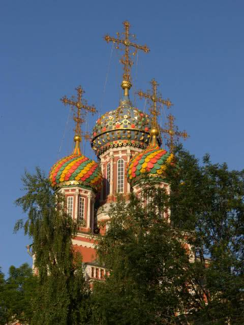
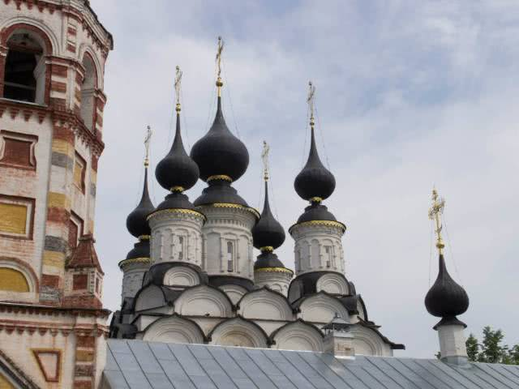
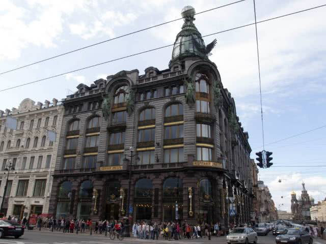
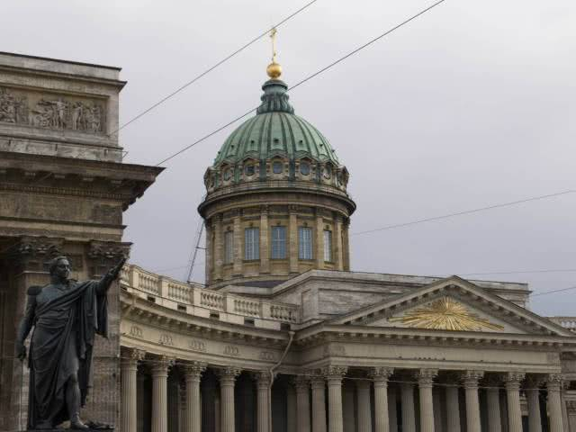
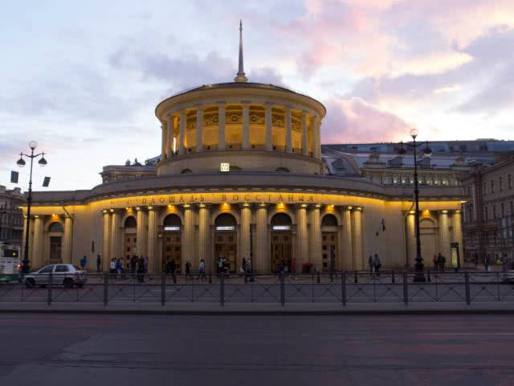
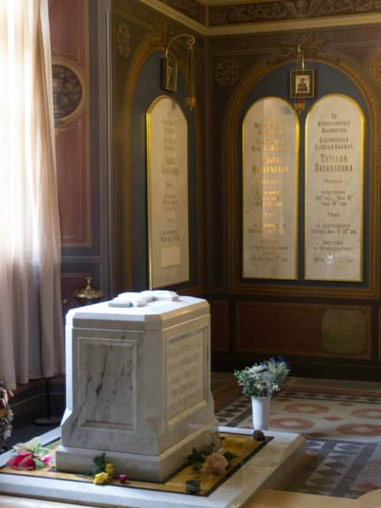
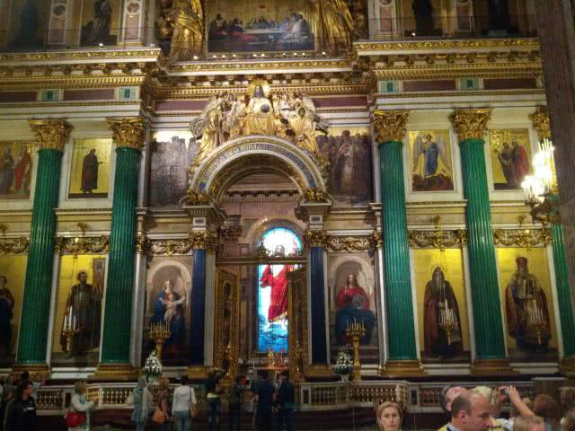
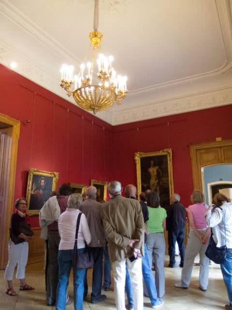
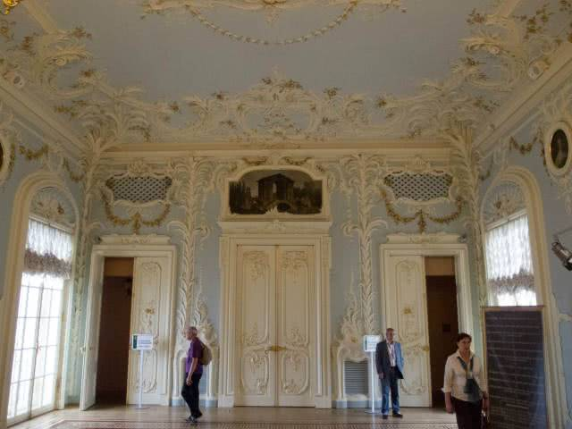

## Moskau

Daß die Metro-Stationen in Moskau prächtig sind, hatte ich gehört. Und auch wenn ich es mir noch grandioser vorgestellt hatte, so findet man doch an allen Ecken und Enden tolle Details.

Das hier war meine allererste Metro-Station. Ich war in Scheremetjewo gelandet und habe den Flughafen-Shuttle-Zug nach Belorusskaja genommen.

Ach ne, Belorusski ist die Eisenbahnstation, und Belorusskaja heißt dann die zugehörige Metro-Station. Details, Details…

Die Russen vertreten im Fernverkehr eine ganz einfache Ansicht: Wer nach Moskau kommt, will nicht durchreisen, sondern eben nach Moskau.

Und daher fahren Fernverkehrszüge auch nicht durch Moskau durch.

Rings um die Stadt liegen lauter Fernbahnhöfe, die nach dem „gegenüberliegenden Reiseziel“ benannt sind, hier Weißrußland.

Und wer wirklich durchreisen will, muß sein Gepäck eben in die Metro schleppen, quer durch die Stadt fahren (und Moskau ist groß!) und dort im den gegenüberliegenden Fernbahnhof wieder einen Zug nehmen.

Bei uns gibts sowas nur in Kirchen...

Ich wollte eigentlich mal die Metro-Linien abfahren und die schönsten Stationen fotografieren, bin dann aber nie dazu gekommen. Außerdem haben Metro-Stationen natürlich so unvorteilhaftes Kunstlicht.

Wo wir schon bei Metro-Stationen sind: die liegen unter der Erde. Tief unter der Erde.

Nicht nur einmal habe ich gestaunt, wieviele hundert Meter Rolltreppe man zuweilen fahren muß.

Und auch sonst sind die Metro-Stationen wahre Monster: mein erster Tag auf Erkundung, ab zum Roten Platz. Ich komme in Borowitskaja an. Und will nur nach oben ans Tageslicht.

Bestimmt zwanzig Minuten bin ich durch die vier Metro-Stationen, die dort miteinander verbunden sind, geirrt. Ich habe mir stets gedacht, nimm die große Rolltreppe nach oben. Nach laaaanger Rolltreppenfahrt und vielen Dutzend Höhenmetern ging es aber immer nur wieder bergab zur nächsten Station.

Das kommt davon, wenn man nicht wenigstens soviel Russisch lernt, daß man „Выход в город“ auf einem Schild erkennt.

Apropos Russisch lernen: Wer glaubt, er käme mit Englisch durch, wird von mir hiermit herzlich ausgelacht. Das klappt nichtmal in der Innenstadt von Moskau. In den Cafés am Roten Platz: vielleicht. In der sonstigen Innenstadt kaum.

Außerhalb Moskaus? Nimm dir einfach einen Strick.

Ausnahme ist Sankt Petersburg. Da spricht praktisch jeder Englisch.

Eine dieser verbundenen Metrostationen ist „Biblioteka Imeni Lenina“.

Vor der Bibliothek sitzt diesmal allerdings nicht Puschkin, sondern Dostojewski.

Und gleich an meinem ersten Tag in Moskau, direkt neben dem Roten Platz: Rettungskräfte. Ein Feuer in der Metro im Berufsverkehr. Der Metroverkehr ist ziemlich durcheinandergekommen, aber ich war weniger betroffen.

Und wenn man in Rußland ist, kann man auch russische Süßigkeiten essen. :-)

Apropos Essen: was ich dort gegessen habe, war alles fantastisch.

Vegetarier gibts dort anscheinend nicht, und wer Vegetarier ist, sollte sich den Rußlandurlaub vielleicht nochmal anders überlegen, auf viel Verständnis wird er nicht hoffen dürfen.

Warm gegessen wird gerne mindestens zweimal am Tag.

Und die Suppen! Ein Traum!

Gut, das hier war mir dann doch zu süß. Und zu geschmolzen. Ich hätte es nicht in der heißen Metro transportieren sollen.

Naja, und meine erste Oper habe ich auch gesehen: Hoffmanns Erzählungen.

Kyrillisch.

Eigentlich ganz einfach. Also das Transliterieren von Texten, verstehen kann ich natürlich trotzdem nichts. Und so ein paar Buchstaben habe ich mir dann doch nie merken können.

Trotzdem, mein großes Aha-Erlebnis hatte ich, als ich an einem Werbeplakat vorbeiging. Von der Lufthansa. Oben drüber groß gedruckt ein Wort. Also habe ich es einfach mal probiert. Buchstabe für Buchstabe, ganz langsam.

Hm, und was heißt das nun? Sprechen wir es nochmal am Stück aus, alle Laute einfach hintereinander. „Stewardess“! Das paßt zur Lufthansa. Mein erstes wirklich gelesenes russisches Wort! :-)

Naja, hier noch ein „Business Center“, anderswo sah ich noch eine „Hemingway Bar“.

Und die amerikanischen Fast-Food-Ketten sind auch alle kyrillisiert! McDonalds, Subway, alle.

Auf dem Weg zum Roten Platz.

Ich weiß nicht, was ein Telegrafen-Zentralirgendwas ist, aber ich fand die Rose rührend.

Paar Häuser weiter: eine Galerie bringt Gemälde außen am Haus an.

Roter Platz.

Ich habs mir beeindruckender vorgestellt, aber Alexandrowski Sad daneben (in meiner Vorstellung gehört der dazu) ist recht spektakulär.

Naja gut, die Basilius-Kathedrale ist natürlich schon ein Hingucker.

Wenigstens keine goldenen Kuppeln, sondern bunte Zwiebeln.

Goldene Kuppeln in Rußland sind für mich dasselbe wie buddhistische Tempeldächer in China: ich mag sie einfach nicht mehr sehen. Die ersten Tage ganz toll, aber irgendwann hat man es sowas von über.

Diese ganzen Türmchen mit Zwiebeln sind eigentlich eigene kleine Kirchen, die unter einem Dach vereint sind.

Und hier sehen wir auch eines der großen Probleme, die ich mit russisch-orthodoxen Kirchen habe, obwohl sie alle unglaublich prächtig und sehenswert sind: von „negative space“ will da niemand etwas wissen.

Es gibt keinen freien Quadratzentimeter! Kein Fleckchen, das weiß gestrichen wäre. Heiligenbilder und Gemälde gehen immer direkt ineinander über, ohne Zwischenraum, Rahmen oder sonst etwas.

Mich erschlägt das völlig.

Auch das ist der Rote Platz: Männer in Militäruniformen, mit denen sich russische Touristen gerne für ein paar Rubel fotografieren lassen.

Ob das hier ein echter Veteran ist, bezweifle ich. Richtig albern fand ich dann aber die ganzen Peter-der-Große- oder Stalin-Darsteller.

Roter Platz, direkt neben der Basilius-Kathedrale: ich hätte ja gedacht, daß dieser Prestige-Platz etwas besser in Schuß ist.

Aber wie gesagt, Alexandrowski Sad finde ich hübscher.

Hinten das Grab des Unbekannten Soldaten an der Kremlmauer.

Davor sieht man die Ehrenmale für die ganzen sowjetischen Heldenstädte.

Zum Beispiel Smolensk.

Was machen Russen, wenn sie einen Krieg gewonnen haben? Sie bauen.

In diesem Fall eine etwas seltsam anmutende Grotte in die Kremlmauer hinein.

Nach ihrem Sieg über Napoleon.

Hinter dem Kreml, bei den drei großen Kathedralen: ein brandneuer Hubschrauberlandeplatz.

Putin hat versprochen, öfter mit dem Hubschrauber einzufliegen. Denn die Moskauer waren stinksauer, daß der Verkehr in der Innenstadt regelmäßig zusammenbrach, wenn die Sicherheitskräfte alles abgeriegelt haben, wenn Putins Konvoi den Weg zum Kreml nahm.

Weiter auf dem Stadtrundgang.

Diesem Herrn entkommt man in Rußland nicht. Rußland hat viele große Schriftsteller hervorgebracht, aber Puschkin scheint am allermeisten vergöttert zu werden.

Und immer wieder hübsche Dinge zu entdecken.

Hier ein Gemälde an einer Fassade.

Warum ich kein brauchbares Foto vom Bolschoi direkt gegenüber habe, weiß ich aber auch nicht.

Dann eine… keine Ahnung. Mini-Kathedrale? Telefonhäuschen?

Das KGB-Hauptquartier.

Die Kirchendichte ist schon sehr hoch.

Moskau hat viele Elektro-Busse. Was hier ein Hingucker und oftmals eher neu ist, fährt dort seit Jahrzehnten.

Allgemein kann man sagen, daß so manches Fahrzeug in Rußland wohl seit Jahrzehnten fährt.

Anderer Bus, ähnlicher Zustand.

Der TÜV hätte seine helle Freude daran.

Szenenwechsel: der Botanische Garten.

Bei bestem Wetter. Der Botanische Garten hat wohl finanzielle Probleme, ist deswegen nicht überall tipptopp hergerichtet, aber er ist ein wunderbares Naherholungsgebiet.

Das findet auch der Pilz. :-)

Lustige Art, den Weg zu säubern. Kam mir bekannt vor, in China lief das genauso.

Das Allrussische Ausstellungszentrum atmet den Geist der sechziger und siebziger Jahre.

Hier der Pavillon für die Fleischindustrie. Ernsthaft.

Das Zentrum ist leider vernachlässigt worden, die meisten Pavillons geschlossen, drumrum ein wenig Jahrmarkt.

Vor dem Kosmospavillon steht eine Rakete. Der Pavillon selbst ist traurig, nur noch ein Basar für Tand. Fake-Goldkettchen und sowas.

Der Brunnen der Völkerfreundschaft.

Russen erkennen wohl an der Tracht der Damen und den Symbolen in ihren Händen, welche Dame welche Sowjetrepublik symbolisiert. Ich nicht.

All die Sowjetrepubliken haben ihre Pavillons. Und am Ende des Geländes in prominenter Position: der russische Pavillon.

Skisprunganlage auf den Sperlingsbergen.

Im Zoo war ich nicht. Aber ich war heilfroh, ihn zu sehen.

Denn als ich nach ein paar Tagen dachte, ich kenne mich jetzt im inneren Stadtgebiet so ein bißchen aus, wurde ich übermütig und bin einfach mal losspaziert.

„Es kommt ja alle paar Meter eine Metrostation, da findest du dich schon zurecht.“

Von wegen. Nachdem keine Metrostationen mehr kamen (Moskau hat zwar sehr viele, aber auch auf großer Fläche verteilt), und ich genau gar keine Ahnung mehr hatte, wo ich bin, war ich froh, auf den Zoo zu stoßen. Den habe ich auf meinem Stadtplan nämlich finden können. Und die Metro war dann auch nicht mehr weit.

## Nischni Nowgorod

Aber genug von Moskau.

Nächste Station war Nischni Nowgorod an der Wolga.

Ein bißchen Basilius-Feeling…

Und eine Burg.

Im Innenhof dürfen Kinder dann mit altem Kriegsgerät spielen.

Ich hatte öfter das Gefühl, daß Rußland für große Menschen eher unpraktisch ist…

Kwas hatte ich in Moskau schon probiert. Nicht so ganz meine Sache, aber auch nicht schlecht.

Dann doch lieber in einem ordentlichen Café etwas trinken.

Und die Glocken werden noch von Hand geläutet.

Ach, lieber nicht…

Dies hingegen ist das Haus, in dem Maxim Gorki aufgewachsen ist, der wohl berühmteste Sohn der Stadt.

Heute ist das ein Museum. Und meine Güte sind die Decken da niedrig!

Nischni Nowgorod ist ein nettes Städtchen, aber ich war nicht lange dort.

## Susdal

Denn nach einer weiteren Zugfahrt und einer Überland-Busfahrt war ich dann auf dem Weg nach Susdal.

Ein ziemlich kleines Nest.

Und ein historisch wichtiges religiöses Zentrum.

Wenn denn schon wieder Kuppeln sein müssen, dann ist Blau mit Sternen doch zumindest mal eine Abwechslung. Das ist die Kathedrale im Kreml zu Susdal.

Wie üblich: alles sehr eng bemalt und sehr prächtig.

Und wie in jeder Kathedrale in Rußland, die ich gesehen habe, gibts auch hier große, reich verzierte Särge von Heiligen, Fürsten oder Zaren.

Susdal hat auch ein Freilichtmuseum, das mich ganz entfernt an Skansen in Stockholm erinnert hat, mit wohl kulturell höchst bedeutsamen Holzbauten.

Primär natürlich Kirchen.

Und noch eine.

Falls jemand schon nach Hause möchte…

## Wladimir

Wladimir ist eine Provinzhauptstadt, nicht weit von Susdal.

Sauber ist es da jedenfalls.

Wenn auch die Farbgebung der Häuser zuweilen irritiert.

Kathedralen gibt es natürlich auch wieder.

Aber auch eine schöne Aussicht.

## Sankt Petersburg

Und schließlich die letzte Station der Reise: Sankt Petersburg.

In meiner jugendlichen Unschuld dachte ich mir, das einfachste sei, nach Sankt Petersburg zu fliegen.

Nachdem ich mein Hotel gefunden hatte, und direkt um die Ecke einen Fernbahnhof mit Aufschrift „Moskowskij“ gesehen hatte, wußte ich, daß ich falsch gelegen hatte. Die Zugverbindung ist wohl einwandfrei, und die Odyssee vom Flughafen zum Hotel wäre mir erspart geblieben.

Gleich nach Ankunft bin ich erstmal die Prachtstraße, den Newski-Prospekt, herabgeschlendert.

Ich erspare mir, all die tollen Gebäude zu zeigen. Denn ich habe so ziemlich jedes fotografiert, ich bin kaum vorwärtsgekommen. Wahnsinn!

Vier Pferdezähmungsstatuen auf einer Brücke.

Der doppelköpfige Adler findet sich allerorten. Der war auf dem Staatswappen, bevor es nach der Oktoberrevolution dann von Hammer und Sichel abgelöst wurde.

Die Kasaner Kathedrale.

Ein Theater.

Sankt Petersburg ist bunt.

Und hat zuweilen etwas venedisches.

Ich war auch noch zur Zeit der Weißen Nächte da, wo es nachts noch recht hell ist. Ergibt nette Lichteffekte.

Und beleuchtet sieht alles nochmal schöner aus.

Der Panzerkreuzer Potemkin.

Sankt Petersburg hat auch tolle Parkanlagen.

Ich war leider zu spät dran, die Parks waren schon geschlossen.

Der Mann wärmt sich nicht, der gedenkt.

Ich weiß zwar nicht, wessen hier gedacht wird, aber es macht doch was her.

Eine Brücke über die Newa. Diese Brücken sind Zugbrücken und werden abends hochgezogen. Die Kreuzfahrtschiffe müssen also rechtzeitig raus oder halt bis zum nächsten Morgen in der Stadt bleiben.

So ein bißchen erinnert das schon wieder an die Basilius-Kathedrale.

Und noch eine russisch-orthodoxe Kirche, beziehungsweise eigentlich sogar zwei. Im Erdgeschoß und im ersten Stock sind wohl zwei unabhängige Gemeinden untergebracht.

Und der andere Punkt, der mich völlig fertigmacht: dieses völlig übertrieben viele Gold.

Hier die Peter-und-Paul-Kathedrale.

Teil der Peter-und-Paul-Festung, die eigentlich der Verteidigung gegen die Schweden dienen sollte. Nur wurden die Schweden geschlagen, bevor sie nach Sankt-Petersburg kamen.

Unfaßbar, diese Pracht.

Und natürlich wieder mit Sarkophagen. Hier Alexander II. mit Gemahlin.

In der Kathedrale liegen über fünfzig Mitglieder der Zarenfamilie begraben.

Für den letzten Zaren, Nikolaus II., gibt es einen eigenen Grabraum. Kurz nach meinem Besuch sind dort wohl nochmal die sterblichen Überreste von Verwandten von ihm bestattet worden.

Wie eben erwähnt wurden die Schweden besiegt. Und was machen Russen, wenn sie Kriege gewinnen? Genau, sie bauen.

In diesem Fall Peterhof.

Eine großzügige Schloß- und Gartenanlage mit Unmengen von Fontänen.

Die Fontänen funktionieren natürlich ganz ohne Pumpen, rein durch die Umwandlung von Lageenergie in Bewegung.

Und hier eben vornehmlich Fontänen.

Auch mal ganz klein, um das Prinzip vorzuführen.

Und dann wieder größer.

Naja, genug davon. Nächste Station: das Alexander-Newski-Kloster.

Die Kirche dort war für mich die schönste, die ich in Rußland gesehen hatte, weil sie einfach geschmackvoll und nicht so mit Gold und Gemälden überladen war.

Fotografieren durfte man nicht, das ist ja normal. Was aber nicht normal ist, ist, daß die zwar Merchandising-Artikel und Postkarten verkaufen, aber keine Postkarten mit dem Inneren der Kirche darauf! Sowas blödsinniges!

Lustig fand ich auch die Beichte dort: der Priester/Mönch steht an einem Stehpult mit dem Beichtenden. Dahinter mit kleinem Diskretionsabstand eine lange Schlange von Menschen. So richtig diskret und vertraulich kam mir das nicht vor.

Die Klosteranlage umfaßt auch zwei Friedhöfe; einen uralten und einen etwas neueren.

Auf dem neueren liegen Unmengen von berühmten Sankt-Petersburgern. So viele, daß die am Eingang gleich einen Wegweiser zu den Gräbern aufgestellt haben.

Ich weiß nicht mehr, wer hier liegt.

Und welcher Musiker das wohl ist?

Dazwischen sehr melancholische Szenen.

Und diese sich nett anlächelnden Löwen.

Und auf dem anderen Friedhof nebenan dieser lustige Geselle.

Weiter zur Isaakskathedrale. An den Säulen außen sieht man schon, wie riesig die ist.

Natürlich auch wieder außerordentlich prächtig.

Ich mag dieses Grün unheimlich, das sehen wir später in der Eremitage auch nochmal.

Die Kathedrale ist wirklich riesig. Das ist ja nur in die eine Richtung aufgenommen.

Hm, ob ich meine Wohnung grün-gold einrichten sollte?

Der…

…helle…

…Wahnsinn!

Weiter zur Eremitage. Die ist unfaßbar groß, wir haben natürlich nur einen kleinen Teil gesehen.

Ich habe von Kunst ja nun wenig bis gar keine Ahnung, und viele Kunstwerke dort sprechen mich auch nicht an. Aber was den Besuch dennoch unheimlich faszinierend gemacht hat, waren die Ausstellungsräume.

Kein Ausstellungsraum gleicht dem anderen. Decken, Wände, Fußboden, alles wird nicht nur ständig variiert, sondern grundlegend verändert.

Zum Beispiel hier.

Oder hier.

Oder hier, ganz bunt und relativ schlicht.

Dann wieder opulent.

Und elegant.

Gemälde sind immer gut. :-)

Und manche Plastiken sind auch ganz nett anzuschauen.

Aber dieses Blau!

Oder dieses Grün erst! Ganz wunderbare Farben.

Letzte Station: der Große Katharinenpalast.

Davor noch diese kleine Wohnung. Puschkin ist wichtig.

Mal wieder dieses helle Blau. Und diese völlig übertriebene Barockfassade.

Ich habe den Mund nicht mehr schließen können.

Ich will gar nicht wissen, wieviel Katharina dafür ausgegeben hat.

Oder wieviel Gold da verbaut ist.

Oder wieviele Kunsthandwerker dort zugange waren.

Die Öfen sind ja nicht so meins, aber ein Abendessen könnte ich mir dort schon vorstellen, doch.

Überall Detailverzierungen.

Und dann mal ein hübscher Farbkontrast.

Wie üblich: bloß keinen Abstand zwischen Gemälden lassen.

Das ist das Bernsteinzimmer. Bernstein sieht man hier nicht, der ist links und rechts verbaut. Fotografieren durfte man im Bernsteinzimmer selbst leider nicht.

Das Bernsteinzimmer hat mich wirklich enttäuscht. Ich dachte, da wäre alles Bernstein, aber es sind eigentlich nur ein paar Tafeln mit Bernsteinmosaiken in die Wände eingelassen.

Und mit einem letzten Blick auf den Palast endet dieses Fotoalbum nun.
