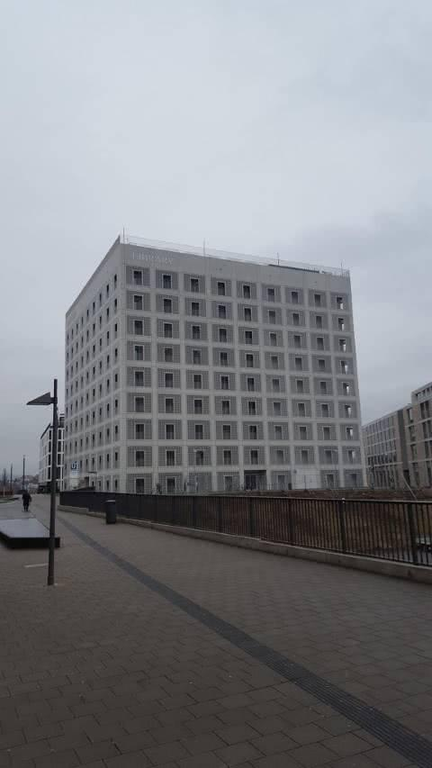

Ein grauer Tag. Der erste Blick: enttäuschend. Aber ich hatte natürlich auch die tollen Bilder mit nächtlicher Beleuchtung vor Augen.

Toiletten und Garderobe im Untergeschoß. Schlecht ausgeschildert.

Unten der Eindruck, der den gesamten Besuch bleiben wird: steril. Kalt. Technokratisch.

Wenn jede Universitätsbibliothek gemütlicher ist als die hochgelobte neue Stadtbibliothek, dann ist doch etwas schiefgelaufen?

Erster Lichtblick: WLAN-Router auf den Toiletten. Zugang gibts aber wohl nur für Leseausweisinhaber, nicht für „Neigschmeckte“.

Hochmodernes Schließfachsystem. Nach x Versuchen und y Fächern noch immer kein Erfolg. Also wieder hoch zum Schalter: ja, Fingerabdruck funktioniere kaum mal, ich solle die Betriebsart PIN wählen. Na super.

So sehen die Ebenen aus. Hochglanz, steril, aber im Prinzip nicht ganz übel. Hier sieht man immerhin auch zwei Hocker.

Denn zum Sitzen gibt es fast nix. Zum gemütlich sitzen noch viel weniger. Ein solches Sofa pro Stockwerk vielleicht.

Aber ich will ja nicht nur meckern. Der Galeriesaal (also der Innenhof) ist genauso spektakulär wie in der Presse gesehen. Er ist halt leider nur ein Teil der Bibliothek.

Die Dachterasse war leider geschlossen.

Was auch auffiel: Katalog-PCs mußte ich ziemlich suchen. Jede Dorfbibliothek hat mehr davon pro Fläche.

Es stehen zwar einige PCs herum, aber…

…halt nur für anderen Kram.

Zum Abschluß noch ein versöhnliches Wort: das Bücherangebot schien mir in den Bereichen, in denen ich geschaut habe, wirklich gut und aktuell zu sein.

Was bleibt? Enttäuschung vor allem. Die Galeriesäle sind toll, aber eine Stadtbibliothek muß zum Verweilen und Schmökern einladen. Diese tut es nicht. Sie ist auf Prestige und Effekt gebaut, kann dann aber die Buchauswahl doch überraschend effektiv und schön präsentieren.

Aber ich habe mich selten in einer Bibliothek so geärgert. Und war selten so schnell wieder draußen.

