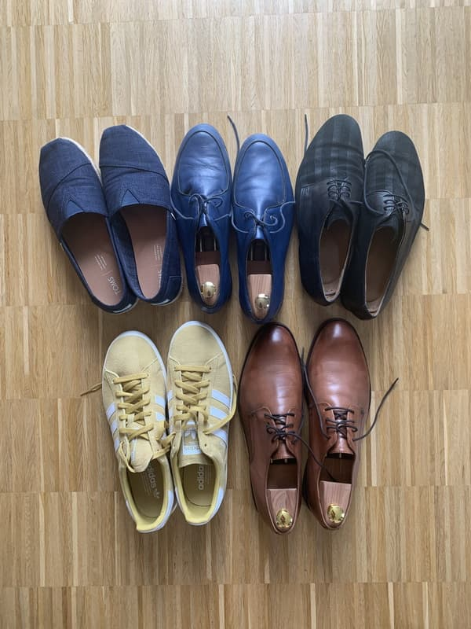

Eine häufige Frage von Tanzanfängern lautet: „Welche Tanzschuhe und Schuhsohlen brauche ich denn zum Tanzen?“. Und auch im weiteren Verlauf der Tanzkarriere probieren viele Tänzer ganz verschiedene Schuhe aus.

In dieser kleinen Reihe möchte ich ein paar Arten von Tanzschuhen vorstellen, die ich selbst schon getragen habe. Oder eigentlich eher verschiedene Arten von Schuhsohlen – denn der Rest des Schuhs ist hauptsächlich eine Frage von Geschmack, Mode und Komfort. Die Schuhsohle „erdet“ den Tänzer jedoch, und damit ist sie wichtig.

Natürlich hängt viel vom konkreten Boden ab. Und auch zwei verschiedene Räume mit Parkett können sich völlig unterschiedlich anfühlen, wenn man tanzt.

Grundsätzlich ist natürlich der ganz klassische, schwingend gelagerte Tanzboden aus Holz das Nonplusultra. Leider ist er außerhalb von Tanzschulen und einigen sehr guten Veranstaltungssälen eher selten in unserem Tänzerleben zu finden.

Das Parkett ist dann die normale Premiumqualität. Andere Arten von Holzboden (gar Dielenboden) können gut sein, müssen es aber nicht.

Am unteren Ende der Skala stehen drei Fußbodenbeläge, die wir Bielefelder leider alle schon kennenlernen durften, bevor wir im wunderbaren [Muschelsaal](http://www.muschelsaal-bielefeld.com/) eine Heimat gefunden haben: Fliesen, PVC/Linoleum und sogar Beton! Alle drei Arten sind indiskutabel und nur im Notfall zu ertanzen. Dann aber mit Augenmerk auf Verletzungsanfälligkeiten. Drehungen sollte man lieber außen vor lassen.

Also beschränke ich mich in meiner Betrachtung auf Holzböden aller Art. Welche Arten von Schuhsohlen bieten sich an?

Außerdem: was ist über Pflege und Haltbarkeit zu sagen? Vertragen sie ein paar Tropfen Nässe?

Wichtig ist natürlich auch der Einsatzzweck. Ganz allgemein möchte man zum Balboa möglichst rutschige Schuhe, da man insbesondere im Pure Bal ohnehin kleine, aber schnelle Schritte setzt und seinen Schwerpunkt nie weit verlagert. Im Lindy Hop ist ein gewisser Grip hingegen hilfreich, besonders, wenn man dynamischer tanzt. Anfänger mögen es sowieso lieber etwas standsicherer.

Solltet ihr nur ungeeignete Schuhe haben, die viel zu stumpfe Sohlen haben, gibt es den alten Tänzertrick: Kunststoffklebeband („Tesa-Packband“) auf die Sohle im Bereich des Fußballens kleben. Das ist für Fälle, in denen der Boden heute mal wieder sehr stumpf ist, ganz brauchbar. Modisch ist das Klebeband natürlich nicht, und ob es sich wieder gut lösen läßt, müßt ihr ausprobieren.

Die Alternative wäre Puder, um stumpfen Boden (oder Schuhe) rutschiger zu machen. Das ist aber immer problematisch: man verunreinigt die Tanzfläche, was der Gastgeber vielleicht nicht so gerne sieht. Und ihr beeinflußt auch andere Tänzer, die in diesen Bereich der Tanzfläche kommen – wenn sie selbst bereits rutschige Schuhe tragen, mag das bis hin zum Sturz führen! Eine Aspirin zertreten und verteilen hat selbst im Erfolgsfall dieselben Probleme, verbuche ich aber ohnehin eher unter „Partygag“.

Auf dem Foto oben seht ihr fünf Paar Schuhe. Mit vieren davon habe ich oft getanzt, das fünfte Paar kommt mir nicht an tanzende Füße.

Aber alles weitere kommt dann in einzelnen Artikeln zu den Schuhtypen.