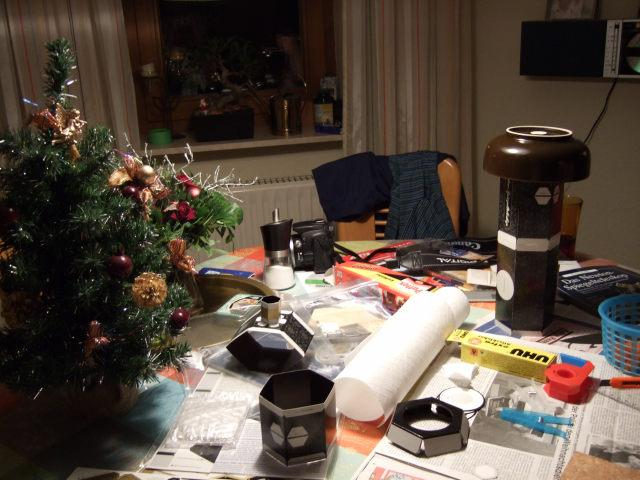

Astromedia verkauft viele interessante Bausätze, darunter auch einen Sextanten, ein Mikroskop, diverse Sternenkarten und einiges mehr. Und von denen ist auch dieser Bausatz.

Die edlen Goldbeschläge sind ebenso wie fast der gesamte Rest des Teleskops aber nur bedruckter Karton.

Geliefert werden neun DIN-A4-Seiten mit vorgestanzten Bauteilen, einen Hauptspiegel, einen Fangspiegel, ein paar Kunststofflinsen (für die Okulare) und eine mehrseitige, klein bedruckte Bauanleitung.

Das Teleskop besteht am Ende tatsächlich zum großen Teil aus Karton, zu einem noch größeren Teil aus Klebstoff (nein, Scherz, aber da verbraucht man schon ziemliche Mengen an Klebstoff), einem einsamen Zahnstocher und den eben genannten Linsen und Spiegeln.

Und weil das nach Arbeit aussah, haben mein Vater und ich zwischen den Jahren ein Vater-Sohn-Projekt daraus gemacht. Und es artete in noch mehr Arbeit aus. Wir haben mehrere Nachmittage daran gesessen. Und zu zweit geht es auch deutlich leichter. Sei es, daß einer den Tubus hält, während der andere die Spiegel justiert, sei es, daß alle sechs Klebelaschen jetzt sofort festgedrückt werden wollen.

Okay, es sah zeitweise etwas chaotisch aus. Die Schüssel rechts im Bild preßt zwei Tubusbestandteile zusammen, und neben meinem kleinen Plastikweihnachtsbäumchen, das ich wirklich sehr schön finde, sieht man noch den letzten Teil des Tubus mit dem Okularstutzen.

Wer diesen Bausatz ebenfalls zusammenbauen möchte, sei schonmal gewarnt: Der Fangspiegel ist an den Seiten verdammt scharf. Da kommt schnell mal Blut ran. Außerdem wird er von einer blauen Klebefolie geschützt, die leider nur sehr schwer abzutrennen ist. Etwas weniger rabiater Schutz wäre sicherlich sinnvoll, da Aktionen mit dem Messer nunmal ein gewisses Risiko bergen. Das ging aber dann doch ohne Beschädigungen.

Wie man am rechten Okular sehen kann, klappte aber nicht alles ohne Schaden: dort weicht man wohl besser von der Bauanleitung ab und klebt den Zylinder erst, nachdem man das Oberteil mit Linse teilweise angeklebt und das Gesamtensemble testweise in den Okularstutzen eingeführt hat. Sonst muß man den bereits fest verklebten Zylinder nochmal öffnen, und dabei spaltet sich leicht der Karton.

Überhaupt, die Okulare sind die Sorgenkinder. Auf zwei Linsen kam während des Baus Klebstoff. Die werden stets einfach so auf einem Stück Karton mit Loch festgeklebt, so daß nur am Rand Klebstoff sein darf. Und wenn man dann abrutscht oder eben etwas zu viel Klebstoff aufgetragen ist und er herausquillt… wir saßen längere Zeit und haben mit Universalverdünner, Spiritus und Waschbenzin versucht zu retten, was zu retten war. Man sieht noch ein paar Rückstände, aber andererseits waren die Kunststofflinsen schon im Lieferzustand nicht von der Qualität wie sie die Spiegel hatten: leichte Kratzer und Flecken, bei denen ich nicht weiß, ob das eher eine Art Belag oder Einschlüsse sind.

Die beiden Okulare finden links und rechts vom Aufbau ihr Quartier. Eine schöne Lösung, wie ich finde.

Ich hoffe doch, daß die Mängel wenigstens ein paar Mondkraterbeobachtungen nicht unmöglich machen. Aber das ist wahrscheinlich wie mit Fingertapsen auf der Brille: sie sind weit jenseits des Fokus und man wird davon kaum gestört.

Apropos „Beobachtungen“. Ich habe mir den Karkoschka-Sternenatlas gekauft und will schon seit zwei Wochen mit einem Fernglas bewaffnet auf Sternenjagd gehen, nur leider war es hier immer bewölkt.

Was ist hier zu sehen?

Nun, da habe ich in den Okularstutzen hineinfotografiert (und dabei zuviel gezittert, um es wirklich mittig hinzubekommen). Man sieht den Fangspiegel, auf dem sich die Kameralinse und der silberne Rand drumrum spiegeln.

Natürlich nicht direkt, der Fangspiegel steht ja im 45°-Winkel. Also ist der Lichtweg „Kamera zu Fangspiegel, Fangspiegel zu Hauptspiegel einmal durch den Tubus, Hauptspiegel zu Fangspiegel wieder zurück durch den Tubus und vom Fangspiegel endlich in die Kamera“.

So justiert man im Prinzip auch: Auf dem Hauptspiegel wird mittig ein kleines kreuz aufgemalt und dann sollte man beim Schauen durch den Objektivstutzen das Kreuz mittig in der eigenen Pupillenreflexion und mittig im Fangspiegel sehen.

Das wird in der Bauanleitung „Basisjustierung“ genannt. Das kann man mittels einer weiteren angegebenen Justierungsmöglichkeit noch genauer machen, allerdings hatten wir wenig Lust, 40 Meter entfernt eine Christbaumkugel aufzuhängen und dann mit der Sonne im Rücken und so weiter…

Und da die Spiegel im Prinzip das Interessanteste sind, gleich noch ein Foto. Was sieht man denn auf diesem?

Nein, das ist nicht ein beidseitig offener Tubus mit Fangspiegel am entfernten Ende. Der Fangspiegel ist vorne das unscharfe schwarze Viereck. Hinten (also wo es schärfer wird) befindet sich der Hauptspiegel, der sowohl den Fangspiegel als auch die Öffnung mit meiner Hand reflektiert.

Naja, doch noch ein weiteres Foto der Spiegel.

Diesmal von vorne durch die Öffnung, an Fangspiegelhalterung und Fangspiegel vorbei, dann zwei innere Blenden (dort sind die drei Tubusbestandteile verklebt).

Ganz hinten befindet sich dann wieder der Hauptspiegel.

Vorne und hinten werden noch Visiere angebracht.

Das Teleskop steht dann wohl sinnvollerweise irgendwo erhöht, auf einem Tisch oder so. Wie man das praktisch handhabt, weiß ich noch nicht, aber ich kann es ja schlecht draußen auf die Wiese stellen (selbst wenn sie trocken ist und die Karton-Bodenplatte nicht durchweicht), da müßte ich mich zum Visieren ja mit dem Kopf irgendwie eingraben…

Der Tubus ruht auf einer sogenannten „Dobson-Montierung“. Auch die ist natürlich komplett aus Karton. Die Achsen bestehen aus zwei größeren Kartonstücken, die von zwei kleineren und aufeinandergeklebten „Achsstücken“ getrennt werden, so daß sie sich auf den Unterbau aufsetzen können.

So sieht das dann aus. Ein Winkelmesser darf natürlich nicht fehlen.

Hier sieht man auch im Ansatz, wie eine ganze Anzahl Kartonstücke jeweils gefaltet und so verklebt werden, daß sich eine stabile dreidimensionale Struktur ergibt.

Ebenso sieht man viele Klebstoffreste, die sich eigentlich am ganzen Teleskop finden…

Und wenn es dann ganz und endgültig fertig ist, dann sieht das Teleskop so aus.

Der Okularstutzen ist mit einem Deckel verschlossen und vorne über der Öffnung spiegelt und glitzert es.

Da hatte ich nämlich noch einen Sonnenfilteraufsatz mitbestellt und dann noch schnell gebastelt.

Spezifiert ist ein Filterfaktor von 1:100000. Das glaube ich sofort. Ich habe den vor eine Zimmerlampe gehalten und kein bißchen Licht hindurchscheinen sehen.

Ob ich den tatsächlich mal „richtig“ verwende, weiß ich noch nicht. Wenn, dann wahrscheinlich eher bald. Wenn ich den vor dem Einsatz erst monatelang rumliegen lasse, habe ich etwas Angst, daß ich die Folie in der Zeit irgendwo leicht und unauffällig beschädige. Also „unauffällig“, so lange, bis ich hindurchschaue.

Es war mir ein Herzenswunsch, das Teleskop am Silvesterabend noch fertiggebaut zu bekommen (nach drei Nachmittagen oder sowas um den Dreh herum), so daß ich unter „Baujahr“ noch das hier vermerken konnte. 
