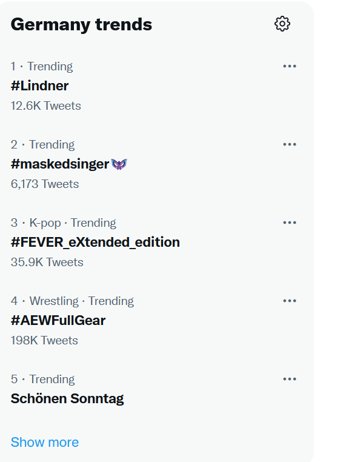
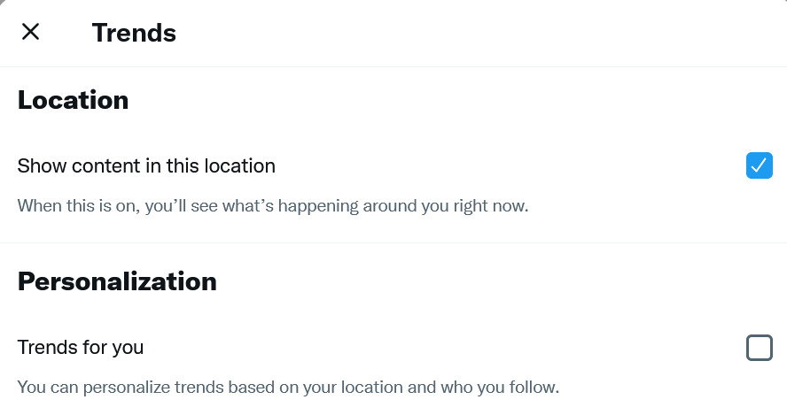
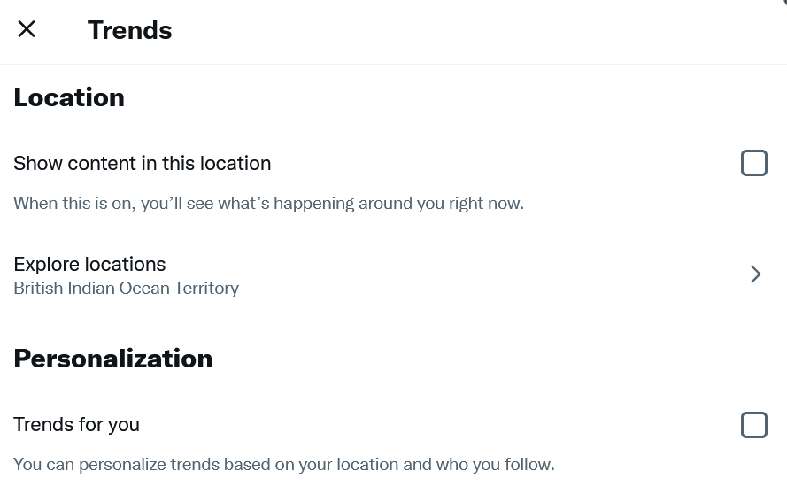

In [„Wie ich zwitschere“]() schrieb ich bereits, daß Twitter das „Engagement“ der Benutzer optimiert. Eine Maßnahme dazu sind die ständig ins Auge stechenden Trends mit den aktuell laufenden Shitstorms.

Natürlich läßt Twitter nicht zu, diese einfach abzuschalten. Aber es gibt einen Trick.

Wenn man nun auf das Zahnrad klickt, erhält man folgende Einstellungen:

Und wenn man nun „Show content in this location“ wegklickt und von Hand als Ort „British Indian Ocean Territory“ einstellt, dann ist himmlische Ruhe. Denn von dort postet niemand etwas:

