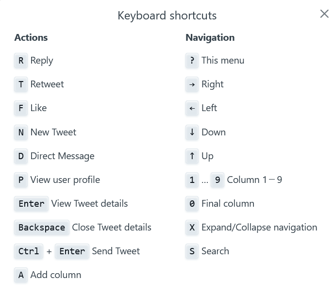

Twitter steht bei vielen Menschen im Ruf, auch nur ein weiteres sinnloses Social-Media-Netzwerk zu sein. Ich glaube aber, daß man Twitter ganz hervorragend gewinnbringend nutzen kann.

Es soll nicht um das übliche gehen: ja, Twitter kann endlos Zeit fressen, das „Doomscrolling“ ist ein echtes Problem. Ja, man kann sich feste Zeiten einrichten und nicht ständig aufs Handy schielen. Aber es gibt handfestere Ratschläge.

Zunächst einmal: ich nutze Twitter täglich. Nachdem ich meinen letzten Twitter-Account gelöscht hatte, bin ich vor einigen Monaten wieder eingestiegen. Alle Follower weg. Oh je!

Aber das ist gar nicht schlimm. Ich habe auch heute, Monate später, noch 0 Follower. Ich folge selbst allerdings auch 0 Personen. Das muß ich erklären.

Die normale Art, Twitter zu nutzen, ist: ich folge ganz vielen interessanten Menschen und dann habe ich eine interessante Timeline. Das funktioniert aber so nicht.

## Die Timeline

Zunächst zur Timeline: Die Standard-Chronik auf Twitter zeigt ganz viel Mist, von dem Twitter glaubt, daß er unser „Engagement“ steigert. Tweets von Personen, denen Personen folgen, denen Personen folgen, denen wir folgen. Tweets, die gerade deutschland- oder weltweit wie blöde retweetet werden. Das sind vor allem Tweets, die uns aufregen. Emotionale Tweets. Die Sau, die durchs Dorf getrieben wird. Dazu ganz viele „empfohlene“ Tweets, die letztenendes auch nur Werbung sind.

Das kann man kaum verhindern. Ein Ansatz (aber keine vollständige Lösung) ist, bestimmte Begriffe zu blocken, die in den Tweets nicht sichtbar sind, die Twitter aber offenbar intern verwendet, um all diese verschiedenen Belästigungen zu kategorisieren. Die heißen dann „suggest_recycled_tweet“ oder „ActivityTweet“ und so. Natürlich sind sie nicht dokumentiert. Aber findige Netizens haben diese Begriffe reverse-engineert.

Und wenn man diese Begriffe stummschaltet, dann verschwinden auch diese störenden Tweets. Jedenfalls derzeit. Wie lange das funktioniert, ist offen. Dennoch: unbedingt tun:

Zum nächsten Problem der normalen Chronik: sie ist keine. Die Tweets erscheinen nicht in chronologischer Rehenfolge, sondern werden vom Twitter-Algorithmus umsortiert, wie Twitter gerade meint, das „Engagement“ steigern zu können. Man kann also nicht da weiterlesen, wo man zuletzt stehengeblieben war. Alte Tweets erscheinen erneut, neue Tweets werden unter all den anderen versteckt.

Auch hier gibt es eine Teil-Lösung: Mit der „Sternschaltfläche“ oben rechts kann man von „Home“ auf „Latest Tweets show up as they happen“ umschalten.

Warum ist das nur eine Teil-Lösung? Weil Twitter das immer wieder mal selbstständig auf den von ihnen gewünschten Default „wild durcheinander“ zurückschaltet. Es besteht ganz leise Hoffnung, daß sie damit aufgehört haben, bei mir ist die Einstellung nun schon bestimmt zwei Monate stabil, aber ich habe das schon mehrfach neu einschalten müssen.

## Follower

Was bedeutet es, jemandem zu folgen? Nach herkömmlicher Ansicht bedeutet das „ich möchte seine Tweets sehen“. Und das ist auch eine Folge des Folgens.

Es gibt aber eine weitere: das soziale Signal. Das kann gewollt sein oder ungewollt interpretiert werden. Wenn ich einem Freund folge, möchte ich wohl auch zeigen, daß wir „zusammengehören“. Doch wenn ich einem Politiker folge, glauben viele andere Twitter-Nutzer, ich sei Wähler seiner Partei. Auch wenn ich ihm nur folge, um mitzubekommen, was er wieder für unmögliche Dinge erzählt.

Spannend wird das bei den Shitstorms, die ständig durch die Twittersphäre schwirren. Folge ich jemandem, der aus irgendwelchen Gründen (Sexismus, Rassismus) gerade im Kreuzfeuer steht – ob berechtigt oder nicht! – dann bin ich offenbar auch „so einer“.

Das ist keine blanke Theorie, inzwischen nutzen viele, die sich häufig an solchen Shitstorms beteiligen, gemeinsame Blocklisten und nutzen Dienste, womit sie nicht nur einen Nutzer blocken können, sondern automatisch auch alle anderen Nutzer, die dem bösen Nutzer folgen.

Es empfiehlt sich daher, das soziale Signal „ich folge jemandem“ vom Abonnement „ich möchte seine Tweets lesen“ zu trennen. Glücklicherweise geht das.

## Twitterlisten

Und es geht nicht nur, die Lösung für das „ich möchte nur lesen“-Problem ist dieselbe, wie die Lösung für das „Twitter spielt mit meiner Chronik herum“-Problem. Und zwar sind die Lösung Twitterlisten.

Listen kann jeder Twitter-Benutzer selbst anlegen. Sie können öffentlich sein. Aber warum? Am besten legt man sich private Listen an und fügt andere Twitter-Nutzer diesen hinzu.

Wenn ich eine Liste anschaue, dann erhalte ich chronologisch sortiert genau die Tweets und Retweets derjenigen Nutzer, die ich auf diese Liste gepackt habe. Nicht mehr und nicht weniger.

Ich kann sortieren, wie immer ich mag, niemand sieht es, niemand ist beleidigt, weil er auf der „Langweiler, aber manchmal wichtig“-Liste steht.

Ich entscheide, welche Liste ich anschauen möchte. Im Moment sind Formale Methoden etwas aus dem Fokus geraten. Egal, die Liste existiert, sie stört nicht, und wenn das Thema wieder aktuell wird, ist sie vorhanden. Ich entfolge niemanden von dieser Liste, weil der ganze Formale-Methoden-Kram gerade eher nervt. Ich gucke sie einfach nicht an. So kann ich Themen ein- und ausblenden.

Es bleibt ein Problem: Das User-Interface für Listen ist okay, aber nicht berauschend. Zum Glück hat Twitter noch ein weiteres User-Interface, auch im Web, auch kostenlos (noch – es gibt immer wieder Gerüchte, das solle sich ändern): [Tweetdeck](https://tweetdeck.twitter.com/).

Hier kann ich ganz viele Spalten einrichten und mit Inhalten befüllen. Ich kann meine Drafts sehen, meine DMs, ich kann Hashtags oder Benutzern folgen – oder ich schaue Listen an. Und genau das tue ich hier.

Nun kann ich in den Spalten endlos nach unten scrollen, um all die Tweets zu sehen. Ich kann nach rechts scrollen, so viele Spalten ich eben habe.

Und ich habe Keyboard-Shortcuts!

Ich kann schnell in bestimmte Spalten springen (jedenfalls die ersten neun und die letzte). Ich kann Details mit einer Taste aufrufen, mit einer Taste antworten. So muß das sein!

Derzeit ist das meine absolut favorisierte Lösung für Twitter. Nach außen sehe ich völlig inaktiv aus, wie ein toter Account. Niemand folgt mir, ich folge auch niemandem. Aber in Wirklichkeit nutze ich Twitter für das, wofür es am besten ist: aus ganz unterschiedlichen Quellen schnell und ohne weiteren Verwaltungsaufwand Informationen bekommen.
